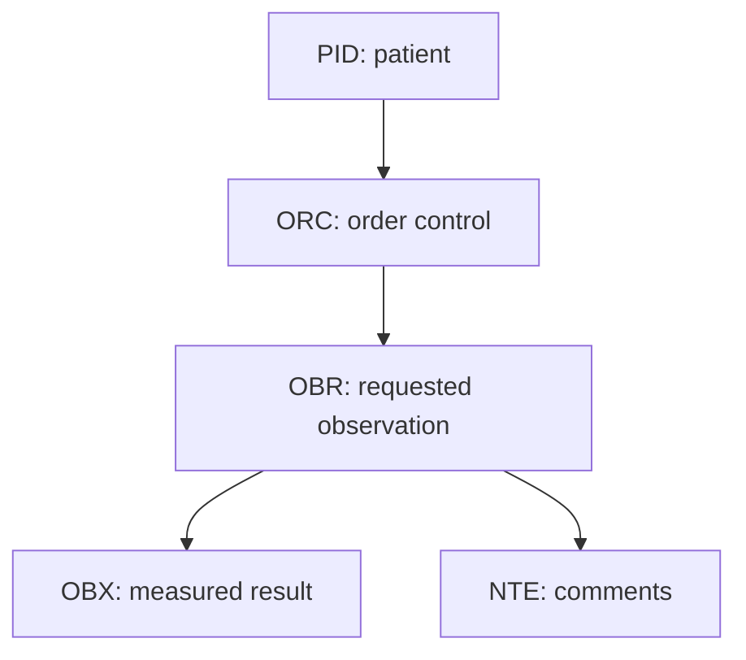

# HL7 OBR — Part 1

## Overview

This guide introduces the HL7 v2 `OBR` segment—**Observation Request**—and explains how it connects an order with the requested test, specimen, timing, providers, and result status.

The recording places OBR in an `ORM^O01` order-message example and notes related HL7 message families such as ORM, ORU, QRY, and ACK. Its main focus is the OBR field table, from order identifiers at the beginning of the segment through parent-observation fields at the end.

> OBR describes an observation request and its result-level context. It does not contain the individual measured values; those are normally represented by one or more `OBX` segments in a result message.

## Learning objectives

After completing this part, you should be able to:

- explain the role of OBR in orders and results;
- distinguish placer and filler order identifiers;
- identify the requested test using `OBR-4`;
- understand observation, collection, and specimen timestamps;
- map the ordering provider and callback contact;
- interpret result status and result-status timestamps;
- recognize parent/child and supplemental-service fields;
- validate an OBR segment without shifting field positions.

## Message context shown in the lesson

The lesson presents an `ORM^O01` order message containing these segments:

| Segment | Meaning |
|---|---|
| `MSH` | Message header |
| `EVN` | Event information in the demonstrated profile |
| `PID` | Patient identification |
| `OBR` | Observation request |
| `ORC` | Common order information |
| `NTE` | Notes/comments |
| `IN1` | Insurance information |

Exact segment order, optionality, repetition, and supported fields depend on the HL7 version and implementation profile. A generic field table is not a substitute for the receiving system's conformance specification.

## Where OBR fits



### ORC versus OBR

- `ORC` controls the order lifecycle: new, cancel, discontinue, status change, and other order-level actions.
- `OBR` describes the observation/test being requested and its clinical, specimen, provider, and result context.

Both can carry placer and filler order numbers. The interface agreement must define how corresponding identifiers in ORC and OBR are populated and validated.

## Core identifiers

| Field | Name | Practical meaning |
|---|---|---|
| `OBR-1` | Set ID — OBR | Sequence number when OBR repeats |
| `OBR-2` | Placer Order Number | Identifier assigned by the system placing the order |
| `OBR-3` | Filler Order Number | Identifier assigned by the system fulfilling the order |
| `OBR-4` | Universal Service Identifier | Code for the requested test, panel, study, or service |

### Placer and filler ownership

The placer and filler numbers identify the same business order from different system perspectives. Preserve both values and their namespaces.

| Identifier | Owner | Typical use |
|---|---|---|
| `OBR-2` | Ordering/placer system | Sender-side order correlation |
| `OBR-3` | Performing/filler system | Laboratory/radiology-side correlation |
| `MSH-10` | Message sender | Message-instance duplicate detection—not order matching |

`OBR-4` is normally a coded element. Send the code, description, and coding system where required, for example `718-7^Hemoglobin^LN`. Display text alone is not a stable service identifier.

## OBR field reference

The following table converts the field list shown in the lesson into functional groups.

### Order and observation timing: OBR-1 through OBR-8

| Field | Name | Notes |
|---|---|---|
| `OBR-1` | Set ID — OBR | Repetition sequence |
| `OBR-2` | Placer Order Number | Placer-assigned order ID |
| `OBR-3` | Filler Order Number | Filler-assigned order ID |
| `OBR-4` | Universal Service Identifier | Requested observation/service |
| `OBR-5` | Priority | Historical/deprecated in some later profiles; follow the selected version |
| `OBR-6` | Requested Date/Time | Requested performance time |
| `OBR-7` | Observation Date/Time | Clinically relevant observation/specimen time |
| `OBR-8` | Observation End Date/Time | End of the observation interval |

Do not assume `MSH-7`, `OBR-6`, `OBR-7`, and `OBR-22` represent the same event. They describe message creation, requested performance, observation, and result-status change respectively.

### Collection and specimen context: OBR-9 through OBR-15

| Field | Name | Notes |
|---|---|---|
| `OBR-9` | Collection Volume | Amount of specimen collected |
| `OBR-10` | Collector Identifier | Person who collected the specimen |
| `OBR-11` | Specimen Action Code | Action/handling instruction for the specimen |
| `OBR-12` | Danger Code | Known hazard or risk |
| `OBR-13` | Relevant Clinical Information | Clinical information relevant to performing/interpreting the test |
| `OBR-14` | Specimen Received Date/Time | When the performing department received the specimen |
| `OBR-15` | Specimen Source | Source/type/site details in older message structures |

For newer implementations, specimen details may also be represented using the `SPM` segment. Never populate both structures inconsistently; follow the version-specific profile.

### Provider, contacts, and local fields: OBR-16 through OBR-23

| Field | Name | Notes |
|---|---|---|
| `OBR-16` | Ordering Provider | Clinician who ordered the observation |
| `OBR-17` | Order Callback Phone Number | Contact number for order questions/critical communication |
| `OBR-18` | Placer Field 1 | Locally defined placer value |
| `OBR-19` | Placer Field 2 | Locally defined placer value |
| `OBR-20` | Filler Field 1 | Locally defined filler value |
| `OBR-21` | Filler Field 2 | Locally defined filler value |
| `OBR-22` | Results Report/Status Change Date/Time | When result/report status last changed |
| `OBR-23` | Charge to Practice | Charge information associated with the practice/order |

Local placer/filler fields should be documented explicitly. Do not put undocumented identifiers into them merely because they are available.

### Department, status, parent, and copies: OBR-24 through OBR-29

| Field | Name | Notes |
|---|---|---|
| `OBR-24` | Diagnostic Service Section ID | Performing discipline/department such as laboratory or radiology |
| `OBR-25` | Result Status | Status of the observation result |
| `OBR-26` | Parent Result | Link/context from a parent result |
| `OBR-27` | Quantity/Timing | Timing/repetition instructions in applicable profiles |
| `OBR-28` | Result Copies To | Additional recipients of the result |
| `OBR-29` | Parent | Parent placer/filler order relationship |

Common `OBR-25` meanings can include preliminary, final, corrected, or cancelled states, but the literal codes must be taken from the applicable HL7 table and interface profile.

### Transportation and result personnel: OBR-30 through OBR-43

| Field | Name |
|---|---|
| `OBR-30` | Transportation Mode |
| `OBR-31` | Reason for Study |
| `OBR-32` | Principal Result Interpreter |
| `OBR-33` | Assistant Result Interpreter |
| `OBR-34` | Technician |
| `OBR-35` | Transcriptionist |
| `OBR-36` | Scheduled Date/Time |
| `OBR-37` | Number of Sample Containers |
| `OBR-38` | Transport Logistics of Collected Sample |
| `OBR-39` | Collector's Comment |
| `OBR-40` | Transport Arrangement Responsibility |
| `OBR-41` | Transport Arranged |
| `OBR-42` | Escort Required |
| `OBR-43` | Planned Patient Transport Comment |

These fields support workflows such as radiology patient transport, specimen movement, and result interpretation. Populate them only when the use case and receiving system support them.

### Procedure and supplemental information: OBR-44 through OBR-53

| Field | Name |
|---|---|
| `OBR-44` | Procedure Code |
| `OBR-45` | Procedure Code Modifier |
| `OBR-46` | Placer Supplemental Service Information |
| `OBR-47` | Filler Supplemental Service Information |
| `OBR-48` | Medically Necessary Duplicate Procedure Reason |
| `OBR-49` | Result Handling |
| `OBR-50` | Parent Universal Service Identifier |
| `OBR-51` | Observation Group ID |
| `OBR-52` | Parent Observation Group ID |
| `OBR-53` | Alternate Placer Order Number |

The availability and precise definition of later fields depends strongly on the HL7 version. Receivers using earlier versions may not recognize them.

## Result status and timestamps

`OBR-25` answers **what state the result is in**. `OBR-22` answers **when that status/report changed**.

Suggested processing rules:

- do not replace a final result with an older preliminary message;
- preserve corrected/amended history;
- require an existing order for result updates unless unsolicited-result processing is explicitly supported;
- validate chronological relationships without assuming all timestamps must be equal;
- store source timezone/offset information when provided.

## Parent and child observations

OBR provides several mechanisms for linking related observations:

- `OBR-26` — parent result;
- `OBR-29` — parent order relationship;
- `OBR-50` — parent universal service identifier;
- `OBR-51` — observation group ID;
- `OBR-52` — parent observation group ID.

Use the mechanism defined by the message profile. Do not infer a parent/child relationship from test names or segment order alone.

## Illustrative ORM message

The following fictional message demonstrates a basic order. It is not a verbatim copy of the training material.

```hl7
MSH|^~\\&|EHR|GENERAL_HOSPITAL|LAB|GENERAL_HOSPITAL|20260927220000||ORM^O01|ORM000401|P|2.5
PID|1||PAT100245^^^GENERAL_HOSPITAL^MR||PATIENT^EXAMPLE||19850512|F
ORC|NW|PLC20260927001^EHR|FIL778899^LAB|||||20260927220000|||PRV0078^CLINICIAN^EXAMPLE
OBR|1|PLC20260927001^EHR|FIL778899^LAB|57021-8^CBC W Auto Differential panel^LN|||20260927213000|||||||20260927214500|BLD^Blood^HL70070|PRV0078^CLINICIAN^EXAMPLE||||||20260927220000||LAB|I
NTE|1|L|Routine outpatient order
```

### Field interpretation

- `OBR-2` is the EHR/placer order number.
- `OBR-3` is the laboratory/filler order number.
- `OBR-4` identifies the requested test panel.
- `OBR-7` is the observation/specimen time in this profile.
- `OBR-14` is the specimen-received time.
- `OBR-15` identifies the specimen source.
- `OBR-16` identifies the ordering provider.
- `OBR-22` records the order/result-status change time.
- `OBR-24` identifies the diagnostic service section.
- `OBR-25` contains the current status code.

## Example result continuation

Individual results are normally sent in OBX segments under the relevant OBR:

```hl7
MSH|^~\\&|LAB|GENERAL_HOSPITAL|EHR|GENERAL_HOSPITAL|20260927223000||ORU^R01|ORU000402|P|2.5
PID|1||PAT100245^^^GENERAL_HOSPITAL^MR||PATIENT^EXAMPLE
OBR|1|PLC20260927001^EHR|FIL778899^LAB|57021-8^CBC W Auto Differential panel^LN|||20260927213000|||||||20260927214500|BLD^Blood^HL70070|PRV0078^CLINICIAN^EXAMPLE||||||20260927223000||LAB|F
OBX|1|NM|718-7^Hemoglobin^LN||14.2|g/dL|12.0-16.0|N|||F
```

Here, OBR identifies and contextualizes the panel, while OBX contains the measured hemoglobin value.

## Validation workflow

### Envelope checks

- Verify sender, receiver, message type, trigger event, processing ID, and HL7 version.
- Require a unique `MSH-10` and detect message replay.
- Validate that the message structure is allowed for the event.

### Order checks

- Correlate `ORC-2` with `OBR-2` where both are required.
- Correlate `ORC-3` with `OBR-3` where both are required.
- Resolve `OBR-4` through an approved order/test catalog crosswalk.
- Validate the order-control action before creating, changing, or cancelling an order.

### Patient and provider checks

- Match the patient with a stable, namespaced identifier.
- Match `OBR-16` using provider ID and assigning authority.
- Validate provider role and active status for the order date.

### Specimen and timing checks

- Validate specimen code, source, volume, and container requirements.
- Check that received time is not implausibly earlier than collection/observation time.
- Validate required timezone handling.
- Do not overwrite a precise source timestamp with the interface-server time.

### Result checks

- Validate `OBR-25` against the allowed state transitions.
- Ensure OBX result statuses are compatible with the parent OBR status.
- Preserve preliminary, final, corrected, and amended audit history.
- Prevent stale results from overwriting newer ones.

## Position verification

OBR contains many optional fields, so misplaced separators are a major risk. Empty fields still occupy positions.

```text
OBR|1|PLACER|FILLER|SERVICE|||OBSERVATION_TIME|...
```

In this fragment, the empty fields between service and observation time are intentional. Removing one pipe would shift the observation time into the wrong field.

Recommended checks:

1. parse using the encoding characters declared in `MSH`;
2. inspect with the exact HL7 version selected;
3. verify populated field numbers, not only visible values;
4. count later fields such as `OBR-22`, `OBR-24`, and `OBR-25` programmatically;
5. validate composite components and assigning authorities.

## Testing checklist

### Positive tests

- New order with placer order number only.
- Filler response that adds `OBR-3`.
- Order with specimen source and ordering provider.
- Preliminary result followed by final result.
- Corrected result after final result.
- Multiple OBR groups with their own OBX segments.

### Negative tests

- Missing `OBR-4` service identifier.
- Unknown placer or filler namespace.
- ORC/OBR order-number mismatch.
- Unsupported test or specimen code.
- Unknown ordering provider.
- Invalid timestamp or chronological inconsistency.
- Unsupported `OBR-25` value.
- OBX result attached to the wrong OBR group.
- Parent reference that cannot be resolved.

### Reliability tests

- Replay the same `MSH-10`.
- Send the same business order under a new message control ID.
- Deliver final before preliminary.
- Resend a corrected result.
- Simulate failure after order creation but before acknowledgment.
- Retry after acknowledgment timeout and confirm no duplicate order is created.

## Common mistakes

- Confusing `MSH-10` with a placer or filler order number.
- Treating `OBR-2` and `OBR-3` as interchangeable.
- Sending only a test description without a code system.
- Confusing requested, observation, received, scheduled, and status-change timestamps.
- Using `OBR-25` without defining valid state transitions.
- Storing measured values in OBR instead of OBX.
- Ignoring ORC/OBR identifier consistency.
- Shifting later fields by removing empty pipe placeholders.
- Treating deprecated fields as universally valid.
- Logging patient, order, and result information without protection.

## Operational recommendations

- Maintain crosswalks for service, specimen, provider, department, priority, and status codes.
- Store both placer and filler identifiers with their namespaces.
- Preserve the original inbound/outbound message and acknowledgment.
- Make order creation and result updates idempotent.
- Use an exception queue for unmatched tests, specimens, providers, and parents.
- Monitor duplicate rate, rejection rate, unmatched-code rate, and turnaround time.
- Reconcile orders and results between placer and filler systems.
- Version the conformance profile and test cases together.

## Summary

OBR is the central observation-request segment in HL7 order and result workflows. It identifies the order from both placer and filler perspectives, specifies the requested service, records clinically significant timing and specimen information, names responsible providers, and tracks result status. Reliable processing depends on namespaced identifiers, governed code mappings, exact field positioning, valid state transitions, idempotency, and clear coordination with ORC and OBX.
