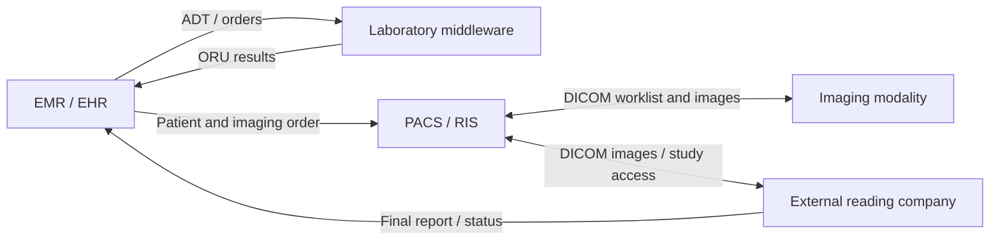
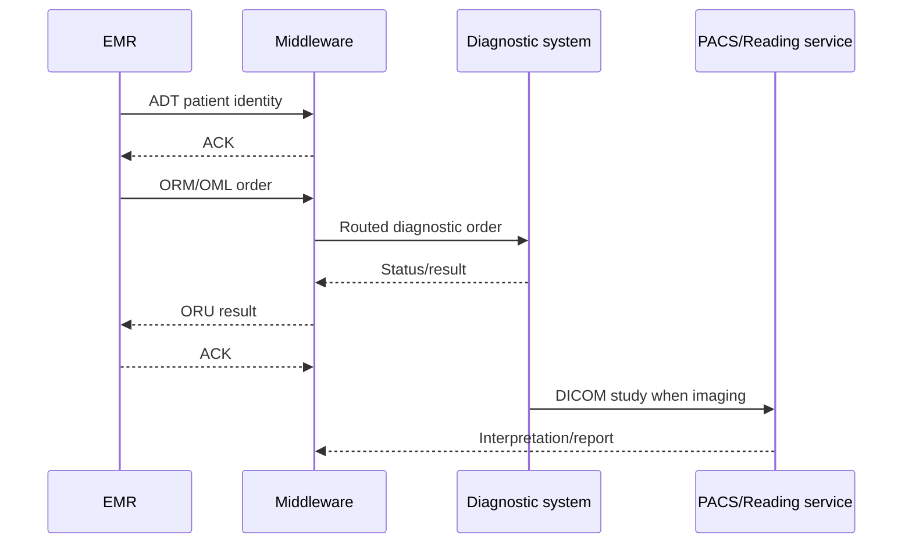

# HL7 OBR — Part 3

## Overview

This guide continues the OBR series by moving from individual segment fields to the complete diagnostic integration workflow. It explains how an Electronic Medical Record (EMR), laboratory middleware, a Picture Archiving and Communication System (PACS), imaging modalities, and an external reading company exchange patient, order, image, and result information.

The lesson also demonstrates two important message families in an HL7 viewer:

- `ADT^A28` for establishing or updating a patient record; and
- `ORU^R01` for returning a laboratory report with multiple `OBX` results beneath one `OBR`.

The examples below are illustrative. Implementations must follow the agreed HL7 version, conformance profile, vocabulary, identifiers, and DICOM workflow of the participating systems.

## Learning Objectives

After studying this guide, you should be able to:

1. identify each system's responsibility in a diagnostic workflow;
2. distinguish patient, order, result, and image exchanges;
3. explain how `ORC`, `OBR`, and `OBX` preserve order/result context;
4. understand why DICOM and HL7 are complementary rather than interchangeable;
5. trace identifiers from the EMR through middleware, PACS, and a reporting service; and
6. inspect an HL7 message at the segment, field, component, and repetition levels.

## End-to-End Architecture



The precise route may differ. For example, a report may return through the RIS/PACS or an integration engine rather than directly to the EMR. The essential requirement is that the patient, accession/order identifiers, procedure, status, and report remain correlated across every hop.

## System Responsibilities

| System | Primary responsibility | Typical exchange |
|---|---|---|
| EMR/EHR | Patient identity, encounter, order entry, result presentation | HL7 ADT, ORM/OML, ORU |
| Integration engine | Routing, transformation, filtering, acknowledgements, monitoring | HL7 v2 and other protocols |
| Laboratory middleware/LIS | Instrument workflow, specimen processing, validation, laboratory results | Orders in; ORU results out |
| RIS/PACS | Imaging workflow, accession tracking, image archive, report association | HL7 plus DICOM |
| Imaging modality | Acquires images and associates them with worklist data | DICOM MWL, MPPS, C-STORE |
| Reading company | Receives study access/images and returns interpretation | DICOM and/or HL7/report API |

## Four Different Kinds of Clinical Exchange

### 1. Patient identity — ADT

Downstream systems must know the patient before safely accepting an order or result. The video demonstrates an `ADT^A28`, commonly used to add person information.

```hl7
MSH|^~\&|EMR|MAIN_HOSPITAL|LAB|MAIN_HOSPITAL|20260927220000||ADT^A28|MSG-ADT-0001|P|2.5.1
EVN|A28|20260927220000
PID|1||MRN-10001^^^MAIN_HOSPITAL^MR||DOE^JANE||19850512|F
```

Important identity fields include:

| Field | Purpose |
|---|---|
| MSH-9 | Message type and trigger event |
| MSH-10 | Unique message-control ID |
| PID-3 | Patient identifier list, including assigning authority and type |
| PID-5 | Patient name |
| PID-7 | Date of birth |
| PID-8 | Administrative sex |

Demographic values can assist reconciliation, but a strongly governed enterprise identifier should be the primary matching key.

### 2. Diagnostic order — ORM/OML

The EMR sends the clinical request to the performing system. Depending on the domain and HL7 version/profile, this may be an `ORM^O01`, an `OML` message, or another order message.

```hl7
MSH|^~\&|EMR|MAIN_HOSPITAL|LAB|MAIN_HOSPITAL|20260927220500||ORM^O01|MSG-ORM-0001|P|2.5.1
PID|1||MRN-10001^^^MAIN_HOSPITAL^MR||DOE^JANE||19850512|F
PV1|1|O|OPD^^ROOM-1
ORC|NW|ORD-2026-1001|||||||20260927220500|||1234567890^PATEL^PRIYA
OBR|1|ORD-2026-1001||57021-8^CBC W Auto Differential panel^LN||||||||||||1234567890^PATEL^PRIYA
```

Key order values are:

- `ORC-1`: the requested order action, such as new, cancel, or discontinue;
- `ORC-2` / `OBR-2`: placer order number assigned by the ordering system;
- `ORC-3` / `OBR-3`: filler order number assigned by the performing system;
- `OBR-4`: requested test, panel, or procedure; and
- `OBR-16`: ordering provider.

### 3. Clinical result — ORU

The performing system returns observations in an `ORU^R01`. One `OBR` supplies report context; its `OBX` segments carry the actual values.

```hl7
MSH|^~\&|LAB|MAIN_HOSPITAL|EMR|MAIN_HOSPITAL|20260927224500||ORU^R01|MSG-ORU-0001|P|2.5.1
PID|1||MRN-10001^^^MAIN_HOSPITAL^MR||DOE^JANE||19850512|F
ORC|RE|ORD-2026-1001|LAB-7788
OBR|1|ORD-2026-1001|LAB-7788|57021-8^CBC W Auto Differential panel^LN||||||||||||1234567890^PATEL^PRIYA||||||20260927224000|||F
OBX|1|NM|6690-2^Leukocytes [#/volume] in Blood^LN||10.1|10*3/uL|3.9-9.7|H|||F|||20260927223800
OBX|2|NM|718-7^Hemoglobin [Mass/volume] in Blood^LN||14.0|g/dL|11.8-15.1|N|||F|||20260927223800
OBX|3|NM|789-8^Erythrocytes [#/volume] in Blood^LN||4.54|10*6/uL|3.8-5.2|N|||F|||20260927223800
```

In this structure:

- the repeated `OBX` segments belong to the preceding `OBR`;
- `OBX-2` declares the data type of `OBX-5`;
- `OBX-3` identifies the observation;
- `OBX-6` provides units;
- `OBX-7` provides the reference range;
- `OBX-8` carries the abnormal flag;
- `OBX-11` carries the observation status; and
- `OBX-14` can carry the observation date/time.

### 4. Images and imaging workflow — DICOM

HL7 usually carries patient, visit, order, status, accession, and report information. DICOM manages imaging-specific workflow and image objects.

| DICOM concept | Role |
|---|---|
| Modality Worklist (MWL) | Supplies scheduled patient/procedure data to the modality |
| Modality Performed Procedure Step (MPPS) | Communicates acquisition progress/status |
| C-STORE | Transfers image objects to an archive or another DICOM node |
| Query/Retrieve | Locates and retrieves studies or series |

An external reading company may receive images or secure study access from PACS and return a preliminary or final interpretation. Do not place large imaging studies directly inside routine HL7 messages unless a specifically agreed profile requires it.

## How OBR Connects the Workflow

`OBR` is the bridge between the request and the returned report.

| Field | Why it matters across systems |
|---|---|
| OBR-2 | Connects the result to the EMR's placer order |
| OBR-3 | Preserves the performing system's filler/accession identifier |
| OBR-4 | Identifies the requested test or procedure |
| OBR-7 / OBR-8 | Defines observation/specimen timing where applicable |
| OBR-16 | Identifies the ordering provider |
| OBR-18 / OBR-19 | Can carry placer/filler workflow identifiers by agreement |
| OBR-22 | Result/report status-change date/time |
| OBR-24 | Diagnostic service section |
| OBR-25 | Overall result status |
| OBR-32 | Principal result interpreter |

The safest correlation uses multiple agreed identifiers—not patient name alone. A common chain is:

```text
Patient MRN + assigning authority
        +
Placer order number
        +
Filler/accession number
        +
Requested procedure code
```

## Imaging Report Example

A radiology interpretation may return as an ORU message while the images remain in PACS:

```hl7
MSH|^~\&|RIS|MAIN_HOSPITAL|EMR|MAIN_HOSPITAL|20260927233000||ORU^R01|MSG-RAD-0001|P|2.5.1
PID|1||MRN-10001^^^MAIN_HOSPITAL^MR||DOE^JANE||19850512|F
ORC|RE|ORD-RAD-1001|ACC-900012
OBR|1|ORD-RAD-1001|ACC-900012|71046^Chest radiograph, 2 views^CPT||||||||||||1234567890^PATEL^PRIYA||||||20260927232500||RAD|F|||||||9988776655^READER^ALEX
OBX|1|TX|FIND^Findings^L||No focal air-space opacity.||||||F
OBX|2|TX|IMP^Impression^L||No acute cardiopulmonary abnormality.||||||F
```

The accession number must be preserved consistently so the report and PACS study are not separated.

## Acknowledgement Flow

Every HL7 transmission needs a clear acknowledgement policy. A minimal positive ACK is:

```hl7
MSH|^~\&|EMR|MAIN_HOSPITAL|LAB|MAIN_HOSPITAL|20260927224501||ACK^R01|ACK-0001|P|2.5.1
MSA|AA|MSG-ORU-0001
```

Common `MSA-1` values are:

| Code | Meaning | Sender action |
|---|---|---|
| AA | Application accept | Mark the delivery successful |
| AE | Application error | Review error detail and retry only when safe |
| AR | Application reject | Correct the message/profile problem before resending |

Transport success alone does not mean the clinical result was filed. Track both delivery and application acknowledgement.

## Inspecting Messages in an HL7 Viewer

The video demonstrates using an HL7 viewer to select a segment and inspect its fields and components. Use this approach during troubleshooting:

1. Confirm the separators declared by `MSH-1` and `MSH-2`.
2. Check `MSH-9`, `MSH-10`, and `MSH-12` for type, identity, and version.
3. Inspect `PID-3` as a composite value rather than a plain string.
4. Confirm `ORC-2`/`ORC-3` agree with `OBR-2`/`OBR-3` when both are present.
5. Select each `OBX` and verify the declared data type, identifier, value, unit, range, flag, status, and observation time.
6. Confirm repetitions (`~`), components (`^`), and subcomponents (`&`) are parsed at the intended level.
7. Compare the parsed tree with the raw pipe-delimited message; never rely only on visual alignment.

## End-to-End Processing Sequence



Actual sequencing may be asynchronous. A result can arrive hours or days after its order, so correlation state must persist reliably.

## Interface Validation Checklist

### Patient identity

- Validate MRN, identifier type, and assigning authority.
- Test patient updates, merges, duplicate identities, and demographic corrections.
- Do not create a new patient automatically from a weak demographic match.

### Orders

- Preserve placer and filler identifiers without trimming or reformatting.
- Validate order-control codes and cancellation/update behavior.
- Map local test/procedure codes to the agreed coding system.
- Verify ordering provider and destination routing.

### Results

- Keep every `OBX` under the correct `OBR`.
- Interpret `OBX-5` according to `OBX-2`.
- Preserve units, reference ranges, abnormal flags, timestamps, and status.
- Test preliminary, final, corrected, and cancelled results.
- Prevent duplicate filing during retransmission.

### Imaging

- Keep MRN, accession number, and procedure codes synchronized across HL7 and DICOM.
- Verify modality worklist values before image acquisition.
- Confirm the report is linked to the correct study.
- Test external-reader outages and delayed report delivery.

### Operations and security

- Record message-control ID, correlation IDs, send/receive times, and ACK status.
- Use idempotent processing and a dead-letter/reconciliation queue.
- Encrypt transports and restrict access to protected health information.
- Avoid placing clinical identifiers or report contents in unrestricted logs.
- Monitor queue depth, message age, error rate, and unacknowledged transmissions.

## Common Failure Scenarios

| Problem | Likely cause | Resolution |
|---|---|---|
| Result cannot find its order | OBR-2/OBR-3 changed or lost | Preserve and map both placer and filler identifiers |
| Correct patient name, wrong chart | Matching relied on demographics | Require governed patient identifiers and assigning authority |
| CBC values display as text | `OBX-2` or local mapping is wrong | Correct the value type and observation mapping |
| Abnormal result appears normal | `OBX-8` ignored | Map abnormal flags and validate UI behavior |
| Imaging report has no study link | Accession mismatch | Reconcile OBR/order identifier with DICOM accession number |
| Duplicate result | Retry was not idempotent | Deduplicate with message and clinical business keys |
| Sender received TCP success but result is absent | Application ACK/error not tracked | Monitor `MSA` outcome and reconciliation queue |

## Key Takeaways

1. HL7 transports patient, order, status, and report context; DICOM transports and manages imaging workflow and objects.
2. An ADT message may need to establish the patient before an order or result is accepted downstream.
3. `OBR` identifies the ordered service/report, while repeated `OBX` segments contain its observations.
4. Placer order number, filler/accession number, patient identifier, and procedure code must survive every system hop.
5. External reading workflows need the same identity and accession discipline as internal systems.
6. Reliable clinical integration requires acknowledgements, idempotency, reconciliation, monitoring, and field-level validation.

---

This README is a practical study guide derived from the **HL7 OBR Part 3** lesson. The applicable HL7 and DICOM standards and the participating systems' conformance profiles remain the authoritative implementation specifications.
