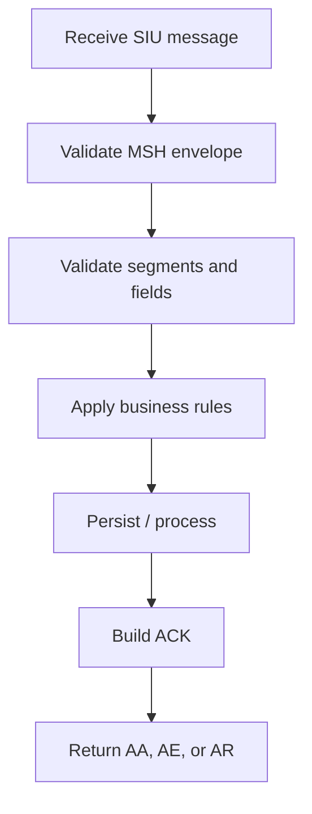
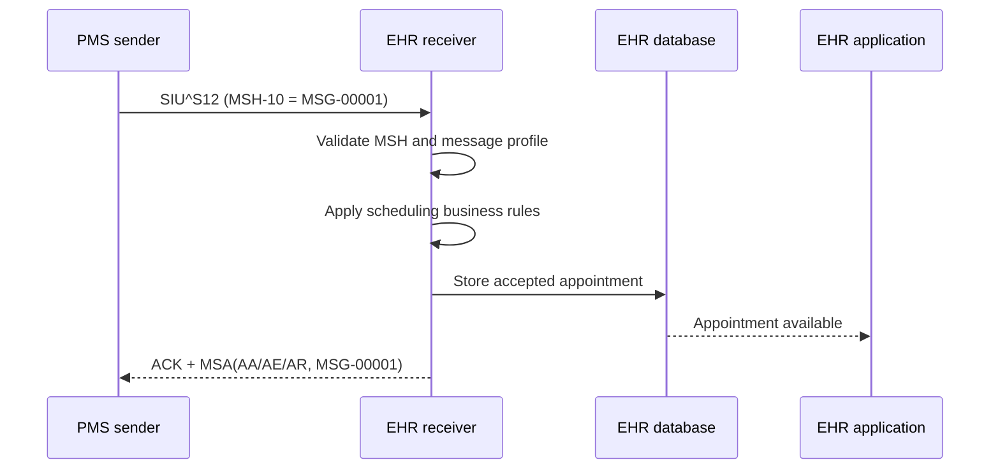

# HL7 ACK — Part 1

## Overview

An HL7 acknowledgement (`ACK`) tells the sending system whether a message was accepted, rejected, or encountered an error. It is a separate HL7 message—not merely a successful network connection.

This guide covers the first ACK lesson:

- the general ACK message structure;
- the `MSA` segment and its fields;
- `AA`, `AE`, and `AR` acknowledgement codes;
- correlation through message-control IDs;
- error reporting with `ERR`;
- application-level acknowledgement in original mode; and
- validation, persistence, timeouts, retries, and duplicate prevention.

The lesson uses an `SIU^S12` scheduling message as its working example. Exact segment usage depends on the declared HL7 version and the interface agreement.

## Why Acknowledgements Matter

When System A sends an HL7 message to System B, several different outcomes are possible:

1. the bytes never reach System B;
2. System B receives the bytes but cannot parse the message;
3. the message parses but violates the expected HL7 profile;
4. the structure is valid but the application cannot process it; or
5. the application processes and stores it successfully.

A TCP connection or MLLP response only proves transport activity. The ACK communicates the receiver's HL7/application outcome and identifies the original message to which that outcome belongs.

## General ACK Structure

The basic general acknowledgement contains:

```text
MSH  Message Header
MSA  Message Acknowledgement
[ERR] Error Information
```

`MSH` describes the acknowledgement message itself. `MSA` supplies the acknowledgement result and references the original message. `ERR` provides structured error details when something went wrong.

```hl7
MSH|^~\&|EHR|HOSPITAL|PMS|CLINIC|20261002071001||ACK|ACK-00001|P|2.3
MSA|AA|MSG-00001
```

## Correlating the ACK With the Original Message

The ACK has its own message-control ID, while `MSA-2` references the original message-control ID:

```text
Original message MSH-10: MSG-00001
ACK message MSH-10:      ACK-00001
ACK MSA-2:               MSG-00001
```

Never copy the ACK's own `MSH-10` into `MSA-2`. The sender uses `MSA-2` to locate the pending outbound message and mark the correct transmission attempt as accepted, failed, or rejected.

## MSA — Message Acknowledgement Segment

| Field | Name | Requiredness/usage |
|---|---|---|
| MSA-1 | Acknowledgement Code | Required; indicates accept, error, or reject |
| MSA-2 | Message Control ID | Required; copies the original message's `MSH-10` |
| MSA-3 | Text Message | Optional human-readable explanation in older versions |
| MSA-4 | Expected Sequence Number | Used only when sequence-number protocol is implemented |
| MSA-5 | Delayed Acknowledgement Type | Legacy/version-dependent field |
| MSA-6 | Error Condition | Legacy/version-dependent; structured `ERR` is preferred in later versions |
| MSA-7 | Message Waiting Number | Optional/version-dependent |
| MSA-8 | Message Waiting Priority | Optional/version-dependent |

The lesson presents all eight fields because they appear in older HL7 definitions. Some later versions remove or deprecate certain fields. Generate and parse the segment according to the version in `MSH-12`, not a single universal layout.

## Original-Mode Acknowledgement Codes

| Code | Meaning | Practical interpretation |
|---|---|---|
| `AA` | Application Accept | The receiving application accepted the message |
| `AE` | Application Error | A receiver-side processing error occurred |
| `AR` | Application Reject | The message cannot be accepted, often because of message/profile problems |

### AA — Application Accept

```hl7
MSH|^~\&|EHR|HOSPITAL|PMS|CLINIC|20261002071001||ACK|ACK-00001|P|2.3
MSA|AA|MSG-00001
```

An `AA` should be returned only after the receiving application has completed the level of validation and processing promised by the interface agreement. It should not be generated merely because the socket received bytes.

### AE — Application Error

```hl7
MSH|^~\&|EHR|HOSPITAL|PMS|CLINIC|20261002071001||ACK|ACK-00002|P|2.3
MSA|AE|MSG-00001|Unable to store appointment
ERR|||SCH^1^0|207^Application internal error^HL70357|E
```

`AE` normally means the message was recognized but could not be processed successfully. The sender should record the error and follow the agreed retry or reconciliation policy.

### AR — Application Reject

```hl7
MSH|^~\&|EHR|HOSPITAL|PMS|CLINIC|20261002071001||ACK|ACK-00003|P|2.3
MSA|AR|MSG-00001|Missing required segment: PV1
ERR|||PV1^1^0|100^Segment sequence error^HL70357|E
```

`AR` indicates that the receiver cannot accept the message as sent. Repeating the identical invalid message will usually fail again; correct the source data or mapping before resubmission.

## Commit Codes in Enhanced Mode

HL7 also defines commit-level acknowledgement codes:

| Code | Meaning |
|---|---|
| `CA` | Commit Accept |
| `CE` | Commit Error |
| `CR` | Commit Reject |

These belong to enhanced acknowledgement workflows and are distinct from application-level `AA`, `AE`, and `AR`. Do not mix the two models casually. Both systems must explicitly agree on original versus enhanced mode and the values used in `MSH-15` and `MSH-16`.

## SIU^S12 Working Example

`SIU^S12` is commonly associated with notification of a new appointment. A simplified inbound message is:

```hl7
MSH|^~\&|PMS|CLINIC|EHR|HOSPITAL|20261002071000||SIU^S12|MSG-00001|P|2.3
SCH|10001|||||ROUTINE||||30|min|^^^20261003100000^20261003103000
PID|1||MRN-10001^^^HOSPITAL^MR||DOE^JANE||19850512|F
PV1|1|O|OPD^^ROOM-1||||1234567890^PATEL^PRIYA
RGS|1
AIG|1||CONSULT^Clinical consultation^L
AIL|1||OPD^^ROOM-1
AIP|1||1234567890^PATEL^PRIYA
```

After receiving it, the EHR validates the envelope, structure, content, and application rules before choosing an acknowledgement outcome.

## Receiver Validation Pipeline



### 1. Validate the MSH envelope

The lesson highlights these header fields:

| Field | Validation |
|---|---|
| MSH-9 | Is the message type and trigger event supported, such as `SIU^S12`? |
| MSH-10 | Is the message-control ID present and unique/idempotently handled? |
| MSH-11 | Is the processing ID appropriate, such as `P`, `T`, or `D`? |
| MSH-12 | Is the declared HL7 version supported? |

Also validate sending/receiving applications and facilities, delimiters, timestamp, and security requirements defined by the interface.

### 2. Validate the message structure

Check that:

- required segments exist;
- segments appear in the permitted order;
- repeating segment groups follow the message profile; and
- unexpected segments are handled according to policy.

For example, if the local `SIU^S12` profile requires `PV1`, its absence may produce an `AR` plus an `ERR` identifying `PV1`.

### 3. Validate individual fields

The receiving system should check:

- required fields;
- maximum lengths;
- data types;
- components and repetitions;
- code-table membership;
- date/time syntax; and
- identifiers and assigning authorities.

### 4. Apply application rules

A syntactically valid message may still fail business validation. Examples include:

- patient not found;
- appointment already exists;
- provider is unknown or inactive;
- location cannot be resolved; or
- appointment time violates application rules.

### 5. Persist and expose the data

When the contract defines an application ACK, return `AA` only after the required durable processing boundary has been reached—for example, after the appointment has been safely stored. If persistence fails, return the agreed error outcome rather than falsely acknowledging success.

## ERR — Error Information

`MSA-3` can contain brief text, but `ERR` is more suitable for machine-readable error details. Depending on the HL7 version, `ERR` can identify:

- the segment, repetition, field, component, and subcomponent;
- an HL7 error code;
- severity;
- application error parameters;
- diagnostic text; and
- user-facing text.

Example:

```hl7
MSA|AR|MSG-00001|Missing required segment: PV1
ERR|||PV1^1^0|100^Segment sequence error^HL70357|E|||PV1 is required by the scheduling profile
```

The exact `ERR` layout is version-dependent. The sender and receiver should agree on the version and the error vocabulary instead of parsing only free text.

## Original-Mode Application Acknowledgement Flow



The diagram in the lesson also illustrates timeout awareness at the sender. The sender keeps a pending record until it receives a correlated ACK or the configured timeout expires.

## Timeouts, Retries, and Duplicate Prevention

An ACK can be lost even after the receiver successfully stores the message. Blindly retrying can therefore create duplicate appointments.

Use this pattern:

1. assign a stable, unique `MSH-10` to the outbound message;
2. store the outbound payload and status before transmission;
3. start an acknowledgement timer;
4. correlate the received `MSA-2` with the original `MSH-10`;
5. retry only under the agreed policy;
6. let the receiver recognize an already processed message-control ID; and
7. return the prior result or safely suppress duplicate processing.

Do not reuse one `MSH-10` for unrelated clinical events. Decide explicitly whether a corrected/resubmitted message receives a new control ID and retain linkage to the original attempt.

## ACK Decision Guide

| Situation | Typical original-mode response | Sender action |
|---|---|---|
| Message validated and processed successfully | `AA` | Mark completed |
| Temporary database/application failure | `AE` | Retry or reconcile according to policy |
| Unsupported message type or version | `AR` | Correct configuration/message before resend |
| Required segment missing | `AR` with `ERR` | Correct source mapping before resend |
| Invalid business data | `AE` or `AR`, by agreement | Correct or manually reconcile |
| No ACK received before timeout | No outcome known | Retry idempotently; do not assume failure |
| ACK contains unknown `MSA-2` | Correlation failure | Quarantine and investigate |

`AE` versus `AR` for a specific validation failure is ultimately an interface-contract decision. Document it so both systems behave consistently.

## Implementation Checklist

### ACK construction

- Swap the original sending and receiving applications/facilities in the ACK header.
- Give the ACK its own unique `MSH-10`.
- Put the original message's `MSH-10` in `MSA-2`.
- Use the agreed ACK code for the actual processing outcome.
- Match the supported HL7 version and acknowledgement mode.
- Add structured `ERR` details for failures.

### Sender behavior

- Persist pending messages and their control IDs.
- Enforce a configurable timeout.
- Correlate on `MSA-2`, not message order.
- Treat `AA`, `AE`, and `AR` differently.
- Quarantine malformed and uncorrelated ACKs.
- Make retransmission safe and idempotent.

### Receiver behavior

- Validate `MSH-9`, `MSH-10`, `MSH-11`, and `MSH-12` first.
- Validate required segments, lengths, data types, codes, and business rules.
- Do not send `AA` before the agreed processing boundary.
- Record the inbound message and ACK result for audit/replay.
- Detect duplicates before creating a second clinical record.
- Avoid exposing protected health information in unrestricted logs or ACK text.

## Common Mistakes

1. Treating TCP delivery as an application acknowledgement.
2. Returning `AA` before validation or persistence completes.
3. Copying the ACK's `MSH-10` into `MSA-2` instead of the original ID.
4. Sending only free-text errors without a structured `ERR` segment.
5. Retrying every `AR` unchanged.
6. Processing retransmissions as new appointments.
7. Mixing original-mode and enhanced-mode codes without an agreement.
8. Assuming one MSA/ERR definition works for every HL7 version.

## Key Takeaways

1. A general ACK contains `MSH`, `MSA`, and optionally `ERR`.
2. `MSA-1` communicates the outcome; `MSA-2` correlates it to the original `MSH-10`.
3. Original mode normally uses `AA`, `AE`, and `AR`.
4. The receiver should validate the envelope, structure, fields, business rules, and required persistence boundary before responding.
5. Timeouts produce an unknown outcome, not proof that processing failed.
6. Safe retry handling requires durable tracking and duplicate prevention.

---

This README is a practical study guide derived from **HL7 ACK Part 1**. The applicable HL7 standard and the sender/receiver conformance agreement remain the authoritative implementation specifications.
