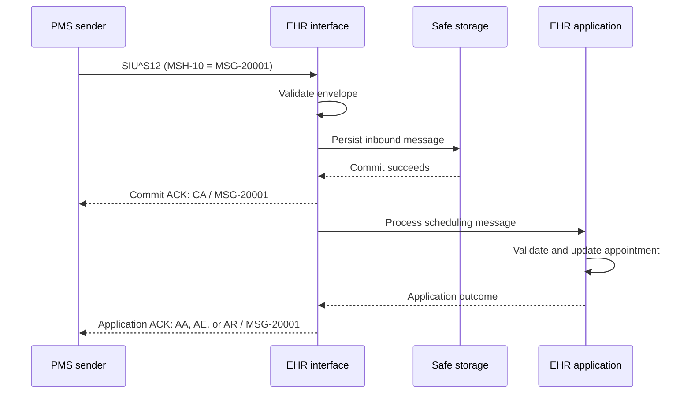

# HL7 ACK — Part 2

## Overview

Part 1 introduced the general ACK, the `MSA` segment, original-mode acknowledgement codes, validation, timeouts, and retry handling. Part 2 extends that model to **enhanced acknowledgement mode** and its two distinct processing stages:

1. **Accept/commit acknowledgement** — confirms whether the receiving system accepted responsibility for the message at the transport/commit boundary.
2. **Application acknowledgement** — reports the later outcome of clinical or business processing.

The lesson describes this coordinated exchange as **acknowledgement choreography**. It also closes with a study approach for understanding common HL7 workflows, real-time data elements, message structures, and core segments.

## Original Mode vs Enhanced Mode

| Feature | Original mode | Enhanced mode |
|---|---|---|
| Number of logical acknowledgement stages | One | Up to two |
| Commit outcome codes | Not separated | `CA`, `CE`, `CR` |
| Application outcome codes | `AA`, `AE`, `AR` | `AA`, `AE`, `AR` |
| Safe-storage confirmation | Implicit in the agreed ACK boundary | Explicit commit acknowledgement |
| Later application result | Same acknowledgement stage | Separate application acknowledgement |
| Configuration fields | Primarily interface agreement | `MSH-15` and `MSH-16` plus interface agreement |

Enhanced mode is useful when the receiver can safely take custody of a message quickly but needs more time to perform full application processing.

## The Two Enhanced-Mode Stages

### Stage 1 — Accept/commit acknowledgement

The receiver checks enough of the message to decide whether it can safely assume responsibility for it. Typical checks include:

- a readable MLLP/HL7 payload;
- valid separators and a parseable `MSH`;
- supported `MSH-9` message type and trigger event;
- appropriate `MSH-11` processing ID;
- supported `MSH-12` version;
- a usable `MSH-10` message-control ID; and
- successful storage in a durable inbound queue or equivalent safe-storage mechanism.

The response uses one of these codes:

| Code | Meaning | Interpretation |
|---|---|---|
| `CA` | Commit Accept | The receiver accepted custody of the message |
| `CE` | Commit Error | An error occurred while attempting to accept/commit it |
| `CR` | Commit Reject | The message was rejected at the commit stage |

### Stage 2 — Application acknowledgement

After commit acceptance, the receiving application continues with deeper work:

- message-profile validation;
- required-segment and required-field validation;
- length, data-type, code-table, and identifier checks;
- clinical/business-rule validation;
- database updates; and
- delivery to the target user workflow or application.

It then sends an application outcome:

| Code | Meaning | Interpretation |
|---|---|---|
| `AA` | Application Accept | Application processing completed successfully |
| `AE` | Application Error | The application recognized the message but failed to process it |
| `AR` | Application Reject | The application cannot accept the message as submitted |

## Safe Storage Is the Commit Boundary

`CA` should mean more than “the socket read the bytes.” It normally indicates that the receiver has durably stored the message and can continue processing it even if the network connection closes or the service restarts.

Examples of safe storage include:

- a transactional database inbox;
- a durable message queue;
- a persistent integration-engine message store; or
- another recoverable store defined by the interface architecture.

An in-memory queue alone is not safe storage when a restart can lose the message.

## MSH-15 and MSH-16

Enhanced acknowledgement behavior is requested through two fields in the original message:

| Field | Name | Controls |
|---|---|---|
| MSH-15 | Accept Acknowledgement Type | Whether an accept/commit acknowledgement is requested |
| MSH-16 | Application Acknowledgement Type | Whether an application acknowledgement is requested |

Common values are:

| Value | Meaning |
|---|---|
| `AL` | Always |
| `NE` | Never |
| `ER` | Only on error/reject |
| `SU` | Only on successful completion |

Example requesting both acknowledgement stages:

```hl7
MSH|^~\&|PMS|CLINIC|EHR|HOSPITAL|20261002081000||SIU^S12|MSG-20001|P|2.5.1|||AL|AL
SCH|APT-10001|||||ROUTINE||||30|min|^^^20261003100000^20261003103000
PID|1||MRN-10001^^^HOSPITAL^MR||DOE^JANE||19850512|F
PV1|1|O|OPD^^ROOM-1||||1234567890^PATEL^PRIYA
RGS|1
AIG|1||CONSULT^Clinical consultation^L
AIL|1||OPD^^ROOM-1
AIP|1||1234567890^PATEL^PRIYA
```

In the `MSH` above:

- `MSH-15 = AL` requests an accept/commit acknowledgement for every message.
- `MSH-16 = AL` requests an application acknowledgement for every message.

The participating systems must still agree on the acknowledgement mode and behavior. Never infer enhanced mode from one field without considering the version and interface profile.

## Complete Enhanced Acknowledgement Choreography



The sender must treat the two ACKs as separate state transitions. A `CA` confirms custody, not successful appointment creation.

## Example: Commit Accept Followed by Application Accept

### 1. Original scheduling message

```hl7
MSH|^~\&|PMS|CLINIC|EHR|HOSPITAL|20261002081000||SIU^S12|MSG-20001|P|2.5.1|||AL|AL
SCH|APT-10001|||||ROUTINE||||30|min|^^^20261003100000^20261003103000
PID|1||MRN-10001^^^HOSPITAL^MR||DOE^JANE||19850512|F
PV1|1|O|OPD^^ROOM-1||||1234567890^PATEL^PRIYA
```

### 2. Commit acknowledgement

```hl7
MSH|^~\&|EHR|HOSPITAL|PMS|CLINIC|20261002081001||ACK|ACK-COMMIT-0001|P|2.5.1
MSA|CA|MSG-20001
```

This means the EHR accepted custody of `MSG-20001`. The scheduling transaction may still be waiting in a durable queue.

### 3. Application acknowledgement

```hl7
MSH|^~\&|EHR|HOSPITAL|PMS|CLINIC|20261002081004||ACK|ACK-APP-0001|P|2.5.1
MSA|AA|MSG-20001
```

This means the EHR application successfully processed the appointment message.

Each acknowledgement has its own unique `MSH-10`, but both place the original control ID `MSG-20001` in `MSA-2`.

## Negative Commit Outcomes

### Commit Error (`CE`)

Use `CE` when the receiver encountered a commit-stage error, such as failure to write to safe storage:

```hl7
MSH|^~\&|EHR|HOSPITAL|PMS|CLINIC|20261002081001||ACK|ACK-COMMIT-0002|P|2.5.1
MSA|CE|MSG-20001|Unable to persist inbound message
ERR|||MSH^1^10|207^Application internal error^HL70357|E
```

The sender may retry according to policy, but the retry must remain idempotent because the true storage outcome can sometimes be uncertain.

### Commit Reject (`CR`)

Use `CR` when the receiver cannot accept the message at the commit boundary—for example, because the message type or HL7 version is unsupported:

```hl7
MSH|^~\&|EHR|HOSPITAL|PMS|CLINIC|20261002081001||ACK|ACK-COMMIT-0003|P|2.5.1
MSA|CR|MSG-20001|Unsupported HL7 version
ERR|||MSH^1^12|203^Unsupported version ID^HL70357|E
```

Resending the identical rejected message is unlikely to succeed. Correct the configuration or payload first.

## Negative Application Outcomes After CA

A message can receive `CA` and later receive `AE` or `AR`. This is not contradictory:

- `CA`: the receiver safely accepted responsibility for the message.
- `AE`/`AR`: later application processing did not complete successfully.

Example:

```hl7
MSH|^~\&|EHR|HOSPITAL|PMS|CLINIC|20261002081005||ACK|ACK-APP-0002|P|2.5.1
MSA|AR|MSG-20001|Patient identifier cannot be resolved
ERR|||PID^1^3|204^Unknown key identifier^HL70357|E
```

The sender should move this transaction from “committed” to an application-error or reconciliation state—not back to “never received.”

## Sender State Model

| State | Trigger | Meaning |
|---|---|---|
| Created | Outbound message built | Not yet transmitted |
| Sent, commit pending | Transmission completed | Waiting for `CA`, `CE`, or `CR` |
| Commit accepted | `CA` received | Receiver owns the message; application result may still be pending |
| Commit failed | `CE` or `CR` received | Commit-stage failure/rejection |
| Application accepted | `AA` received | End-to-end application success |
| Application failed | `AE` or `AR` received | Requires retry, correction, or reconciliation by policy |
| Timed out | Expected ACK not received | Outcome is unknown and must be investigated or retried safely |

Store the commit and application outcomes separately. A single Boolean `acknowledged` flag cannot represent enhanced-mode choreography correctly.

## Independent Timeouts

Use different timers for the two stages:

- **Commit-ACK timeout:** short, because envelope checks and safe storage should normally be quick.
- **Application-ACK timeout:** potentially longer, because business validation and downstream processing may be asynchronous.

The specific durations belong in the interface agreement. A timeout does not prove failure; it means the sender did not receive the expected evidence within the agreed period.

## Retry Rules

| Outcome | Recommended response |
|---|---|
| `CA` | Do not resend merely because the application ACK is still pending |
| `CE` | Retry only under the configured transient-error policy |
| `CR` | Correct the message or configuration before resending |
| `AA` | Mark the transaction complete |
| `AE` | Retry or reconcile according to error classification |
| `AR` | Correct the clinical/profile problem before resending |
| Commit timeout | Query/retry idempotently; custody is unknown |
| Application timeout after `CA` | Reconcile application status; do not assume the receiver lost the message |

The receiver should use the original `MSH-10` and agreed business identifiers to detect duplicate delivery.

## Acknowledgement Coordination Rules

1. Preserve the original message-control ID through both ACK stages.
2. Assign a distinct `MSH-10` to every ACK message.
3. Send `CA` only after the message is durably recoverable.
4. Do not treat `CA` as proof that business processing succeeded.
5. Return the application ACK only after the agreed application boundary.
6. Use structured `ERR` information for failures.
7. Log the stage, code, correlation ID, timestamp, and processing attempt.
8. Prevent duplicate clinical actions during retries or replay.

## Operational Data Model

A production interface should retain at least:

| Attribute | Purpose |
|---|---|
| Original MSH-10 | End-to-end correlation |
| Message type/trigger | Routing and workflow classification |
| Sender and receiver | Trading-partner validation |
| Payload hash | Duplicate and integrity checks |
| Transmission attempts | Retry audit |
| Commit ACK code/time | Custody state |
| Commit ACK MSH-10 | ACK audit/correlation |
| Application ACK code/time | Business-processing state |
| Application ACK MSH-10 | ACK audit/correlation |
| Error location/code/text | Troubleshooting and reconciliation |
| Final disposition | Completed, retrying, rejected, or manually reconciled |

## Practical HL7 Study Method

The lesson concludes by emphasizing that knowing segment names is not enough. For each interface, study four layers:

### 1. Understand the workflow

Identify the real clinical event, the system of origin, all receiving systems, the expected state change, and the acknowledgement responsibility.

### 2. Identify real-time data elements

Document which identifiers, dates, providers, locations, orders, observations, financial values, and statuses actually drive the receiving application.

### 3. Learn the message structure

Know the required and optional segment groups, repetition rules, trigger event, and version-specific profile.

### 4. Trace the core segments

The lesson highlights these commonly encountered messages and segments:

| Area | Common message/segments | Purpose |
|---|---|---|
| Patient administration | `ADT`, `MSH`, `PID`, `PV1` | Patient and encounter lifecycle |
| Scheduling | `SIU`, `SCH`, `RGS`, resource segments | Appointment workflow |
| Financial transactions | `DFT`, `FT1` | Charges and financial activity |
| Orders | `ORM`, `ORC`, `OBR` | Diagnostic/service requests |
| Results | `ORU`, `OBR`, `OBX` | Clinical observations and reports |
| Acknowledgements | `ACK`, `MSA`, `ERR` | Delivery/processing outcomes |

The correct segment meaning always depends on the workflow, trigger event, HL7 version, and implementation profile.

## Enhanced-Mode Validation Checklist

- Confirm both systems explicitly support enhanced acknowledgement mode.
- Validate `MSH-15` and `MSH-16` against the interface agreement.
- Maintain separate commit and application ACK state.
- Check `MSA-2` against the original `MSH-10` for every ACK.
- Treat `CA`, `CE`, and `CR` only as commit-stage outcomes.
- Treat `AA`, `AE`, and `AR` only as application-stage outcomes.
- Define the safe-storage boundary precisely.
- Configure independent commit and application timeouts.
- Make retries and replays idempotent.
- Persist structured errors and route unresolved messages to reconciliation.
- Test success, commit failure, application failure, duplicate delivery, lost ACK, delayed ACK, restart recovery, and out-of-order ACK delivery.

## Common Mistakes

1. Treating `CA` as final application success.
2. Sending `CA` before durable storage succeeds.
3. Using one status flag for both acknowledgement stages.
4. Retrying after `CA` merely because `AA` is delayed.
5. Using `AA`/`AE`/`AR` where a commit response is expected.
6. Mixing original and enhanced modes without configuring `MSH-15`/`MSH-16`.
7. Failing to correlate both ACKs with the original `MSH-10`.
8. Ignoring delayed or out-of-order application acknowledgements.
9. Learning fields without understanding the clinical workflow and message structure.

## Key Takeaways

1. Enhanced mode separates message custody from application processing.
2. `CA`, `CE`, and `CR` describe the commit stage; `AA`, `AE`, and `AR` describe the application stage.
3. `MSH-15` and `MSH-16` communicate the requested acknowledgement behavior.
4. Both ACKs correlate to the same original `MSH-10` through `MSA-2`.
5. A safe, durable inbound store is central to a meaningful commit acknowledgement.
6. Reliable interfaces track two states, two timeout classes, structured errors, and idempotent retries.
7. Effective HL7 learning starts with workflow and real-time data, then moves into message and segment structure.

---

This README is a practical study guide derived from **HL7 ACK Part 2**. The applicable HL7 standard and the participating systems' conformance agreement remain the authoritative implementation specifications.
