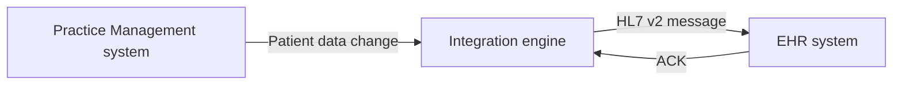
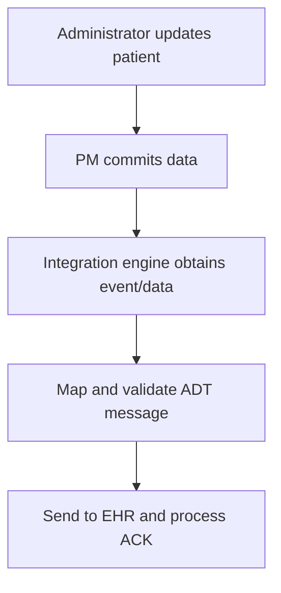

# HL7 Workflow: Practice Management to EHR — Part 1

This guide documents the concepts demonstrated in **HL7 Workflow PM to EHR Part 1**. The lesson begins with an `ADT^A08` message, uses an HL7 viewer to inspect its structure, and then introduces the outbound workflow from a Practice Management (PM) system to an Electronic Health Record (EHR).

> **Scope:** Part 1 explains the sample message, viewer-assisted analysis, and the beginning of the **export** workflow. The **import** workflow is introduced near the end but is not developed in detail in this video. Sections marked **Implementation guidance** extend the demonstration with production practices.

## Learning objectives

After working through this guide, you should be able to:

- recognize the purpose of an `ADT^A08` message;
- identify the major segments in the demonstrated message;
- distinguish fields, components, repetitions, and subcomponents;
- inspect an HL7 v2 message with a structured viewer;
- explain how a PM user action can result in an HL7 message sent to an EHR;
- describe the integration engine's role in extraction, transformation, delivery, and monitoring;
- identify the additional controls required for a reliable production interface.

## 1. Workflow context

The video uses the following high-level relationship:



### Systems and responsibilities

| Component | Responsibility |
|---|---|
| Practice Management system | Source application in this workflow. An administrative action creates or updates patient information. |
| PM database | Stores the committed application data from which an interface event may be produced. |
| Integration engine | Detects or receives the event, retrieves required data, transforms it into HL7, validates it, and sends it. |
| EHR | Destination application that receives and processes the patient update. |
| HL7 viewer | Development and troubleshooting tool used to inspect message structure; it is not itself the production transport. |

PM and EHR are roles in this lesson. Exact ownership of each field, transport method, acknowledgment mode, and trigger condition must be agreed in the interface specification.

## 2. The demonstrated message: `ADT^A08`

`ADT` means **Admission, Discharge, and Transfer**. `A08` is commonly used to communicate an update to patient information when the update does not represent a different, more specific ADT event.

The message type appears in `MSH-9`:

```text
ADT^A08
```

- `ADT` is the message code.
- `A08` is the trigger event.
- Some profiles also populate a third component, such as `ADT_A01`, for the message structure.

An A08 does not mean that every receiving system will update every supplied field. The receiver's conformance profile and interface agreement determine what is supported.

## 3. Fictional normalized example

The following example mirrors the lesson's structure but uses fictional test data. Real messages are normally delimited by carriage returns (`\r`), even though they are displayed here one segment per line.

```hl7
MSH|^~\&|PMS|TESTCLINIC|EHR|TESTHOSPITAL|20260922103000||ADT^A08|MSG000001|T|2.3
EVN|A08|20260922103000
PID|1||81698786^^^TESTCLINIC^MR~0008169^^^EHR^PI||PATIENT^TAYLOR^A||19850314|U|||100 MAIN ST^^TESTVILLE^CA^90000||5555550100
PV1|1|O|CLINIC^ROOM1^A||||1234^PROVIDER^CASEY
PV2|||ROUTINE FOLLOW-UP
GT1|1||PATIENT^TAYLOR^A||100 MAIN ST^^TESTVILLE^CA^90000|5555550100
IN1|1|TESTPLAN|PLAN001|TEST INSURANCE
IN2|1
```

> Never send real protected health information in documentation, screenshots, tickets, or non-production test systems. Use approved synthetic data.

## 4. Segment map

The viewer in the video exposes a segment tree containing `MSH`, `EVN`, `PID`, `PV1`, `PV2`, `GT1`, `IN1`, and `IN2`.

| Segment | Name | Purpose in this message |
|---|---|---|
| `MSH` | Message Header | Identifies sender, receiver, message type, control ID, processing mode, and HL7 version. |
| `EVN` | Event Type | Carries information about the event and its recorded time. |
| `PID` | Patient Identification | Carries patient identifiers, name, birth date, sex, address, and contact details. |
| `PV1` | Patient Visit | Carries visit class, location, providers, and visit-related information. |
| `PV2` | Patient Visit—Additional Information | Extends visit information when needed. |
| `GT1` | Guarantor | Identifies the person or organization financially responsible. |
| `IN1` | Insurance | Carries insurance plan and payer information. |
| `IN2` | Insurance—Additional Information | Extends insurance information when required. |

Segment presence does not guarantee that every field is populated or accepted. Optionality is controlled by the applicable HL7 version, implementation profile, and bilateral interface specification.

## 5. Important MSH fields

For a line beginning with `MSH|`, the first visible character after `MSH` is special: `MSH-1` is the field separator (`|`), while `MSH-2` contains the encoding characters (`^~\&`).

| Field | Meaning | Example | Why it matters |
|---|---|---|---|
| `MSH-3` | Sending Application | `PMS` | Identifies the source application. |
| `MSH-4` | Sending Facility | `TESTCLINIC` | Identifies the source organization or location. |
| `MSH-5` | Receiving Application | `EHR` | Routes the message to the target application. |
| `MSH-6` | Receiving Facility | `TESTHOSPITAL` | Identifies the target organization or location. |
| `MSH-7` | Date/Time of Message | `20260922103000` | Records when the message was created. |
| `MSH-9` | Message Type | `ADT^A08` | Declares the message code and trigger event. |
| `MSH-10` | Message Control ID | `MSG000001` | Uniquely correlates the message with its acknowledgment. |
| `MSH-11` | Processing ID | `T` | Indicates processing context, such as test or production. |
| `MSH-12` | Version ID | `2.3` | Tells the receiver which HL7 version is represented. |

Do not hard-code production routing based only on human-readable names. Agree on exact application/facility identifiers and environment-specific values.

## 6. HL7 delimiters and hierarchy

The encoding characters in the example are:

| Character | Level | Example use |
|---|---|---|
| `\r` | Segment terminator | Separates `MSH`, `PID`, `PV1`, and other segments. |
| `|` | Field separator | Separates `PID-3` from `PID-4`. |
| `^` | Component separator | Separates family name, given name, and other name components. |
| `~` | Repetition separator | Allows a field such as `PID-3` to contain multiple identifiers. |
| `&` | Subcomponent separator | Splits a component into smaller values where the datatype permits it. |
| `\` | Escape character | Introduces an HL7 escape sequence. |

### Repeated patient identifiers

The lesson highlights repeated values in `PID-3`. A normalized example is:

```text
81698786^^^TESTCLINIC^MR~0008169^^^EHR^PI
```

This is one field with two repetitions:

| Repetition | ID value | Assigning authority | Identifier type |
|---|---|---|---|
| 1 | `81698786` | `TESTCLINIC` | `MR` (medical record number) |
| 2 | `0008169` | `EHR` | `PI` (patient internal identifier) |

The exact component positions depend on the HL7 datatype and version. A receiver should select an identifier using qualifiers such as assigning authority and identifier type—not simply assume that the first repetition is always correct.

## 7. Inspecting the message with an HL7 viewer

The video mentions several viewer tools:

- HL7 Spy
- HL7 Inspector
- HL7 Smart Viewer
- HL7 Soup

The demonstration uses **SmartHL7 Message Viewer**. Product availability and licensing can change; the important technique is tool-independent.

### Suggested inspection procedure

1. Copy the raw message into a plain-text editor such as Notepad++.
2. Confirm that each segment is separated correctly. Convert line endings to carriage returns if the viewer requires them.
3. Load or paste the message into the HL7 viewer.
4. Verify that the viewer detects the intended version and message type.
5. Expand the segment tree.
6. Select a segment, such as `PID`.
7. Review field names and values.
8. Expand components, repetitions, and subcomponents.
9. Compare the parsed values with the receiver's interface specification.
10. Record any structural, datatype, vocabulary, or required-field errors.

### What the viewer helps reveal

- the boundary of each segment and field;
- the human-readable name associated with a field position;
- composite datatype components;
- repeated identifiers or other repeated fields;
- empty fields that are hard to count manually;
- whether delimiters or segment terminators are malformed.

A viewer proves that a message can be parsed; it does **not** prove that the message conforms to a particular receiver's business rules.

## 8. Export workflow shown in Part 1

The video's notes describe export as a real-time administrative action. The integration engine picks data from the database, transforms it into an HL7 message, and sends the result to the destination system.



### Step-by-step interpretation

1. **Administrative action** — A user registers a patient or updates demographics, visit, guarantor, or insurance information in the PM system.
2. **Database commit** — The PM application validates and commits the change.
3. **Event detection** — The integration engine learns that an eligible change occurred.
4. **Data acquisition** — The engine receives the event payload or retrieves the required committed records.
5. **Transformation** — Source values are mapped into the agreed HL7 version and message profile.
6. **Validation** — Required fields, datatypes, codes, identifiers, and routing values are checked.
7. **Delivery** — The encoded message is sent to the EHR using the agreed transport.
8. **Acknowledgment** — The engine receives and interprets an HL7 ACK when the interface uses one.
9. **Audit/status update** — The event is marked delivered, rejected, or pending retry.

Steps 8–9 are production guidance that completes the operational lifecycle; they are not fully demonstrated in Part 1.

## 9. Detecting database changes safely

**Implementation guidance:** “Pick data from the DB” describes the concept, but repeatedly scanning arbitrary application tables is fragile. Prefer a supported integration mechanism:

| Pattern | Description | Considerations |
|---|---|---|
| Application event/API | The PM publishes a committed event or invokes an interface API. | Strong ownership and low latency; requires application support. |
| Transactional outbox | The business change and outbound event are committed atomically. | Reliable and replayable; requires an outbox publisher. |
| Change data capture | Database logs expose committed changes. | Low source impact; needs careful filtering and schema governance. |
| Interface/staging table | The application writes integration-ready events to a dedicated table. | Simple to operate; requires status and locking discipline. |
| Scheduled query | The engine polls using a watermark or status column. | Easy to begin; vulnerable to duplicates, gaps, and source load if poorly designed. |

Whichever pattern is chosen:

- read only committed data;
- assign a stable event or message ID;
- avoid updating vendor-owned tables unless explicitly supported;
- store a durable processing status;
- use transactions or locks to prevent two workers taking the same event;
- preserve enough source context to rebuild or replay the message;
- protect credentials and PHI in logs.

## 10. Mapping source data to HL7

Create a mapping specification before implementing the transformation.

| Source value | HL7 target | Example rule |
|---|---|---|
| Source system name | `MSH-3` | Use the agreed sending-application code. |
| Clinic/location code | `MSH-4` | Translate local facility code to interface code. |
| Current timestamp | `MSH-7` | Format as an HL7 timestamp and document timezone handling. |
| Event type | `MSH-9`, `EVN-1` | Map an eligible demographic update to `ADT^A08` and `A08`. |
| Event UUID | `MSH-10` | Create a unique, durable message control ID. |
| Patient identifiers | `PID-3` | Repeat qualified CX values; include assigning authority/type. |
| Patient name | `PID-5` | Map family, given, middle, suffix, and prefix components. |
| Date of birth | `PID-7` | Format according to the agreed precision. |
| Administrative sex | `PID-8` | Translate to the receiver's accepted vocabulary. |
| Visit class | `PV1-2` | Map the local encounter type to the agreed HL7 code. |
| Guarantor | `GT1` | Include only when required and permitted. |
| Insurance plan | `IN1`/`IN2` | Map plan identifiers and payer values per the profile. |

### Transformation pseudocode

```text
event = claimNextCommittedEvent()
patient = loadPatientSnapshot(event.patientId)

message.MSH = buildHeader(
  type = "ADT^A08",
  controlId = event.messageId,
  version = "2.3"
)
message.EVN = buildEvent(event)
message.PID = mapPatient(patient)
message.PV1 = mapVisit(patient.currentVisit)
message.GT1 = mapGuarantor(patient.guarantor)
message.IN1 = mapInsurance(patient.insurance)

validate(message)
send(message)
processAcknowledgment(event.messageId)
```

Build segments according to the destination's profile. Do not emit empty optional segments merely because they appear in a sample.

## 11. Transport and acknowledgments

The video focuses on message construction and workflow rather than a specific transport. HL7 v2 may be exchanged through MLLP over TCP, files, queues, APIs, or vendor-specific mechanisms. Both sides must agree on framing, encoding, connection behavior, TLS/VPN requirements, timeouts, and acknowledgment semantics.

### Fictional acknowledgment

```hl7
MSH|^~\&|EHR|TESTHOSPITAL|PMS|TESTCLINIC|20260922103002||ACK^A08|ACK000001|T|2.3
MSA|AA|MSG000001
```

`MSA-2` echoes the original `MSH-10`, allowing the engine to correlate the ACK with the outbound message.

| ACK code | General meaning | Typical engine action |
|---|---|---|
| `AA` | Application accept | Mark the message acknowledged. |
| `AE` | Application error | Record the error; retry only if the error is recoverable. |
| `AR` | Application reject | Quarantine/escalate; correct routing, structure, or policy issue. |

Do not treat a successful TCP write as successful application processing. Define what constitutes delivery: connection success, commit ACK, application ACK, or a downstream business confirmation.

## 12. Reliability controls

**Implementation guidance:** A production channel should include:

- **Idempotency:** replaying the same event must not create a second patient or corrupt data.
- **Unique control IDs:** generate and persist `MSH-10`; do not casually reuse it.
- **Retry policy:** use bounded retries and backoff for transient failures.
- **Dead-letter handling:** quarantine messages that require correction.
- **Ordering:** preserve order when two updates for the same patient must not be reversed.
- **Auditability:** retain event ID, control ID, timestamps, route, outcome, and safe error detail.
- **Observability:** alert on queue growth, connection failure, ACK errors, unusual latency, and message-rate changes.
- **Replay:** provide a controlled, authorized procedure that avoids duplicate side effects.
- **Privacy:** mask PHI in routine logs and restrict message access.
- **Disaster recovery:** document how unprocessed and unacknowledged events are recovered.

### Example processing states

```text
NEW -> CLAIMED -> TRANSFORMED -> SENT -> ACKNOWLEDGED
                         |          |
                         v          v
                      ERROR      RETRY / QUARANTINE
```

The stored state should distinguish “not sent,” “sent but ACK unknown,” and “receiver rejected.” Those conditions have different recovery actions.

## 13. Import workflow: preview only

The video introduces **Import of data** at the end, but its detailed explanation belongs to a later part. At a conceptual level, the reverse direction usually consists of:

1. receive and safely frame the incoming message;
2. parse it using the declared delimiters and version;
3. authenticate/authorize the source as required;
4. validate syntax, profile rules, identifiers, and codes;
5. map HL7 values to the destination's internal data model;
6. apply business rules and persist atomically;
7. generate the appropriate ACK;
8. audit the outcome without exposing unnecessary PHI.

Do not infer detailed import behavior from Part 1 alone.

## 14. Validation checklist

### Message structure

- [ ] `MSH` is first and all segments use the correct terminator.
- [ ] `MSH-1` and `MSH-2` declare the delimiters actually used.
- [ ] `MSH-9` contains the agreed message type and trigger event.
- [ ] `MSH-12` matches the agreed HL7 version.
- [ ] Required segments are present in the correct order.
- [ ] Required fields and components are populated.
- [ ] Repetitions and escape sequences are valid.

### Identity and business rules

- [ ] Each `PID-3` identifier has the expected assigning authority and type.
- [ ] The receiver has a deterministic patient-match strategy.
- [ ] Code sets are translated to accepted destination values.
- [ ] Dates/times have the required precision and timezone policy.
- [ ] Visit, guarantor, and insurance segments meet the receiver's rules.
- [ ] The event qualifies for A08 rather than another trigger.

### Routing and operations

- [ ] Sender, receiver, facility, environment, and endpoint values are correct.
- [ ] `MSH-10` is unique and stored with the source event.
- [ ] Transport security, framing, encoding, timeout, and ACK mode are agreed.
- [ ] Positive, negative, delayed, duplicate, and missing ACK cases are tested.
- [ ] Retry, quarantine, replay, alerting, and support ownership are documented.
- [ ] Logs and screenshots comply with privacy policy.

## 15. Common mistakes

| Mistake | Consequence | Better approach |
|---|---|---|
| Counting `MSH` like every other segment | Header fields appear shifted by one. | Remember that `MSH-1` is the field separator itself. |
| Selecting the first `PID-3` repetition blindly | Wrong patient identifier is stored or matched. | Match on assigning authority and identifier type. |
| Using line feed only when carriage return is required | Receiver may see one invalid segment. | Normalize and verify segment terminators. |
| Treating viewer success as conformance | Receiver rejects a syntactically parseable message. | Validate against the receiver's profile and business rules. |
| Sending before the source transaction commits | Message and PM database disagree. | Publish or claim only committed events. |
| Regenerating a new control ID on every retry | ACK correlation and deduplication break. | Define retry/replay ID rules and persist identifiers. |
| Retrying every error forever | Poison messages block queues or flood the receiver. | Classify errors and use bounded retry plus quarantine. |
| Logging complete production messages by default | Unnecessary PHI exposure. | Use access controls, masking, and retention limits. |

## 16. Testing scenarios

At minimum, test:

1. a valid demographic update;
2. multiple `PID-3` identifiers;
3. optional or missing name/address components;
4. delimiter characters embedded in source text and correct escaping;
5. unsupported code values;
6. missing required identifiers;
7. duplicate delivery of the same message;
8. two rapid updates for the same patient;
9. receiver timeout after the message may have been processed;
10. `AA`, `AE`, and `AR` acknowledgments;
11. connection interruption and recovery;
12. quarantine, correction, and authorized replay.

Use approved synthetic patients and validate both the HL7 output and the resulting EHR state.

## 17. Quick review

- An `ADT^A08` communicates a patient-information update.
- `MSH` controls message identity, routing, type, environment, and version.
- The sample includes patient, visit, guarantor, and insurance segments.
- HL7 viewers make fields, components, repetitions, and subcomponents easier to inspect.
- The PM-to-EHR export begins with a real-time administrative action.
- The integration engine obtains committed data, transforms it into HL7, validates it, and sends it.
- A production interface also needs acknowledgments, durable status, idempotency, retries, monitoring, privacy controls, and replay procedures.
- Part 1 only begins the import topic; its detailed workflow should be documented separately.

## 18. Knowledge check

1. Which MSH field contains `ADT^A08`?
2. Why is `MSH-10` important?
3. What character separates repeated patient identifiers in `PID-3`?
4. Why should the engine qualify an identifier by assigning authority and type?
5. What is the difference between parsing successfully and conforming to a receiver's profile?
6. What should happen after the destination returns `AE`?
7. Why is reading only committed source data important?
8. Which part of the PM-to-EHR workflow is not fully covered in Part 1?

### Answers

1. `MSH-9`.
2. It uniquely identifies the message and supports ACK correlation, audit, and deduplication.
3. The repetition separator, normally `~`.
4. Different systems may assign different identifiers to the same patient.
5. Parsing verifies structure; profile conformance also verifies receiver-specific constraints and business rules.
6. Capture the error and retry only if it is classified as recoverable; otherwise quarantine and escalate.
7. It prevents the interface from publishing incomplete or rolled-back application state.
8. The detailed import workflow.

## 19. Practical deliverables for an interface project

Before implementation sign-off, prepare:

- an interface scope and data-flow diagram;
- the sender and receiver conformance profiles;
- a source-to-HL7 mapping workbook;
- code-set and identifier crosswalks;
- sample positive and negative messages using synthetic data;
- transport and security specifications;
- ACK, retry, quarantine, and replay rules;
- monitoring thresholds and support ownership;
- test evidence and acceptance criteria;
- deployment, rollback, and disaster-recovery procedures.

---

**Document basis:** prepared from *HL7 Workflow PM to EHR Part 1*. Examples are normalized and fictional. Production behavior must be verified against the applicable HL7 specification, vendor documentation, conformance profiles, security policy, and interface agreement.
