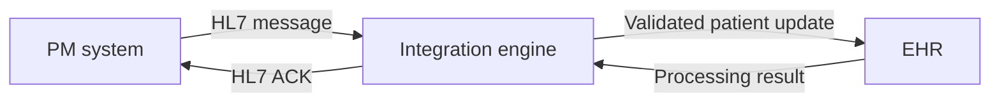
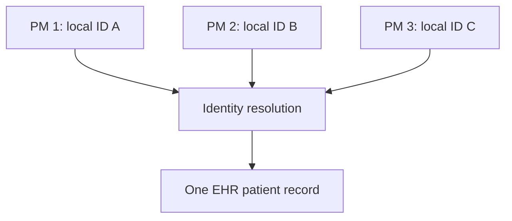
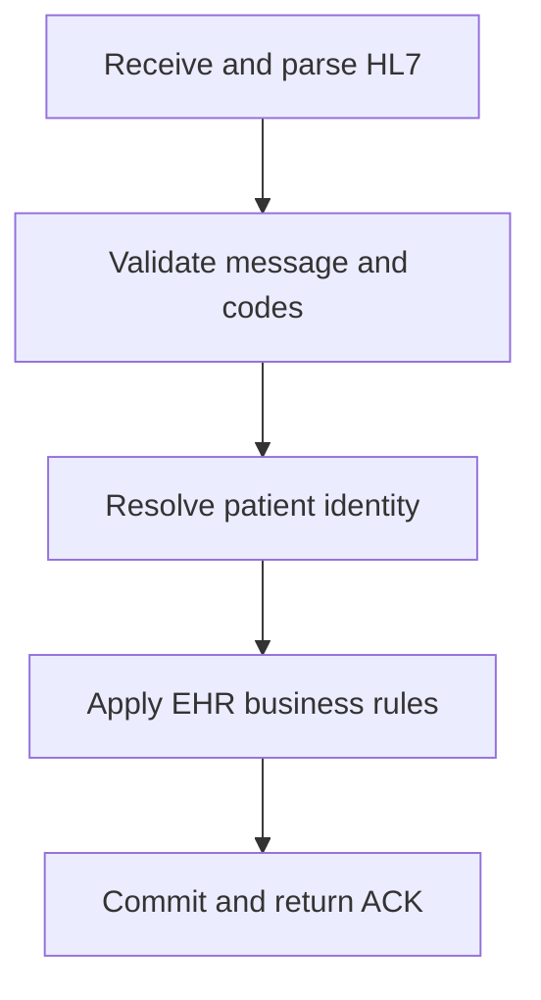
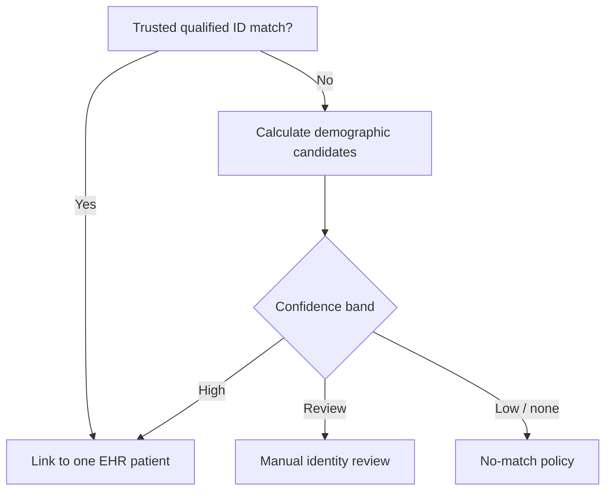

# HL7 Workflow: Practice Management to EHR — Part 2

This guide documents the concepts demonstrated in **HL7 Workflow PM to EHR Part 2**. It continues Part 1 by explaining the **inbound/import workflow** and the central challenge of identifying the correct EHR patient when one or more Practice Management (PM) systems send different identifiers for the same person.

> **Scope:** The video explains message receipt, data interpretation, validation, EHR import, identifier matching, and an illustrative demographic score card. Sections marked **Production guidance** extend the lesson with safe implementation practices.

## Learning objectives

After working through this guide, you should be able to:

- describe the inbound HL7 workflow from a PM system to an EHR;
- explain why one patient can have different IDs in different source systems;
- interpret qualified identifiers in `PID-3`;
- distinguish deterministic identifier matching from probabilistic demographic matching;
- explain the score-card idea demonstrated in the video;
- design safe match, review, and no-match outcomes;
- map the workflow into an integration-engine channel;
- acknowledge, audit, retry, and reconcile inbound messages safely.

## 1. Relationship to Part 1

Part 1 introduced two complementary operations:

### Export of data

1. An administrator performs a real-time action in the PM system.
2. The integration engine obtains the committed source data.
3. The engine transforms that data into an HL7 message.
4. The message is sent to the destination system.

### Import of data

Part 2 develops the inbound side:

1. Receive the HL7 message.
2. Interpret the data points in the message.
3. Perform validations.
4. Import the data into the EHR.



The integration engine can validate syntax and transform data, but patient matching may ultimately be owned by the EHR, a master patient index (MPI), or a dedicated identity service. Define that ownership explicitly.

## 2. Why patient matching is necessary

The video first illustrates one PM system sending patient information to an EHR. It then expands the diagram to several PM systems—shown as **PM system**, **PM2**, and **PM3**—feeding the same EHR.

The same real-world patient can have a different local identifier in each application:

| System | Example local patient ID |
|---|---:|
| PM system | `456123652` |
| PM2 | `74152632` |
| PM3 | `74512362` |
| EHR | A separate enterprise/EHR identifier may already exist |

These values are identifiers **within their assigning systems**. Equal numbers do not automatically mean the same patient, and different numbers do not automatically mean different patients.



The import process must answer two separate questions:

1. **Who sent this identifier?**
2. **Which EHR person, if any, does it represent?**

## 3. Identifiers discussed in the video

The lesson lists possible identifiers such as:

- patient ID;
- medical record number (MRN);
- Social Security Number (SSN);
- passport number.

In HL7 v2, patient identifiers are normally carried in repeating field `PID-3` using the CX datatype.

### Fictional `PID-3` example

```hl7
PID|1||456123652^^^PM1^PI~MRN00991^^^EHRFACILITY^MR~P0001234^^^PASSPORTAUTH^PPN||TESTPATIENT^GEORGE^T||20151010|M
```

| Repetition | ID value | Assigning authority | Identifier type |
|---|---|---|---|
| 1 | `456123652` | `PM1` | `PI` — patient internal identifier |
| 2 | `MRN00991` | `EHRFACILITY` | `MR` — medical record number |
| 3 | `P0001234` | `PASSPORTAUTH` | `PPN` — passport number |

> The data above is fictional. Use approved synthetic information in test messages and documentation.

### Why qualifiers matter

The tuple below is safer than the identifier value alone:

```text
(identifier value, assigning authority, identifier type)
```

For example, `456123652^^^PM1^PI` and `456123652^^^PM2^PI` are not necessarily the same identifier. The assigning authority establishes the namespace.

## 4. Import workflow in detail



### Step 1 — Receive the HL7 message

The receiving endpoint must:

- accept the agreed transport and framing;
- preserve the raw message for controlled troubleshooting where policy permits;
- identify the sender and environment;
- extract `MSH-9`, `MSH-10`, `MSH-11`, and `MSH-12`;
- detect duplicate delivery using the agreed message identity rules.

### Step 2 — Interpret the data points

The engine parses segments, fields, components, repetitions, and subcomponents. For an `ADT^A08`, relevant information can include:

| Data point | Typical HL7 location | Matching use |
|---|---|---|
| Patient identifiers | `PID-3` | Strong match when authority and type are trusted |
| Patient name | `PID-5` | Demographic comparison after normalization |
| Date of birth | `PID-7` | Demographic comparison |
| Administrative sex | `PID-8` | Supporting demographic comparison |
| Address | `PID-11` | Optional supporting evidence |
| Phone | `PID-13` | Optional supporting evidence |
| Sender | `MSH-3` / `MSH-4` | Determines source namespace and route |
| Message control ID | `MSH-10` | Deduplication and ACK correlation |

### Step 3 — Perform validations

Validation should occur in layers:

1. **Transport:** framing, connection, encoding, and message completeness.
2. **Syntax:** valid delimiters, segment order, field structure, and HL7 version.
3. **Profile:** required segments, fields, repetitions, datatypes, and cardinality.
4. **Vocabulary:** supported codes and identifier types.
5. **Identity:** identifier namespace, conflicts, and match confidence.
6. **Business rules:** whether the event is allowed to create or update a record.

### Step 4 — Import into the EHR

Only after validation and identity resolution should the receiver apply the update. The database transaction should be atomic: either the intended patient update and audit/cross-reference changes succeed together, or none are committed.

## 5. Two patient-matching strategies

### 5.1 Deterministic identifier matching

Deterministic matching uses an exact, trusted identifier with its qualifiers.

```text
PID-3 value + assigning authority + identifier type
```

Examples:

- an existing PM-to-EHR cross-reference;
- a trusted national identifier issued by an authoritative source;
- an enterprise MRN assigned by the receiving organization.

This should normally be attempted before demographic scoring.

### 5.2 Demographic score-card matching

When no reliable identifier link exists, the video demonstrates comparing demographic attributes and assigning weights. This is a form of probabilistic or weighted matching.

The screen shows the following illustrative score card:

| Attribute | Video weight |
|---|---:|
| First name | 150 |
| Last name | 150 |
| Middle initial | 20 |
| Date of birth | 100 |
| Gender | 25 |
| National ID | 20 |

The video also displays the notation `350 > 365` near the score-card example. The listed weights total **465**, so the displayed notation should be treated as an informal illustration, not a complete or internally verified algorithm.

> **Production guidance:** Confirm every weight, total, comparison operator, threshold, and missing-value rule with the identity-governance owner. Test the algorithm against labeled historical cases before activation.

## 6. Recommended match decision flow



Use at least three outcomes rather than a single threshold:

| Outcome | Meaning | Safe action |
|---|---|---|
| Match | One candidate satisfies strict evidence and conflict rules. | Update the identified patient and record the source link. |
| Possible match | Evidence is ambiguous or candidates are too close. | Hold the update for authorized manual review. |
| No match | No candidate meets the minimum policy. | Create, reject, or queue according to the agreed event-specific policy. |
| Conflict | A trusted identifier points to inconsistent demographics or multiple records. | Stop automatic processing and escalate. |

Do not automatically select “the best” candidate when the best score is still weak or when two candidates are nearly tied.

## 7. Data normalization before comparison

**Production guidance:** Demographic comparison is unreliable without consistent normalization.

| Attribute | Possible normalization |
|---|---|
| Names | Trim whitespace, standardize case, normalize Unicode, handle punctuation, and apply approved transliteration rules. |
| Middle name/initial | Compare according to explicit missing and initial-vs-full-name rules. |
| Date of birth | Parse the declared HL7 precision; do not invent missing month or day values. |
| Sex/gender code | Translate through the agreed code map before comparing. |
| National ID | Remove only formatting characters permitted by the issuing authority; preserve leading zeroes. |
| Passport | Normalize case and spacing only under the authority's documented rules. |
| Phone | Normalize country and area codes; never use as the only strong identifier. |
| Address | Normalize abbreviations cautiously; addresses change and may be shared. |

Never use a generic transformation that changes the semantic value of an identifier. For example, converting an identifier to a number can discard leading zeroes.

## 8. Missing, conflicting, and changed values

A matching rule must define what happens when:

- the source omits a value;
- the EHR value is unknown;
- both values are present but different;
- an identifier has expired or changed;
- a name uses a different script or transliteration;
- twins or family members share demographics;
- two EHR records already represent the same person;
- one source identifier is linked to two EHR patients.

Missing values should generally contribute **no evidence**, not be treated as equal merely because both are blank. A trusted-identifier conflict should override a high demographic score and route the message for investigation.

## 9. Cross-reference model

After an identity is verified, maintain a durable link between the source identity and the EHR patient.

| Conceptual field | Purpose |
|---|---|
| Source application/facility | Identifies the source namespace. |
| Source patient ID | Stores the PM system's local identifier. |
| Assigning authority | Qualifies the source identifier. |
| Identifier type | Distinguishes PI, MR, PPN, and other identifiers. |
| EHR patient ID | Identifies the resolved destination record. |
| Link status | Active, merged, inactive, disputed, or pending review. |
| Created/verified timestamps | Supports auditing and revalidation. |
| Verification method | Exact identifier, manual verification, or approved algorithm/version. |

Conceptual uniqueness rule:

```text
(source system, assigning authority, identifier type, source patient ID)
    -> one active EHR patient
```

Changes to this link are safety-sensitive and should be versioned, auditable, and restricted to authorized workflows.

## 10. Fictional multi-source examples

### PM1 message

```hl7
MSH|^~\&|PM1|CLINIC1|EHR|HOSPITAL|20260922110000||ADT^A08|PM1-000001|T|2.3
EVN|A08|20260922110000
PID|1||456123652^^^PM1^PI||TESTPATIENT^GEORGE^T||20151010|M
```

### PM2 message for the same test person

```hl7
MSH|^~\&|PM2|CLINIC2|EHR|HOSPITAL|20260922110200||ADT^A08|PM2-000001|T|2.3
EVN|A08|20260922110200
PID|1||74152632^^^PM2^PI||TESTPATIENT^GEORGE^T||20151010|M
```

The local patient IDs differ. A previously verified cross-reference can resolve both deterministically to one EHR identity. Without one, the system must follow the approved matching and review policy.

## 11. Integration-engine channel design

The exact connector depends on the environment, but a logical inbound channel can contain:

| Stage | Responsibility |
|---|---|
| Source connector | Receive MLLP/TCP, file, queue, API, or another agreed transport. |
| Preprocessor | Normalize transport artifacts without altering clinical meaning. |
| Parser | Parse the declared HL7 v2 version and encoding characters. |
| Filter | Accept supported senders, message types, and trigger events. |
| Transformer | Map source-specific codes and construct a canonical representation. |
| Validator | Apply structure, profile, vocabulary, and business rules. |
| Identity resolver | Query trusted cross-references and/or matching service. |
| EHR destination | Submit the update through the supported EHR interface. |
| Response transformer | Convert the processing result into the required HL7 ACK. |
| Error handler | Classify, quarantine, alert, and support controlled reprocessing. |

### Mirth-style pseudocode

```javascript
var sender = msg['MSH']['MSH.3']['MSH.3.1'].toString();
var facility = msg['MSH']['MSH.4']['MSH.4.1'].toString();
var controlId = msg['MSH']['MSH.10']['MSH.10.1'].toString();
var messageCode = msg['MSH']['MSH.9']['MSH.9.1'].toString();
var trigger = msg['MSH']['MSH.9']['MSH.9.2'].toString();

if (messageCode !== 'ADT' || trigger !== 'A08') {
    throw 'Unsupported message type: ' + messageCode + '^' + trigger;
}

var identifiers = extractQualifiedPid3Identifiers(msg);
var exactMatch = findTrustedCrossReference(sender, facility, identifiers);

if (exactMatch.hasConflict) {
    routeToIdentityException(controlId, exactMatch.reason);
} else if (exactMatch.patientId) {
    updateEhrPatient(exactMatch.patientId, msg);
} else {
    var result = evaluateDemographicCandidates(msg);
    applyApprovedMatchPolicy(result, msg, controlId);
}
```

This is conceptual pseudocode. Use supported Mirth Connect APIs, parameterized database operations, connection pooling, secret management, and centralized error handling in a real channel.

## 12. Acknowledgment behavior

The ACK should reflect the agreed processing stage. Do not return `AA` merely because the message was readable if identity resolution or EHR persistence failed.

### Accepted example

```hl7
MSH|^~\&|EHR|HOSPITAL|PM1|CLINIC1|20260922110002||ACK^A08|ACK-000001|T|2.3
MSA|AA|PM1-000001
```

### Error example

```hl7
MSH|^~\&|EHR|HOSPITAL|PM1|CLINIC1|20260922110002||ACK^A08|ACK-000002|T|2.3
MSA|AE|PM1-000001|Patient identity requires review
ERR|||204^Unknown Key Identifier^HL70357|E
```

| ACK code | General meaning | Example action |
|---|---|---|
| `AA` | Application accept | Mark the message successfully processed. |
| `AE` | Application error | Correct/retry when recoverable or route to a work queue. |
| `AR` | Application reject | Correct an unsupported or fundamental problem before resubmission. |

The precise use of `AA`, `AE`, `AR`, `ERR`, commit acknowledgments, and delayed application acknowledgments must be agreed between sender and receiver.

## 13. Duplicate message handling

Transport retry can deliver the same message more than once. Store enough information to recognize a duplicate, commonly including:

- sending application and facility;
- message control ID (`MSH-10`);
- message type and trigger;
- processing outcome;
- original and most recent receipt timestamps.

If an already completed message is received again, return the agreed repeat response without applying the patient update twice. Do not rely on `MSH-10` alone across all senders unless its uniqueness scope is contractually defined.

## 14. Safety and privacy controls

Patient matching is safety-critical. A false positive can update the wrong chart; a false negative can create a duplicate record.

**Production guidance:**

- use least-privilege access for messages and identity data;
- encrypt transport according to organizational policy;
- mask identifiers and demographics in normal logs;
- prohibit production PHI in training documents and screenshots;
- retain only the data needed for audit and support;
- record the matching algorithm version and decision evidence;
- require dual control or specialist review for merges/unmerges;
- monitor false-positive, false-negative, review, and duplicate rates;
- evaluate fairness and accuracy across names, languages, scripts, and populations;
- establish an urgent correction process for wrong-patient events.

## 15. Validation checklist

### Message and routing

- [ ] The sender and facility are recognized.
- [ ] `MSH-9` contains a supported message type and event.
- [ ] `MSH-10` is present and follows the uniqueness agreement.
- [ ] `MSH-11` identifies the correct environment.
- [ ] `MSH-12` matches the supported HL7 version/profile.
- [ ] Segment terminators and encoding characters are valid.

### Patient identity

- [ ] Every `PID-3` repetition is parsed independently.
- [ ] Identifier value, assigning authority, and type are preserved.
- [ ] Trusted identifiers are checked for conflicts and expiry.
- [ ] Cross-reference lookup precedes demographic scoring.
- [ ] Demographics are normalized using approved rules.
- [ ] Missing values do not create false agreement.
- [ ] Match, review, no-match, and conflict outcomes are supported.
- [ ] A close second candidate prevents unsafe automatic matching.

### EHR update and operations

- [ ] Create-versus-update behavior is explicitly defined for A08.
- [ ] Identity link and EHR update commit atomically when required.
- [ ] Duplicate messages are idempotent.
- [ ] ACK is correlated through `MSA-2` and original `MSH-10`.
- [ ] Errors are actionable but do not expose unnecessary PHI.
- [ ] Review queues, alerts, retry, quarantine, and replay are monitored.
- [ ] Every decision is auditable.

## 16. Test scenarios

Test at least the following with synthetic data:

1. exact source cross-reference match;
2. exact trusted national-identifier match;
3. same raw identifier value from two different assigning authorities;
4. no identifier match but a strong unique demographic candidate;
5. two candidates with similar scores;
6. name variation with the same verified identifier;
7. conflicting trusted identifier and demographics;
8. missing middle initial or date precision;
9. non-Latin name and approved transliteration;
10. duplicate delivery of the same `MSH-10`;
11. message replay after a timeout with unknown commit status;
12. unknown sender or identifier type;
13. match requiring manual review;
14. no-match create policy and no-match reject policy;
15. merged, unmerged, inactive, or disputed EHR identities.

Measure outcomes against cases whose true identity has been independently verified. A technically valid message is not sufficient evidence that the patient match is correct.

## 17. Common mistakes

| Mistake | Risk | Better approach |
|---|---|---|
| Matching on the identifier value alone | Collisions across PM systems | Include assigning authority and identifier type. |
| Assuming different local IDs mean different patients | Duplicate EHR records | Use a verified cross-reference or approved identity resolution. |
| Treating names as unique | Wrong-patient linkage | Use several attributes and explicit conflict rules. |
| Counting two blank values as a match | Inflated score | Treat missing values as no evidence. |
| Using one automatic threshold for every case | False matches near the boundary | Use match, review, and no-match bands. |
| Ignoring the second-best candidate | Ambiguous match selected automatically | Apply a minimum separation/margin rule. |
| Using the screen's weights without validation | Uncontrolled clinical risk | Validate weights and thresholds on representative labeled data. |
| Returning `AA` before persistence succeeds | Sender believes a failed update succeeded | Align ACK with the agreed durable processing point. |
| Reprocessing duplicate messages | Repeated or conflicting updates | Make the import idempotent. |
| Logging full `PID` data | Privacy exposure | Mask sensitive values and restrict diagnostic access. |

## 18. Quick review

- Part 2 completes the import side: receive, interpret, validate, and import.
- Several PM systems can assign different local IDs to the same person.
- `PID-3` identifiers must be interpreted with assigning authority and identifier type.
- Trusted deterministic matching should precede demographic scoring.
- The video demonstrates a weighted score card using name, middle initial, DOB, gender, and national ID.
- The displayed score-card numbers are illustrative and require formal validation before implementation.
- Safe workflows include match, possible-match/manual-review, no-match, and conflict outcomes.
- Production processing also requires idempotency, appropriate ACKs, auditability, privacy, monitoring, and controlled correction.

## 19. Knowledge check

1. Why can the same patient have different IDs in PM1, PM2, and PM3?
2. Which three properties make a patient identifier safer to interpret?
3. What should happen before demographic score-card matching?
4. Why must blank values not count as an agreement?
5. What is the purpose of a manual-review band?
6. Why should an identifier conflict override a high demographic score?
7. Which ACK field correlates to the original message control ID?
8. Why must the video weights not be copied directly into production?

### Answers

1. Each source application maintains its own local identifier namespace.
2. Identifier value, assigning authority, and identifier type.
3. Search for an existing trusted identifier or source-to-EHR cross-reference.
4. Two missing values provide no evidence that records represent the same person.
5. It prevents uncertain or closely competing candidates from being linked automatically.
6. Conflicting trusted identity evidence may indicate the wrong person, duplicate records, or corrupt data.
7. `MSA-2`, which echoes the original `MSH-10`.
8. The example is illustrative, its displayed notation is incomplete/inconsistent, and a real algorithm requires governance and validation against verified cases.

## 20. Project deliverables

Before approving this interface, prepare:

- a sender/receiver responsibility matrix;
- the HL7 conformance profile and mapping specification;
- an identifier authority and type registry;
- source-to-EHR cross-reference rules;
- normalization and code-translation rules;
- deterministic and demographic matching specifications;
- approved weights, thresholds, margin rules, and missing/conflict behavior;
- create/update/manual-review workflows;
- ACK, duplicate, retry, quarantine, and replay rules;
- privacy, audit, access, and retention controls;
- verified test cases and acceptance metrics;
- wrong-patient incident and merge/unmerge procedures.

---

**Document basis:** prepared from *HL7 Workflow PM to EHR Part 2*. All message examples are normalized and fictional. Production behavior must be verified against the applicable HL7 specification, destination conformance profile, vendor documentation, organizational identity-governance rules, privacy policy, and interface agreement.
