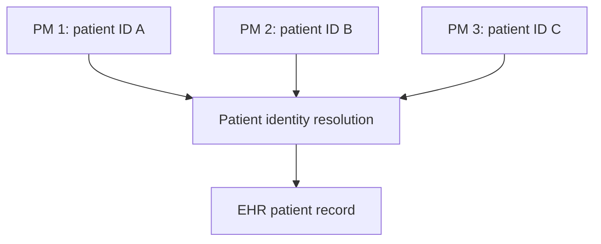
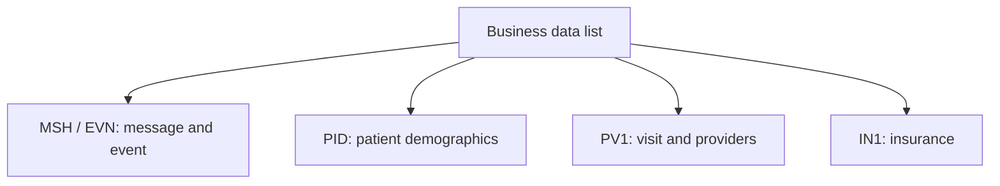

# HL7 Workflow: Practice Management to EHR — Part 3

This guide documents **HL7 Workflow PM to EHR Part 3**. The lesson completes the discussion of patient matching across multiple Practice Management (PM) systems and then introduces a practical exercise: create an HL7 v2.5 ADT message from a list of business data elements.

> **Scope:** The video revisits the patient-match score card, displays a sample ADT message, uses an HL7 v2.5 reference site, and begins constructing `MSH` and `PID` segments in a text editor. This README completes the exercise with a safe, fictional message and field-by-field mapping. Sections marked **Production guidance** extend the demonstrated material.

## Learning objectives

After working through this guide, you should be able to:

- explain why several PM identifiers may resolve to one EHR patient;
- describe the score-card matching concept continued from Part 2;
- translate business names into precise HL7 v2.5 field locations;
- distinguish message metadata, patient data, visit data, and insurance data;
- construct a structured `ADT^A08` message;
- construct and correlate an `AA` acknowledgment;
- recognize ambiguous requirements that require an interface specification;
- validate the result before sending it to an EHR.

## 1. Continuation from Part 2

The opening portion continues the multi-source identity scenario:



Different IDs can still represent the same person because each PM application owns a local identifier namespace. Patient identity should be established by:

1. a trusted, qualified identifier or an existing source-to-EHR cross-reference; or
2. an approved demographic matching process when deterministic evidence is unavailable.

Never compare a patient ID as an unqualified number. Preserve its assigning authority and identifier type from `PID-3`.

## 2. Score-card matching recap

The video retains the illustrative score card introduced in Part 2:

| Attribute | Displayed weight |
|---|---:|
| First name | 150 |
| Last name | 150 |
| Middle initial | 20 |
| Date of birth | 100 |
| Gender | 25 |
| National ID | 20 |

The listed weights total **465**. The diagram also displays a threshold-like notation that is not a complete algorithm specification.

> **Production guidance:** Do not copy these values directly into a live patient-matching service. Define normalization, missing-value behavior, conflicts, match/review/no-match thresholds, tie handling, and validation metrics through formal identity governance.

### Safe decision outcomes

| Outcome | Meaning | Action |
|---|---|---|
| Exact trusted match | One qualified identifier resolves to one patient without conflict. | Use the established EHR patient link. |
| High-confidence match | Approved demographic rules identify one clear candidate. | Match only if automatic matching is authorized. |
| Possible match | Evidence is incomplete, contradictory, or candidates are close. | Hold for authorized manual review. |
| No match | No candidate satisfies the policy. | Create or reject according to the interface agreement. |
| Identity conflict | A trusted identifier points to inconsistent or multiple records. | Stop automatic processing and escalate. |

## 3. Practical exercise shown in the video

The second portion asks the learner to create an ADT message using these data elements:

- message unique ID;
- event date/time;
- patient deceased indicator;
- first name and last name;
- date of birth;
- gender;
- SSN;
- race;
- ethnicity;
- language;
- account ID;
- phone number;
- address;
- insurance plan and plan ID;
- visit ID;
- patient class;
- attending provider;
- referring caregiver;
- `ADT`;
- `Test`;
- HL7 version `2.5`;
- `AA` acknowledgment;
- insurance company name;
- insurance company address;
- insurance group number.

The video opens a sample ADT message, consults an HL7 v2.5 definition/reference page, and starts a blank message in a text editor with `MSH` followed by `PID`.

## 4. Organizing the business data by segment



| Segment | Information category |
|---|---|
| `MSH` | Sender, receiver, message type, unique message ID, environment, and HL7 version |
| `EVN` | Event type and event date/time |
| `PID` | Patient identifiers and demographics |
| `PV1` | Visit class, providers, and visit number |
| `IN1` | Insurance plan, payer, address, and group information |
| `MSA` | Acknowledgment code and original message control ID; appears in the ACK, not the inbound ADT |

## 5. Business-to-HL7 v2.5 mapping

The table below converts the exercise terms into HL7 v2.5 locations. “Profile decision” means the phrase is not precise enough to implement safely without the sender/receiver agreement.

| Business element | HL7 location | HL7 field name | Notes |
|---|---|---|---|
| Message unique ID | `MSH-10` | Message Control ID | Unique within the agreed sender scope; echoed in `MSA-2`. |
| Message creation date/time | `MSH-7` | Date/Time of Message | Time the HL7 message is created. |
| Event date/time | `EVN-2` | Recorded Date/Time | Business event timestamp; not necessarily identical to `MSH-7`. |
| Patient deceased indicator | `PID-30` | Patient Death Indicator | Normally `Y` or `N`; use `PID-29` for death date/time when applicable. |
| Last name | `PID-5.1` | Patient Name — Family Name | `PID-5` uses the XPN datatype. |
| First name | `PID-5.2` | Patient Name — Given Name | Keep component order correct. |
| Date of birth | `PID-7` | Date/Time of Birth | Preserve the supplied precision. |
| Gender | `PID-8` | Administrative Sex | Use the receiver's accepted vocabulary. |
| SSN | `PID-19` | SSN Number — Patient | Sensitive and profile-dependent; many interfaces prefer a qualified `PID-3` identifier. |
| Race | `PID-10` | Race | Coded field; do not send uncontrolled display text unless agreed. |
| Ethnicity | `PID-22` | Ethnic Group | Coded field under the applicable profile. |
| Language | `PID-15` | Primary Language | Typically coded using the profile's vocabulary. |
| Account ID | `PID-18` | Patient Account Number | Use only if the business meaning truly is a patient account. |
| Phone number | `PID-13` | Phone Number — Home | Other contexts may use `PID-14`; profile decision. |
| Address | `PID-11` | Patient Address | XAD components carry street, city, state, postal code, and country. |
| Visit ID | `PV1-19` | Visit Number | A CX value; qualify it with an assigning authority when required. |
| Patient class | `PV1-2` | Patient Class | Examples include `I`, `O`, `E`; allowed values are profile-specific. |
| Attending provider | `PV1-7` | Attending Doctor | XCN datatype; include a provider identifier and authority where required. |
| Referring caregiver | `PV1-8` | Referring Doctor | The exercise phrase maps most closely here. |
| ADT | `MSH-9.1` | Message Code | A complete message type also needs a trigger event in `MSH-9.2`. |
| Test | `MSH-11.1` | Processing ID | Encoded as `T`; production is normally `P`. |
| 2.5 | `MSH-12.1` | Version ID | Declares HL7 v2.5. |
| Insurance plan ID | `IN1-2` | Insurance Plan ID | CE datatype; define its coding system and meaning. |
| Insurance company/payer ID | `IN1-3` | Insurance Company ID | Not explicitly named in the exercise, but commonly required. |
| Insurance company name | `IN1-4` | Insurance Company Name | XON datatype. |
| Insurance company address | `IN1-5` | Insurance Company Address | XAD datatype. |
| Insurance group number | `IN1-8` | Group Number | Do not confuse with group name in `IN1-9`. |
| AA acknowledgment | `MSA-1` | Acknowledgment Code | Belongs in the receiver's ACK message. |

## 6. Important ambiguities in the exercise

### `ADT` is incomplete by itself

`ADT` is the message code, but routing also requires a trigger event. For a patient-information update, a typical value is:

```text
ADT^A08^ADT_A01
```

- `ADT` — message code;
- `A08` — trigger event;
- `ADT_A01` — message structure used by this event in HL7 v2.5.

The exact trigger must reflect the real business event. Do not use A08 for every patient workflow.

### `EventDateTime` can mean two timestamps

| Timestamp | Location | Meaning |
|---|---|---|
| Message creation time | `MSH-7` | When this encoded message was created |
| Event recorded time | `EVN-2` | When the underlying ADT event was recorded |

They may be equal in a simple example but should remain conceptually separate.

### `patientDeceasedNo`

The video phrase appears to mean “patient deceased = No.” In HL7 v2.5:

```text
PID-30 = N
```

Do not place the word `No` in an unverified field. Send the agreed coded value.

### `insuranceplan` and `insurancePlanID`

The two labels overlap. HL7 v2.5 provides `IN1-2` for Insurance Plan ID and `IN1-3`/`IN1-4` for payer identification/name. A plan's display name is not universally mapped to a single separate field. Resolve this in the mapping specification rather than duplicating the same value.

### `AA` is not part of the ADT payload

`AA` means **Application Accept**. It belongs in the acknowledgment's `MSA-1` after the receiver has successfully processed the original message at the agreed level.

## 7. Field templates before inserting values

Using field names first makes the structure easier to learn.

```text
MSH|EncodingCharacters|SendingApplication|SendingFacility|ReceivingApplication|ReceivingFacility|MessageDateTime||MessageType|MessageControlID|ProcessingID|VersionID
EVN|EventTypeCode|RecordedDateTime
PID|SetID||PatientIdentifiers||FamilyName^GivenName||DateOfBirth|AdministrativeSex||Race|PatientAddress||HomePhone||PrimaryLanguage|||PatientAccountNumber|SSN|||EthnicGroup|||||||DeathDateTime|DeathIndicator
PV1|SetID|PatientClass|||||AttendingProvider|ReferringProvider|||||||||||VisitNumber
IN1|SetID|InsurancePlanID|InsuranceCompanyID|InsuranceCompanyName|InsuranceCompanyAddress|||GroupNumber
```

This is a teaching template, not a receiver conformance profile. Empty placeholders still count as fields.

## 8. Complete fictional ADT message

The following message uses synthetic values and supplies all major exercise elements. Each segment is shown on its own line for readability; the encoded message normally uses carriage return (`\r`) segment terminators.

```hl7
MSH|^~\&|PMS|TESTCLINIC|EHR|TESTHOSPITAL|20260922123000||ADT^A08^ADT_A01|MSG-P3-000001|T|2.5
EVN|A08|20260922122500
PID|1||PM100045^^^TESTCLINIC^PI||TESTPATIENT^ALEX^R||19880615|M||2106-3^White^CDCREC|100 TEST STREET^^TESTCITY^KW^00000^KWT||+96555550100||en^English^ISO639|||ACC900001|000000000|||2186-2^Not Hispanic or Latino^CDCREC|||||||N
PV1|1|O|||||12345^PROVIDER^CASEY^^^^^^TESTHOSPITAL&1.2.3&ISO|67890^CAREGIVER^ROBIN^^^^^^TESTCLINIC&1.2.4&ISO|||||||||||VISIT700001^^^TESTHOSPITAL^VN
IN1|1|PLAN001^Test Health Plan^99TEST|PAY001^^^TESTPAYER^XX|TEST INSURANCE COMPANY|200 PAYER ROAD^^TESTCITY^KW^00000^KWT|||GROUP100
```

### Segment walkthrough

#### MSH

- `MSH-2` = `^~\&` — encoding characters
- `MSH-3` = `PMS` — sending application
- `MSH-4` = `TESTCLINIC` — sending facility
- `MSH-5` = `EHR` — receiving application
- `MSH-6` = `TESTHOSPITAL` — receiving facility
- `MSH-7` = `20260922123000` — message date/time
- `MSH-9` = `ADT^A08^ADT_A01` — message type
- `MSH-10` = `MSG-P3-000001` — unique message control ID
- `MSH-11` = `T` — test processing mode
- `MSH-12` = `2.5` — HL7 version

#### EVN

- `EVN-1` = `A08` — event type code retained for compatibility
- `EVN-2` = `20260922122500` — recorded event date/time

#### PID

- `PID-3` contains a qualified source patient identifier.
- `PID-5` contains family name, given name, and middle initial.
- `PID-7` contains date of birth.
- `PID-8` contains administrative sex.
- `PID-10`, `PID-15`, and `PID-22` contain coded race, language, and ethnicity examples.
- `PID-11` and `PID-13` contain address and phone.
- `PID-18` contains the patient account number.
- `PID-19` contains a fictional SSN placeholder.
- `PID-30` is `N`, meaning the patient is not indicated as deceased.

#### PV1

- `PV1-2` = `O` — example outpatient class.
- `PV1-7` contains the attending provider.
- `PV1-8` contains the referring caregiver/provider.
- `PV1-19` contains the visit number.

#### IN1

- `IN1-2` identifies the insurance plan.
- `IN1-3` identifies the payer/company.
- `IN1-4` contains the insurance company name.
- `IN1-5` contains the insurance company address.
- `IN1-8` contains the group number.

## 9. Corresponding `AA` acknowledgment

After accepting and processing the ADT according to the interface contract, the EHR can return:

```hl7
MSH|^~\&|EHR|TESTHOSPITAL|PMS|TESTCLINIC|20260922123002||ACK^A08^ACK|ACK-P3-000001|T|2.5
MSA|AA|MSG-P3-000001
```

| ACK location | Value | Meaning |
|---|---|---|
| `MSH-9` | `ACK^A08^ACK` | Acknowledgment for the A08 event |
| `MSH-10` | `ACK-P3-000001` | Unique ID of the ACK itself |
| `MSA-1` | `AA` | Application Accept |
| `MSA-2` | `MSG-P3-000001` | Original ADT `MSH-10` value |

Do not copy the original control ID into the ACK's `MSH-10`. The ACK has its own control ID; correlation uses `MSA-2`.

## 10. Building the message step by step

The video begins by typing delimiter placeholders. A safer repeatable approach is:

1. Select the target HL7 version and receiver profile.
2. Confirm the business trigger event.
3. Build `MSH`, remembering its special field numbering.
4. Add `EVN` with the recorded event time.
5. Build `PID` from qualified identifiers and demographics.
6. Add `PV1` for visit and provider values.
7. Add `IN1` for payer/plan data.
8. Replace field labels with approved synthetic values.
9. Normalize segment terminators to carriage returns.
10. Parse the message with an HL7 viewer.
11. Validate it against the receiver's conformance profile.
12. Send it in the test environment and verify the ACK and EHR result.

### The special MSH counting rule

In every normal segment, the first `|` follows the segment name. `MSH` is special:

- `MSH-1` is the field separator itself: `|`.
- `MSH-2` is the visible value `^~\&`.
- The next visible field is `MSH-3`.

Ignoring this rule shifts every MSH field and can put the message type, control ID, environment, or version in the wrong position.

## 11. Parsing versus conformance

The video uses an online HL7 v2.5 definition/reference resource to find segments, datatypes, and tables. Such a reference helps identify standard field positions, but successful parsing does not prove that a message is acceptable to a particular EHR.

| Validation level | Question answered |
|---|---|
| Syntax | Can an HL7 parser read the delimiters, fields, and segments? |
| Standard structure | Are fields and segments valid for HL7 v2.5? |
| Receiver profile | Are required/optional elements, repetitions, and codes correct for this EHR? |
| Business validation | Is the event allowed to create or update this patient/visit? |
| Identity validation | Does the message resolve safely to the intended patient? |

## 12. Datatypes used in the exercise

| HL7 location | Typical datatype | Structural implication |
|---|---|---|
| `MSH-9` | MSG | Message code, trigger event, message structure |
| `PID-3` | CX | ID, check digit, assigning authority, identifier type, and more |
| `PID-5` | XPN | Family, given, middle, suffix, prefix, and name type |
| `PID-10` | CE | Identifier, display text, coding system |
| `PID-11` | XAD | Street, city, state, postal code, country, address type |
| `PID-13` | XTN | Telephone/email components |
| `PV1-7` / `PV1-8` | XCN | Provider ID, name, assigning authority, and identifier type |
| `PV1-19` | CX | Qualified visit number |
| `IN1-2` | CE | Coded insurance plan identifier |
| `IN1-3` | CX | Qualified insurance company identifier |
| `IN1-4` | XON | Organization name and identifiers |

Components matter. For example, `TESTPATIENT^ALEX^R` is not one unstructured name; it is family name, given name, and middle name/initial.

## 13. Code-table considerations

Several fields use controlled vocabularies:

| Field | Examples only | Requirement |
|---|---|---|
| `MSH-11` Processing ID | `T`, `P`, `D` | Use the correct environment code. |
| `PID-8` Administrative Sex | `M`, `F`, `O`, `U`, `A`, `N` depending on profile/version | Follow the receiver's allowed set. |
| `PID-30` Death Indicator | `Y`, `N` | Do not send free text. |
| `PV1-2` Patient Class | `I`, `O`, `E`, etc. | Map from the source encounter type. |
| `PID-10` Race | Profile-defined coding system | Send code, display, and system as required. |
| `PID-22` Ethnic Group | Profile-defined coding system | Never infer from name or nationality. |
| `PID-15` Primary Language | Profile-defined language codes | Agree on coding system and version. |

The sample codes are illustrative. Local, national, or vendor profiles can constrain or replace them.

## 14. Mirth-style construction example

```javascript
// Conceptual example: values must already be validated and escaped.
var msh10 = java.util.UUID.randomUUID().toString();

tmp['MSH']['MSH.3']['MSH.3.1'] = 'PMS';
tmp['MSH']['MSH.4']['MSH.4.1'] = 'TESTCLINIC';
tmp['MSH']['MSH.5']['MSH.5.1'] = 'EHR';
tmp['MSH']['MSH.6']['MSH.6.1'] = 'TESTHOSPITAL';
tmp['MSH']['MSH.9']['MSH.9.1'] = 'ADT';
tmp['MSH']['MSH.9']['MSH.9.2'] = 'A08';
tmp['MSH']['MSH.9']['MSH.9.3'] = 'ADT_A01';
tmp['MSH']['MSH.10']['MSH.10.1'] = msh10;
tmp['MSH']['MSH.11']['MSH.11.1'] = 'T';
tmp['MSH']['MSH.12']['MSH.12.1'] = '2.5';

tmp['PID']['PID.5']['PID.5.1'] = normalizedFamilyName;
tmp['PID']['PID.5']['PID.5.2'] = normalizedGivenName;
tmp['PID']['PID.7']['PID.7.1'] = birthDate;
tmp['PID']['PID.30']['PID.30.1'] = deceasedIndicator;

tmp['PV1']['PV1.2']['PV1.2.1'] = mappedPatientClass;
tmp['PV1']['PV1.19']['PV1.19.1'] = sourceVisitId;

tmp['IN1']['IN1.2']['IN1.2.1'] = insurancePlanId;
tmp['IN1']['IN1.8']['IN1.8.1'] = insuranceGroupNumber;
```

This is conceptual pseudocode. A production channel must also handle repetitions, assigning authorities, nulls, escaping, timestamps, code translation, validation, exceptions, and secure configuration.

## 15. Production guidance for sensitive fields

- Do not use real SSNs, passport numbers, national IDs, names, phone numbers, or addresses in screenshots and training files.
- Include SSN only when legally permitted and operationally necessary.
- Prefer qualified identifiers in `PID-3` over copying sensitive identifiers into several fields.
- Mask identifiers in routine application and integration-engine logs.
- Do not infer race, ethnicity, language, sex, or deceased status.
- Encrypt the transport and restrict message-store access.
- Define retention and purge rules for raw messages.
- Audit access, matching decisions, corrections, and replay.

## 16. Validation checklist

### MSH and EVN

- [ ] `MSH-1` and `MSH-2` define the delimiters used by the message.
- [ ] Sender and receiver fields contain approved routing codes.
- [ ] `MSH-7` is a valid HL7 timestamp.
- [ ] `MSH-9` includes the correct code, trigger, and structure.
- [ ] `MSH-10` is unique within the agreed scope.
- [ ] `MSH-11` is `T` in test and not accidentally `P`.
- [ ] `MSH-12` is `2.5` as required by the exercise/profile.
- [ ] `EVN-2` represents the actual recorded event time.

### PID

- [ ] Patient identifiers have assigning authority and type.
- [ ] Family and given names are in the correct XPN components.
- [ ] Date of birth has valid format and precision.
- [ ] Sex/gender, race, ethnicity, and language use approved codes.
- [ ] Address and phone components are escaped correctly.
- [ ] Account number has the intended business meaning.
- [ ] SSN is allowed, protected, and correctly mapped.
- [ ] `PID-30` is a valid deceased indicator.
- [ ] `PID-29` is populated only when the death date/time is known and required.

### PV1 and IN1

- [ ] Patient class is mapped to the receiver's vocabulary.
- [ ] Visit number is qualified as required.
- [ ] Attending and referring provider IDs use the agreed authority.
- [ ] Insurance plan ID is not confused with payer ID or plan name.
- [ ] Company name and address use the correct IN1 fields.
- [ ] Group number is in `IN1-8`, not group name `IN1-9`.

### ACK and operations

- [ ] `MSA-2` echoes the original `MSH-10`.
- [ ] ACK `MSH-10` is independently unique.
- [ ] `AA` is sent only at the agreed successful processing point.
- [ ] `AE`/`AR` and `ERR` behavior is tested.
- [ ] Duplicate message delivery is idempotent.
- [ ] The resulting EHR patient and visit are verified, not only the ACK.

## 17. Common mistakes

| Mistake | Consequence | Correction |
|---|---|---|
| Treating `ADT` as a complete `MSH-9` | Trigger event cannot be routed correctly. | Supply the agreed event and structure, such as `ADT^A08^ADT_A01`. |
| Placing `AA` in the original ADT | Payload and response semantics are mixed. | Put `AA` in `MSA-1` of the ACK. |
| Putting message and event time in one field without analysis | Audit chronology becomes inaccurate. | Distinguish `MSH-7` from `EVN-2`. |
| Writing first name before family name in `PID-5` | Patient name components are reversed. | Use `family^given^middle`. |
| Using unqualified patient/visit/provider IDs | IDs collide across systems. | Include assigning authority and identifier type. |
| Mapping plan name and plan ID to the same field blindly | Insurance information becomes ambiguous. | Define `IN1-2`, `IN1-3`, and `IN1-4` explicitly. |
| Using `No` rather than coded `N` in `PID-30` | Receiver rejects or misreads the indicator. | Use the profile-approved table value. |
| Assuming a reference website equals the EHR profile | Standard-valid message can still be rejected. | Validate against the destination's conformance specification. |
| Sending full real patient data in test | Privacy and compliance exposure. | Use approved synthetic data. |

## 18. Test scenarios

1. Valid `ADT^A08` with every required exercise element.
2. Missing optional insurance address.
3. Multiple qualified `PID-3` identifiers.
4. Invalid or unknown patient class.
5. Missing assigning authority on visit/provider identifiers.
6. `PID-30=N` with an incorrectly populated death date.
7. Event time earlier than, equal to, and later than message creation time.
8. Duplicate `MSH-10` delivery.
9. Unsupported sender, version, or trigger event.
10. Valid parse but receiver-profile failure.
11. Successful import returning `AA`.
12. Validation error returning `AE` plus `ERR`.
13. Rejected routing/version returning `AR`.
14. Insurance plan ID versus payer ID mapping verification.
15. Confirmed EHR result for the correct matched patient.

## 19. Quick review

- Several PM system IDs can belong to the same real-world patient.
- Identity matching should prefer qualified deterministic evidence before demographic scoring.
- Part 3 turns business data into MSH, EVN, PID, PV1, IN1, and MSA fields.
- `MSH-10` is the message unique ID; `MSA-2` echoes it in the ACK.
- `EVN-2` records the event time, while `MSH-7` records message creation time.
- `PID-30=N` represents “patient deceased: No.”
- `PV1-7`, `PV1-8`, and `PV1-19` carry attending provider, referring provider, and visit number.
- `IN1-2`, `IN1-3`, `IN1-4`, `IN1-5`, and `IN1-8` distinguish plan, payer ID, company name, company address, and group number.
- `AA` belongs in `MSA-1` of the receiver's acknowledgment.
- A message must pass the receiver's profile and business rules—not merely parse successfully.

## 20. Knowledge check

1. Where is the unique ID of the original ADT message stored?
2. Which ACK field echoes that ID?
3. What is the difference between `MSH-7` and `EVN-2`?
4. Which PID component contains the patient's first/given name?
5. Where is the deceased indicator stored in HL7 v2.5?
6. Which fields carry attending and referring providers?
7. Where is the visit number stored?
8. Which IN1 fields hold company name, address, and group number?
9. Why is `ADT` alone insufficient as the message type?
10. Why must insurance plan name and plan ID be clarified?

### Answers

1. `MSH-10`.
2. `MSA-2`.
3. `MSH-7` is message creation time; `EVN-2` is the recorded ADT event time.
4. `PID-5.2`.
5. `PID-30`.
6. `PV1-7` and `PV1-8`.
7. `PV1-19`.
8. `IN1-4`, `IN1-5`, and `IN1-8`.
9. It lacks the trigger event—and, in v2.5 messaging, the structure component used for precise routing/conformance.
10. They are overlapping business labels and may require different coded/name fields under the receiver's profile.

## 21. Interface deliverables

Before implementation sign-off, prepare:

- the supported ADT trigger-event list;
- the HL7 v2.5 receiver conformance profile;
- a source-to-HL7 mapping for every exercise element;
- identifier authority and type rules;
- code maps for patient class, sex/gender, race, ethnicity, and language;
- patient-matching and manual-review rules;
- insurance plan, payer, and group definitions;
- timestamp and timezone policy;
- ACK and error specification;
- duplicate, retry, quarantine, and replay procedures;
- synthetic positive/negative test messages and expected EHR results;
- privacy, access, audit, and retention controls.

---

**Document basis:** prepared from *HL7 Workflow PM to EHR Part 3*. All identifiers and patient data in this README are fictional. Verify production mappings against the official HL7 v2.5 specification, the destination's conformance profile, vendor documentation, identity-governance rules, privacy policy, and the bilateral interface agreement.
