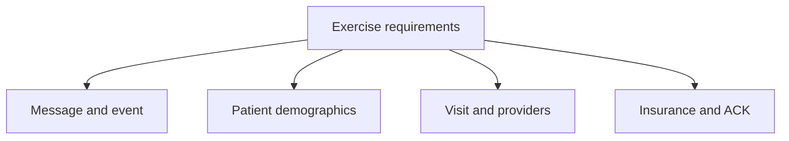
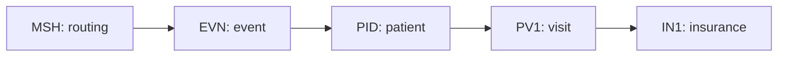

# HL7 Workflow: Practice Management to EHR — Part 4

This guide documents **HL7 Workflow PM to EHR Part 4**. The video is a short continuation of the practical exercise introduced in Part 3. It focuses on a list of business data elements that must be translated into an HL7 v2.5 ADT message.

> **Scope:** The recording reviews and highlights the requested data elements. It does not show a complete final message. This README completes the exercise using fictional values, while identifying requirements that must be clarified before production implementation.

## Learning objectives

After working through this guide, you should be able to:

- classify business data as message, event, patient, visit, insurance, or acknowledgment information;
- map the exercise terms to HL7 v2.5 segments and fields;
- distinguish the original ADT message from its acknowledgment;
- recognize overlapping or ambiguous business labels;
- construct a valid teaching example from the requirements;
- validate the message against a receiver-specific interface profile.

## 1. Data elements presented in the video

The Part 4 slide contains the following requirements:

- `messageuniqueID`
- `EventDateTime`
- `patientDeceasedNo`
- `firstname`
- `lastname`
- `DOB`
- `gender`
- `ssn`
- `race`
- `ethnicity`
- `language`
- `accountid`
- `phonenumber`
- `address`
- `insuranceplan`
- `insurancePlanID`
- `visitID`
- `patientClass`
- `attendingProvider`
- `ReferringCareGiver`
- `ADT`
- `Test`
- `2.5`
- `AA-Acknowledgment`
- `insuranceCompanyName`
- `insuranceCompanyAddress`
- `InsGroupNumber`

These are business-friendly labels—not encoded HL7 field names. They must first be assigned precise meanings and then mapped to the appropriate HL7 location.

## 2. Classifying the requirements



| Category | Exercise elements | Main segment |
|---|---|---|
| Message metadata | Message unique ID, ADT, Test, 2.5 | `MSH` |
| Event metadata | Event date/time | `EVN` and possibly `MSH` |
| Patient demographics | Name, DOB, sex/gender, SSN, race, ethnicity, language, phone, address, deceased indicator | `PID` |
| Account and visit | Account ID, visit ID, patient class | `PID`, `PV1` |
| Providers | Attending provider, referring caregiver | `PV1` |
| Insurance | Plan ID, company name/address, group number | `IN1` |
| Acknowledgment | AA acknowledgment | `MSA` in a separate ACK message |

## 3. HL7 v2.5 field mapping

| Exercise label | HL7 location | Standard field name | Implementation note |
|---|---|---|---|
| `messageuniqueID` | `MSH-10` | Message Control ID | Must uniquely identify the message within the agreed sender scope. |
| `EventDateTime` | `EVN-2` | Recorded Date/Time | Represents the event time. `MSH-7` separately represents message creation time. |
| `patientDeceasedNo` | `PID-30` | Patient Death Indicator | If the intended meaning is “deceased = No,” encode the approved value `N`. |
| `firstname` | `PID-5.2` | Patient Name — Given Name | `PID-5` is an XPN composite field. |
| `lastname` | `PID-5.1` | Patient Name — Family Name | HL7 name order is normally `family^given^middle`. |
| `DOB` | `PID-7` | Date/Time of Birth | Use an HL7 date/timestamp with only the known precision. |
| `gender` | `PID-8` | Administrative Sex | Use the destination's approved code set. |
| `ssn` | `PID-19` | SSN Number — Patient | Highly sensitive and profile-dependent. A qualified `PID-3` identifier may be preferred. |
| `race` | `PID-10` | Race | Use a coded value and coding system required by the profile. |
| `ethnicity` | `PID-22` | Ethnic Group | Never infer this value. |
| `language` | `PID-15` | Primary Language | Use the agreed language coding system. |
| `accountid` | `PID-18` | Patient Account Number | Confirm that “account” means patient account, not visit number. |
| `phonenumber` | `PID-13` | Phone Number — Home | Business/work phone may map elsewhere; profile decision. |
| `address` | `PID-11` | Patient Address | Map street, city, region, postal code, and country to XAD components. |
| `insuranceplan` | Profile decision | Plan display/business name | The requirement overlaps with plan ID and payer name; clarify before mapping. |
| `insurancePlanID` | `IN1-2` | Insurance Plan ID | Define identifier, display text, and coding system. |
| `visitID` | `PV1-19` | Visit Number | Prefer a qualified CX value. |
| `patientClass` | `PV1-2` | Patient Class | Examples include inpatient, outpatient, and emergency codes. |
| `attendingProvider` | `PV1-7` | Attending Doctor | XCN datatype; include provider identifier and authority. |
| `ReferringCareGiver` | `PV1-8` | Referring Doctor | Closest standard mapping; confirm business meaning. |
| `ADT` | `MSH-9.1` | Message Code | A trigger event is also required in `MSH-9.2`. |
| `Test` | `MSH-11.1` | Processing ID | Encode as `T`, not the free-text word `Test`. |
| `2.5` | `MSH-12.1` | Version ID | Declares HL7 version 2.5. |
| `AA-Acknowledgment` | `MSA-1` | Acknowledgment Code | Appears in the receiver's ACK, not in the original ADT. |
| `insuranceCompanyName` | `IN1-4` | Insurance Company Name | XON organization datatype. |
| `insuranceCompanyAddress` | `IN1-5` | Insurance Company Address | XAD address datatype. |
| `InsGroupNumber` | `IN1-8` | Group Number | Do not confuse it with `IN1-9`, Group Name. |

## 4. Requirements that need clarification

The slide provides useful business terms, but several are insufficient for a production mapping.

### 4.1 Which ADT trigger event?

`ADT` identifies the message family. It does not explain the business event. Examples include:

| Trigger | General purpose |
|---|---|
| `A01` | Admit/visit notification |
| `A04` | Register a patient |
| `A08` | Update patient information |
| `A11` | Cancel admit/visit notification |
| `A40` | Merge patient identifiers |

For continuity with Parts 1–3, this guide uses `ADT^A08^ADT_A01`. The real event must come from the interface requirements.

### 4.2 Which timestamp?

“EventDateTime” can be misunderstood if message time and business-event time are not separated.

| Field | Meaning |
|---|---|
| `MSH-7` | Date/time the HL7 message was created |
| `EVN-2` | Date/time the ADT event was recorded |

### 4.3 What does `patientDeceasedNo` mean?

The most likely meaning is a deceased indicator whose value is “No”:

```text
PID-30 = N
```

If the requirement instead means a death-registration number or another local identifier, `PID-30` would be incorrect. Confirm the source definition.

### 4.4 What is `accountid`?

Possible meanings include:

- patient account number → `PID-18`;
- visit/encounter number → `PV1-19`;
- billing account controlled by a local extension/profile.

The exercise already contains `visitID`, so this README treats `accountid` as `PID-18` and `visitID` as `PV1-19`.

### 4.5 Plan versus payer

These concepts must not be collapsed:

| Concept | Recommended location |
|---|---|
| Insurance plan ID | `IN1-2` |
| Insurance company/payer ID | `IN1-3` |
| Insurance company name | `IN1-4` |
| Insurance company address | `IN1-5` |
| Group number | `IN1-8` |

The generic label `insuranceplan` needs an agreed definition. A product name, payer name, and coded plan identifier are different values.

### 4.6 When may the receiver return `AA`?

`AA` means **Application Accept**. The interface agreement must say whether this means:

- message accepted into a durable queue;
- structural and business validation completed;
- EHR transaction committed successfully; or
- a later downstream workflow completed.

Do not return `AA` simply because the TCP connection or parser succeeded.

## 5. Message structure for the exercise



An `ADT^A08` teaching message containing the requested categories can use:

```text
MSH
EVN
PID
PV1
IN1
```

The ACK is a separate message:

```text
MSH
MSA
ERR  (when needed)
```

## 6. Field-name template

This template uses descriptive placeholders instead of patient data:

```text
MSH|EncodingCharacters|SendingApplication|SendingFacility|ReceivingApplication|ReceivingFacility|MessageDateTime||MessageCode^TriggerEvent^MessageStructure|MessageUniqueID|ProcessingID|VersionID
EVN|EventTypeCode|EventDateTime
PID|SetID||PatientIdentifierList||LastName^FirstName||DOB|Gender||Race|Address||PhoneNumber||Language|||AccountID|SSN|||Ethnicity|||||||DeathDateTime|PatientDeceasedIndicator
PV1|SetID|PatientClass|||||AttendingProvider|ReferringCareGiver|||||||||||VisitID
IN1|SetID|InsurancePlanID|InsuranceCompanyID|InsuranceCompanyName|InsuranceCompanyAddress|||InsuranceGroupNumber
```

> Empty HL7 fields still occupy positions. Count delimiters carefully and validate the result with a structured viewer.

## 7. Fictional completed ADT message

The following example is a learning aid and uses synthetic values:

```hl7
MSH|^~\&|PM_APP|TEST_CLINIC|EHR_APP|TEST_HOSPITAL|20260923100000||ADT^A08^ADT_A01|MSG-P4-000001|T|2.5
EVN|A08|20260923095500
PID|1||PM000100^^^TEST_CLINIC^PI||SAMPLE^PATIENT||19900115|U||UNK^Unknown^99TEST|100 TEST ROAD^^TESTCITY^^00000^KWT||+96555550000||en^English^ISO639|||ACC000100|000000000|||UNK^Unknown^99TEST||||||||N
PV1|1|O|||||PRV100^CLINICIAN^ATTENDING^^^^^^TEST_HOSPITAL&1.2.3&ISO|PRV200^CLINICIAN^REFERRING^^^^^^TEST_CLINIC&1.2.4&ISO|||||||||||VISIT000100^^^TEST_HOSPITAL^VN
IN1|1|PLAN100^Sample Plan^99TEST|PAYER100^^^TEST_PAYER^XX|SAMPLE INSURANCE COMPANY|200 TEST AVENUE^^TESTCITY^^00000^KWT|||GROUP100
```

### Key values

| Requirement | Encoded example |
|---|---|
| Message unique ID | `MSH-10 = MSG-P4-000001` |
| Event date/time | `EVN-2 = 20260923095500` |
| Patient deceased = No | `PID-30 = N` |
| First/last name | `PID-5 = SAMPLE^PATIENT` |
| Test environment | `MSH-11 = T` |
| Version | `MSH-12 = 2.5` |
| Visit ID | `PV1-19 = VISIT000100...` |
| Patient class | `PV1-2 = O` |
| Plan ID | `IN1-2 = PLAN100...` |
| Group number | `IN1-8 = GROUP100` |

## 8. Fictional `AA` acknowledgment

```hl7
MSH|^~\&|EHR_APP|TEST_HOSPITAL|PM_APP|TEST_CLINIC|20260923100002||ACK^A08^ACK|ACK-P4-000001|T|2.5
MSA|AA|MSG-P4-000001
```

| Field | Purpose |
|---|---|
| ACK `MSH-10` | Unique identifier of the ACK itself |
| `MSA-1` | `AA`, Application Accept |
| `MSA-2` | Original ADT message's `MSH-10` value |

The ACK should have its own control ID. Correlation occurs through `MSA-2`.

## 9. Component-level examples

HL7 composite fields use `^` to separate components.

### Patient name — `PID-5`

```text
SAMPLE^PATIENT^A
```

| Component | Meaning | Value |
|---|---|---|
| `PID-5.1` | Family name | `SAMPLE` |
| `PID-5.2` | Given name | `PATIENT` |
| `PID-5.3` | Second/middle name | `A` |

### Patient identifier — `PID-3`

```text
PM000100^^^TEST_CLINIC^PI
```

| Component | Meaning | Value |
|---|---|---|
| `PID-3.1` | ID number | `PM000100` |
| `PID-3.4` | Assigning authority | `TEST_CLINIC` |
| `PID-3.5` | Identifier type | `PI` |

### Provider — `PV1-7`

```text
PRV100^CLINICIAN^ATTENDING
```

| Component | Meaning | Value |
|---|---|---|
| `PV1-7.1` | Provider ID | `PRV100` |
| `PV1-7.2` | Family name | `CLINICIAN` |
| `PV1-7.3` | Given name | `ATTENDING` |

## 10. Constructing the message safely

1. Confirm the real business event and select the ADT trigger.
2. Obtain the destination's HL7 v2.5 conformance profile.
3. Define the sender and receiver application/facility codes.
4. Clarify every ambiguous business term.
5. Build `MSH` and remember its special numbering rule.
6. Build `EVN` using the actual event time.
7. Build `PID` using qualified identifiers and coded demographics.
8. Build `PV1` using the agreed patient class and provider identifiers.
9. Build `IN1` with distinct plan, payer, and group meanings.
10. Use synthetic data while developing and documenting.
11. Parse the message in an HL7 viewer.
12. Validate it against the receiving system's profile.
13. Test positive and negative ACK scenarios.
14. Verify the resulting EHR record—not only transport success.

### Special MSH numbering rule

`MSH` is different from other segments:

- `MSH-1` is the field separator itself (`|`).
- `MSH-2` is the encoding-character field (`^~\&`).
- the next visible value is `MSH-3`.

Incorrect counting can shift `MSH-9`, `MSH-10`, `MSH-11`, and `MSH-12`, making the message unroutable or invalid.

## 11. Validation checklist

### Message metadata

- [ ] `MSH-9` includes message code, trigger event, and structure.
- [ ] `MSH-10` is unique within the agreed scope.
- [ ] `MSH-11` is `T` for this test exercise.
- [ ] `MSH-12` is `2.5`.
- [ ] Sending and receiving applications/facilities are approved.
- [ ] `MSH-7` and `EVN-2` have the intended meanings.

### Patient data

- [ ] Family and given names occupy `PID-5.1` and `PID-5.2`.
- [ ] Date of birth has the correct HL7 format and precision.
- [ ] Sex/gender, race, ethnicity, and language use approved codes.
- [ ] Address and telephone components are encoded and escaped correctly.
- [ ] Account ID is truly a patient account number.
- [ ] SSN is required, lawful, protected, and correctly mapped.
- [ ] `PID-30` contains the approved deceased-indicator code.

### Visit and providers

- [ ] `PV1-2` uses an allowed patient-class value.
- [ ] `PV1-7` and `PV1-8` contain qualified provider identifiers.
- [ ] `PV1-19` contains the intended visit number and authority.

### Insurance

- [ ] Plan ID, payer ID, and company name are distinct.
- [ ] Insurance company address uses `IN1-5` components.
- [ ] Group number is in `IN1-8`.
- [ ] The meaning of `insuranceplan` has been documented.

### Acknowledgment

- [ ] `AA` is returned only after the agreed success point.
- [ ] `MSA-2` echoes the original `MSH-10`.
- [ ] ACK `MSH-10` is separately unique.
- [ ] `AE`, `AR`, `ERR`, timeout, and duplicate cases are tested.

## 12. Common mistakes

| Mistake | Consequence | Correct approach |
|---|---|---|
| Mapping business labels without defining them | Correct-looking but semantically wrong message | Create an approved source-to-HL7 mapping specification. |
| Using `ADT` without a trigger | Receiver cannot determine the event | Add the agreed trigger and structure in `MSH-9`. |
| Encoding `Test` as free text | Invalid processing ID | Use `MSH-11.1 = T`. |
| Placing `AA` in the ADT | Response data mixed into request | Put `AA` in `MSA-1` of a separate ACK. |
| Using one value for plan ID and company name | Insurance semantics are lost | Separate `IN1-2`, `IN1-3`, and `IN1-4`. |
| Reversing first and last name | Wrong name components | Encode `family^given`. |
| Treating event time as message time | Inaccurate audit chronology | Distinguish `EVN-2` and `MSH-7`. |
| Sending unqualified IDs | Cross-system collisions | Include assigning authority and identifier type. |
| Using production PHI in training | Privacy exposure | Use approved synthetic data. |
| Trusting parser success alone | EHR may still reject the message | Validate the receiver profile and business behavior. |

## 13. Suggested test cases

1. Complete valid A08 message returning `AA`.
2. Missing required message control ID.
3. Unsupported ADT trigger event.
4. Incorrect processing ID such as the word `Test` instead of `T`.
5. Invalid version or receiver routing value.
6. Reversed name components.
7. Unknown patient-class code.
8. Unqualified visit or provider identifier.
9. Ambiguous insurance plan and payer mapping.
10. `PID-30=N` combined with an inappropriate death timestamp.
11. Duplicate delivery using the same sender and `MSH-10`.
12. Application validation failure returning `AE` with `ERR`.
13. Routing/profile rejection returning `AR`.
14. Timeout after possible EHR commit and safe retry behavior.
15. Verification that the correct EHR patient and visit were updated.

## 14. Quick review

- Part 4 reviews the data requirements for constructing an HL7 v2.5 ADT message.
- Business labels must be clarified before they are mapped.
- Message metadata belongs in `MSH`; event time belongs in `EVN`.
- Patient demographics belong mainly in `PID`.
- Visit and provider information belong in `PV1`.
- Insurance plan, payer, address, and group information belong in `IN1`.
- `AA` belongs in `MSA-1` of the acknowledgment.
- `MSA-2` echoes the original `MSH-10`.
- `ADT` requires a trigger event; this guide uses A08 only as the continuing exercise scenario.
- Receiver-profile validation is mandatory even when the message parses successfully.

## 15. Knowledge check

1. Which field carries the message unique ID?
2. Which field represents the recorded event time?
3. Where are family and given name stored?
4. Which field carries the patient death indicator?
5. Where are attending and referring providers stored?
6. Which field carries the visit number?
7. Which IN1 fields represent plan ID, company name, address, and group number?
8. Where does `AA` belong?
9. Which field correlates the ACK with the original message?
10. Why is `insuranceplan` not safe to map without clarification?

### Answers

1. `MSH-10`.
2. `EVN-2`.
3. `PID-5.1` and `PID-5.2`.
4. `PID-30`.
5. `PV1-7` and `PV1-8`.
6. `PV1-19`.
7. `IN1-2`, `IN1-4`, `IN1-5`, and `IN1-8`; payer ID is commonly `IN1-3`.
8. `MSA-1` in a separate ACK message.
9. `MSA-2`, which echoes the original `MSH-10`.
10. It could mean a coded plan ID, product/display name, or payer name, which have different mappings.

## 16. Required project artifacts

Before implementing the interface, prepare:

- an approved business glossary for every element shown in the video;
- a source-to-HL7 v2.5 mapping specification;
- the destination EHR conformance profile;
- supported ADT event and message-structure rules;
- sender/receiver routing identifiers;
- code-set mappings;
- identifier assigning-authority rules;
- insurance plan/payer/group definitions;
- timestamp and timezone policy;
- ACK and error behavior;
- privacy, logging, retention, and access controls;
- synthetic test messages and expected EHR outcomes.

---

**Document basis:** prepared from *HL7 Workflow PM to EHR Part 4*. The video presents the exercise requirements but does not demonstrate a completed final message. All example values in this README are fictional. Verify production mappings against the official HL7 v2.5 specification, the destination's conformance profile, vendor documentation, organizational policies, and the bilateral interface agreement.
