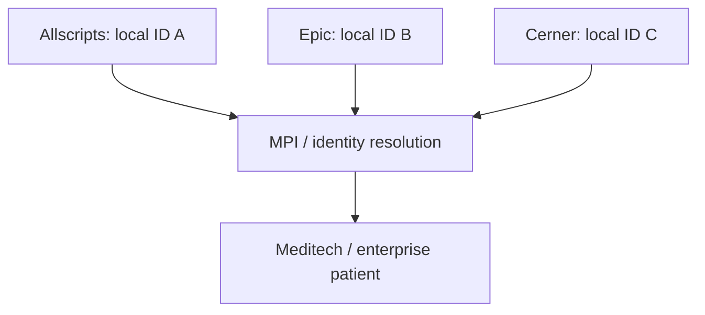
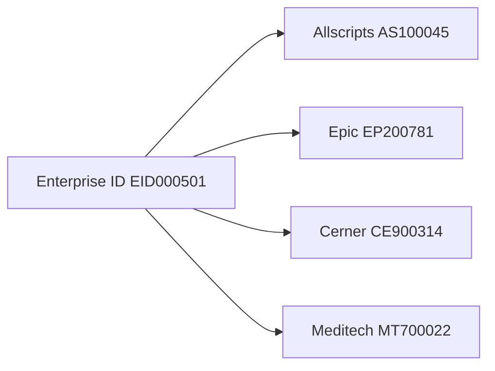
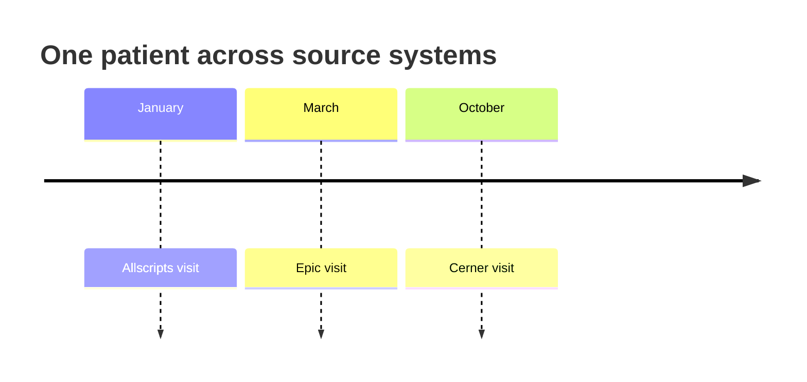
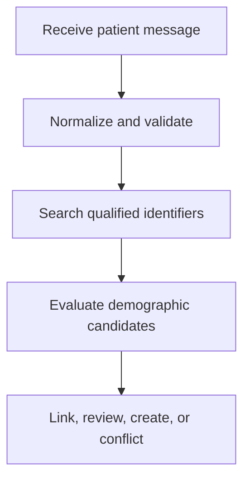

# HL7 PM-to-EHR Workflow v2 — Part 1

This guide documents **HL7_PMtoEHR_v2 Part 1**. The lesson explains how a healthcare organization can recognize one patient across several Practice Management (PM) or clinical systems—even when every system assigns a different local patient number—and link those records through a Master Patient Index (MPI) and an enterprise identifier.

> **Scope:** The video uses a conceptual drawing with Allscripts, Epic, Cerner, a Meditech EHR, and an MPI. It discusses identifiers, demographic score-card matching, visits occurring in different months, and an enterprise ID. Product names are used only to describe the teaching diagram; no vendor-specific implementation is demonstrated. Sections marked **Production guidance** extend the lesson with operational safeguards.

## Learning objectives

After working through this guide, you should be able to:

- explain why one patient may have different IDs in different systems;
- distinguish a local patient ID, MRN, account number, visit number, and enterprise ID;
- describe the purpose of an MPI or Enterprise Master Patient Index (EMPI);
- compare deterministic identifier matching with demographic score matching;
- explain how an MPI cross-reference links source records;
- identify relevant HL7 v2 patient-identity events and fields;
- design safe match, review, merge, and unmerge workflows;
- recognize the controls needed to prevent wrong-patient updates.

## 1. Scenario demonstrated in the video

The diagram presents three source systems and one destination EHR:

| Role in the diagram | Example system | Example visit period |
|---|---|---|
| PM/source system 1 | Allscripts | January |
| PM/source system 2 | Epic | March |
| PM/source system 3 | Cerner | October |
| Central EHR | Meditech | Receives or consolidates patient information |
| Identity service | MPI — Master Patient Index | Assigns or maintains an enterprise ID |

The patient is the same real-world person, but each source system stores a different local identifier.



The central problem is not transporting an HL7 message. It is establishing that the records sent by independent systems represent the **same person**.

## 2. Why patient IDs differ

Patient identifiers are usually unique only inside an identifier domain.

```text
Local patient ID 456100 may belong to:
  - one person in System A; and
  - a different person in System B.
```

Therefore, an identifier must be interpreted as a qualified tuple:

```text
(identifier value, assigning authority, identifier type)
```

### Fictional examples

| Source system | Identifier value | Assigning authority | Type |
|---|---|---|---|
| Allscripts | `AS100045` | `ALLSCRIPTS_CLINIC` | `PI` |
| Epic | `EP200781` | `EPIC_FACILITY` | `MR` |
| Cerner | `CE900314` | `CERNER_HOSPITAL` | `MR` |
| Enterprise MPI | `EID000501` | `ORG_EMPI` | `PI` |

These four values can all identify the same person while remaining distinct identifiers.

## 3. Identifier types mentioned in the lesson

The video lists identifiers such as:

- patient ID;
- medical record number (MRN);
- Social Security Number (SSN);
- passport number.

The exact identifiers used depend on jurisdiction, organizational policy, and the destination profile.

| Identifier | Typical purpose | Important qualifier |
|---|---|---|
| Patient internal ID | Local application identity | Source application/facility |
| MRN | Medical record identity within a provider organization | Assigning facility/authority |
| National/SSN identifier | Government-issued identity | Issuing authority and legal use |
| Passport number | Travel-document identity | Issuing country/authority and type |
| Enterprise ID | Organization-wide identity | Enterprise MPI authority |
| Account number | Billing or patient account | Account domain; not necessarily the patient ID |
| Visit number | Encounter identity | Visit assigning authority |

Do not use an account or visit number as a permanent person identifier unless the interface specification explicitly defines it that way.

## 4. HL7 representation of patient identifiers

In HL7 v2, patient identifiers are normally sent as repetitions of `PID-3` using the CX datatype.

### Fictional PID example

```hl7
PID|1||AS100045^^^ALLSCRIPTS_CLINIC^PI~EID000501^^^ORG_EMPI^PI||SAMPLE^PATIENT^A||19900115|U
```

The repetitions are separated by `~`:

| Repetition | ID | Assigning authority | Type |
|---|---|---|---|
| 1 | `AS100045` | `ALLSCRIPTS_CLINIC` | `PI` |
| 2 | `EID000501` | `ORG_EMPI` | `PI` |

### Relevant CX components

| Component | Meaning |
|---|---|
| `CX.1` | ID number |
| `CX.4` | Assigning authority |
| `CX.5` | Identifier type code |
| `CX.6` | Assigning facility |
| `CX.7` / `CX.8` | Effective and expiration dates, when used |

Receiving logic should select an identifier by authority and type, not merely by its repetition position.

## 5. What is an MPI?

An MPI is a patient-identity service or repository that links patient records from participating source systems.

An enterprise implementation is often called an **EMPI**—Enterprise Master Patient Index.

### Core MPI responsibilities

- maintain an enterprise patient identity;
- store cross-references to local source identifiers;
- search for candidate patient records;
- apply deterministic and probabilistic match rules;
- detect duplicates and identity conflicts;
- support authorized manual review;
- record merges, unmerges, and identity history;
- return the enterprise ID or matched source identifiers to connected systems.

### What an MPI is not

An MPI is not automatically:

- the complete clinical record;
- the source of every patient demographic field;
- proof that two records truly represent the same person;
- a replacement for governance and human review;
- the same as an EHR database, although an EHR may include MPI-like functions.

## 6. Enterprise identifier and cross-reference

The video adds an **Enterprise ID** inside the MPI box. The enterprise ID acts as a common identity key across participating systems.



### Conceptual cross-reference table

| Enterprise ID | Source system | Local ID | Authority | Type | Status |
|---|---|---|---|---|---|
| `EID000501` | Allscripts | `AS100045` | `ALLSCRIPTS_CLINIC` | `PI` | Active |
| `EID000501` | Epic | `EP200781` | `EPIC_FACILITY` | `MR` | Active |
| `EID000501` | Cerner | `CE900314` | `CERNER_HOSPITAL` | `MR` | Active |
| `EID000501` | Meditech | `MT700022` | `CENTRAL_EHR` | `MR` | Active |

Recommended logical uniqueness:

```text
(source system, assigning authority, identifier type, local identifier)
    -> one active enterprise identity
```

The enterprise ID should be durable, opaque, and managed by the identity authority. It should not be calculated from sensitive demographics.

## 7. Visits occurring at different times

The diagram uses January, March, and October to show that patient identity persists across time and across facilities.



Each event can create:

- a new local visit number;
- a new account number;
- updated demographics;
- another HL7 message;
- a new or confirmed source-to-enterprise identity link.

The MPI should link the **person identities** while preserving each system's separate visits and accounts.

## 8. Identity-resolution workflow



### Step 1 — Receive the event

The integration engine or MPI receives an ADT or identity message from a trusted source.

### Step 2 — Validate the message

Validate:

- sender and facility;
- HL7 version and message type;
- required patient identifiers;
- assigning authorities and identifier types;
- demographic datatypes and code values;
- duplicate message-control IDs.

### Step 3 — Search trusted identifiers

Search for an exact cross-reference or authoritative identifier match.

### Step 4 — Generate demographic candidates

If no deterministic match exists, locate plausible candidates using approved blocking/search keys. Avoid comparing every incoming record with the entire patient population.

### Step 5 — Calculate and evaluate match evidence

Compare normalized demographics and apply conflict rules.

### Step 6 — Choose a controlled outcome

- link to an existing enterprise identity;
- route for manual review;
- create a new enterprise identity;
- quarantine an identity conflict.

### Step 7 — Persist and respond

Store the cross-reference and audit evidence atomically, then return the agreed response or acknowledgment.

## 9. Deterministic matching

Deterministic matching uses an exact trusted value.

Examples:

- an existing source-ID-to-enterprise-ID cross-reference;
- an enterprise ID issued by the MPI;
- a verified national identifier with the correct authority;
- a trusted organization-wide MRN.

### Safe deterministic key

```text
value + assigning authority + identifier type
```

An exact value alone is not sufficient because two systems may reuse the same numeric range.

### Conflict example

If a trusted source ID points to enterprise patient A, while a verified national ID points to enterprise patient B, the system must not select whichever match is processed first. It should stop automatic processing and create an identity-conflict case.

## 10. Demographic score-card matching

The video displays an illustrative score card:

| Attribute | Displayed weight |
|---|---:|
| First name | 150 |
| Last name | 150 |
| Middle initial | 20 |
| Date of birth | 100 |
| Gender | 25 |
| National ID | 20 |

The weights total **465**. The diagram also shows a threshold-style notation near the score card. The notation is incomplete and should not be treated as a deployable matching rule.

> **Production guidance:** The displayed weights are teaching values. A live algorithm requires formally approved normalization, agreement/disagreement weights, missing-value behavior, thresholds, tie rules, validation data, monitoring, and governance.

### Example calculation

Suppose a candidate agrees on:

- first name: +150;
- last name: +150;
- date of birth: +100;
- gender: +25;
- middle initial unavailable: +0;
- national ID unavailable: +0.

Illustrative total:

```text
150 + 150 + 100 + 25 = 425
```

Whether 425 is a match cannot be decided without an approved threshold, disagreement penalties, candidate margin, and conflict policy.

## 11. Normalize before matching

| Attribute | Typical controlled normalization |
|---|---|
| Names | Trim, standardize case, normalize Unicode, and handle punctuation under approved rules |
| Arabic/Latin names | Use approved script and transliteration handling; never assume two transliterations are equivalent |
| Middle name/initial | Define initial-to-full-name comparison and missing-value behavior |
| Date of birth | Preserve known precision; do not invent missing month/day values |
| Administrative sex | Map source codes to the enterprise vocabulary |
| National ID | Preserve leading zeroes and issuing authority; remove only approved formatting |
| Passport | Include issuing authority/country and document type |
| Phone | Normalize country/area code; use only as supporting evidence |
| Address | Normalize cautiously because values change and can be shared |

Two blank values are not evidence of identity. Missing data should normally contribute neither a match nor a mismatch unless the validated algorithm specifies otherwise.

## 12. Match decision bands

A safe implementation supports more than “match” and “no match.”

| Outcome | Meaning | Action |
|---|---|---|
| Deterministic match | Trusted qualified identifier resolves cleanly | Link to existing enterprise ID |
| High-confidence demographic match | One candidate exceeds the approved automatic threshold and conflict checks | Link if auto-match is authorized |
| Possible match | Score is in the review band or candidates are close | Hold for authorized manual review |
| No match | No candidate meets the minimum threshold | Create or reject according to policy |
| Conflict | Trusted evidence disagrees or one source ID maps to multiple people | Quarantine and investigate |

### Candidate-margin rule

Even when the top candidate has a high score, automatic matching should be blocked if the second candidate is nearly as strong. The difference between the top two candidates is often as important as the top score itself.

## 13. MPI versus EHR responsibilities

The teaching diagram contains both a Meditech EHR and a separate MPI box. Responsibilities must be explicit.

| Responsibility | Possible owner |
|---|---|
| Parse and validate inbound HL7 | Integration engine or receiving service |
| Maintain enterprise ID | MPI/EMPI |
| Store source cross-references | MPI/EMPI |
| Perform demographic candidate search | MPI/EMPI or EHR identity module |
| Create/update clinical patient record | EHR |
| Maintain visits and accounts | EHR and originating systems |
| Route manual identity review | MPI work queue / registration team |
| Merge or unmerge patient identities | Authorized enterprise identity workflow |
| Generate ACK | System owning the agreed processing endpoint |

Do not allow both the integration engine and EHR to make independent, conflicting patient-match decisions.

## 14. Relevant HL7 v2 events

The actual event set depends on the profile and HL7 version.

| Event | General use |
|---|---|
| `ADT^A04` | Register a patient |
| `ADT^A08` | Update patient information |
| `ADT^A28` | Add person information |
| `ADT^A31` | Update person information |
| `ADT^A40` | Merge patient identifiers/patient records |
| `ADT^A47` | Change patient identifier list |

An interface must not treat all identity actions as A08. Registration, update, identifier change, and merge have different meanings and operational risks.

## 15. Fictional multi-source HL7 examples

### Allscripts patient update

```hl7
MSH|^~\&|ALLSCRIPTS|CLINIC_A|EMPI|ENTERPRISE|20260923100000||ADT^A08^ADT_A01|AS-MSG-000001|T|2.5
EVN|A08|20260923100000
PID|1||AS100045^^^ALLSCRIPTS_CLINIC^PI||SAMPLE^PATIENT^A||19900115|U
```

### Epic patient update

```hl7
MSH|^~\&|EPIC|FACILITY_B|EMPI|ENTERPRISE|20260923100500||ADT^A08^ADT_A01|EP-MSG-000001|T|2.5
EVN|A08|20260923100500
PID|1||EP200781^^^EPIC_FACILITY^MR||SAMPLE^PATIENT^A||19900115|U
```

### Cerner patient update

```hl7
MSH|^~\&|CERNER|HOSPITAL_C|EMPI|ENTERPRISE|20260923101000||ADT^A08^ADT_A01|CE-MSG-000001|T|2.5
EVN|A08|20260923101000
PID|1||CE900314^^^CERNER_HOSPITAL^MR||SAMPLE^PATIENT^A||19900115|U
```

After verified identity resolution, the enterprise ID can be included as another qualified `PID-3` repetition in downstream messages:

```hl7
PID|1||EP200781^^^EPIC_FACILITY^MR~EID000501^^^ORG_EMPI^PI||SAMPLE^PATIENT^A||19900115|U
```

All data above is fictional. Never use production PHI in training material.

## 16. Mirth-style identity-resolution flow

```javascript
var sender = msg['MSH']['MSH.3']['MSH.3.1'].toString();
var facility = msg['MSH']['MSH.4']['MSH.4.1'].toString();
var controlId = msg['MSH']['MSH.10']['MSH.10.1'].toString();
var identifiers = extractQualifiedPid3Identifiers(msg);

validateSenderAndIdentifiers(sender, facility, identifiers);

var exactResult = findActiveCrossReference(sender, facility, identifiers);

if (exactResult.hasConflict) {
    quarantineIdentityConflict(controlId, exactResult.reason);
} else if (exactResult.enterpriseId) {
    routeWithEnterpriseId(msg, exactResult.enterpriseId);
} else {
    var candidates = findDemographicCandidates(msg);
    var decision = applyApprovedMatchPolicy(candidates, msg);

    if (decision.type === 'MATCH') {
        createVerifiedCrossReference(decision.enterpriseId, identifiers);
        routeWithEnterpriseId(msg, decision.enterpriseId);
    } else if (decision.type === 'REVIEW') {
        routeToIdentityReview(controlId, decision);
    } else if (decision.type === 'NO_MATCH') {
        applyApprovedNewIdentityPolicy(msg, identifiers);
    } else {
        quarantineIdentityConflict(controlId, decision.reason);
    }
}
```

This is conceptual pseudocode. Production Mirth channels must use supported APIs, parameterized queries, connection pooling, transactions, safe logging, durable queues, and centralized error handling.

## 17. Merge and unmerge safety

Merging patient identities is significantly riskier than ordinary demographic updating.

### Before a merge

- confirm the surviving and obsolete identifiers;
- check for conflicting authoritative identifiers;
- review clinical, medication, allergy, laboratory, and billing implications;
- verify downstream systems support the event;
- require appropriate authorization;
- capture a complete audit trail.

### During a merge

- preserve historical identifiers;
- make the transaction idempotent;
- prevent concurrent contradictory identity updates;
- send the agreed merge event and identifier structure;
- correlate acknowledgments and downstream completion.

### After a merge

- reconcile every participating system;
- monitor rejects and partial completion;
- preserve a controlled unmerge/correction path;
- never reuse a retired identifier for another person.

An HL7 `AA` response from one system does not prove that every downstream application completed the merge.

## 18. Duplicate prevention and idempotency

Identity messages can be redelivered because of network retries or uncertain acknowledgments.

Store at least:

- sending application and facility;
- `MSH-10` message control ID;
- message type and trigger event;
- source identifier tuple;
- enterprise ID decision;
- processing state and timestamps;
- acknowledgment/result.

If an already completed event is received again, return the agreed repeat response without creating a second enterprise identity or cross-reference.

## 19. Privacy, security, and governance

Patient identity data is highly sensitive.

**Production guidance:**

- use least-privilege access for raw messages, MPI searches, and review queues;
- encrypt transport and stored identity data according to policy;
- mask names, national IDs, passports, phone numbers, and addresses in ordinary logs;
- record who linked, merged, unmerged, or corrected an identity;
- version matching algorithms, thresholds, and normalization rules;
- validate performance across languages, scripts, name patterns, ages, and populations;
- monitor false matches, missed matches, duplicates, review volume, and override rates;
- define an urgent wrong-patient correction process;
- never infer race, ethnicity, nationality, or language from a person's name.

## 20. Validation checklist

### Source and message

- [ ] Sending application and facility are recognized.
- [ ] Message type and trigger are supported.
- [ ] HL7 version and profile are correct.
- [ ] `MSH-10` is present and checked for duplicate delivery.
- [ ] Message environment is correct.

### Identifiers

- [ ] Every `PID-3` repetition is parsed independently.
- [ ] Identifier value, authority, and type are preserved.
- [ ] Enterprise IDs are accepted only from an authorized issuer.
- [ ] Visit/account identifiers are not mistaken for person identifiers.
- [ ] Retired, merged, expired, or disputed identifiers are handled safely.

### Matching

- [ ] Existing cross-reference lookup occurs before demographic scoring.
- [ ] Demographics are normalized under approved rules.
- [ ] Missing values do not create false agreement.
- [ ] Trusted-identifier conflicts stop automatic processing.
- [ ] Candidate margin and multiple-candidate ambiguity are evaluated.
- [ ] Match, review, no-match, and conflict outcomes are available.
- [ ] Algorithm version and decision evidence are audited.

### Persistence and operations

- [ ] Enterprise identity and cross-reference updates are atomic.
- [ ] Repeated messages are idempotent.
- [ ] ACK timing matches the agreed durable processing point.
- [ ] Retry, quarantine, replay, and manual review are monitored.
- [ ] Merge/unmerge procedures are authorized and tested.
- [ ] Logs and screenshots protect patient information.

## 21. Test scenarios

Use synthetic, independently labeled test patients.

1. Known Allscripts cross-reference resolves to an existing enterprise ID.
2. Known Epic and Cerner IDs resolve to the same enterprise ID.
3. Same numeric local ID arrives from two different authorities.
4. No exact ID match but one strong demographic candidate exists.
5. Two demographic candidates have nearly equal scores.
6. Names differ by punctuation, spacing, script, or approved transliteration.
7. Date of birth is partial or conflicts with a trusted identifier.
8. Two records share name, DOB, and gender, such as twins.
9. National ID points to a different enterprise identity than the source cross-reference.
10. Message is redelivered with the same `MSH-10`.
11. A source identifier is already linked to two enterprise IDs.
12. A no-match record follows the approved create-new-identity policy.
13. Manual reviewer links a possible match and the cross-reference becomes reusable.
14. Merge succeeds in one system but fails downstream.
15. Authorized unmerge restores the correct identities and relationships.

## 22. Common mistakes

| Mistake | Risk | Better approach |
|---|---|---|
| Matching on raw patient ID alone | Collision across systems | Qualify ID with authority and type. |
| Assuming different IDs mean different people | Duplicate enterprise records | Resolve through cross-reference and governed matching. |
| Treating account or visit ID as person ID | Wrong longitudinal linkage | Preserve identifier purpose and domain. |
| Counting two blanks as a demographic match | Inflated score | Treat missing data as no evidence. |
| Automatically choosing the highest candidate | Wrong-patient match when evidence is weak | Require threshold, margin, and conflict checks. |
| Copying the video's score weights into production | Unvalidated clinical/operational risk | Calibrate and validate an approved algorithm. |
| Letting multiple systems independently assign enterprise IDs | Duplicate or conflicting identity authority | Define one authoritative issuer. |
| Overwriting local IDs with the enterprise ID | Loss of source traceability | Preserve local and enterprise IDs as separate qualified repetitions. |
| Using A08 for a merge | Incorrect event semantics | Use the profile-approved merge event and structure. |
| Logging full PID segments | Privacy exposure | Mask sensitive identity data and restrict access. |

## 23. Quick review

- One person can have a different local identifier in Allscripts, Epic, Cerner, and Meditech.
- An identifier is meaningful only with its assigning authority and type.
- The MPI maintains an enterprise identity and source-system cross-references.
- Visits in January, March, and October remain separate events while the person identity is linked.
- Deterministic matching should precede demographic score matching.
- The displayed score card is illustrative, not a production algorithm.
- Safe outcomes include match, manual review, no match, and identity conflict.
- Merge/unmerge workflows require stronger controls than ordinary updates.
- HL7 transport success does not prove patient-identity correctness.

## 24. Knowledge check

1. Why can the same patient have different IDs in Allscripts, Epic, and Cerner?
2. What three values qualify an identifier safely?
3. What does an enterprise ID represent?
4. Why should source IDs not be overwritten by the enterprise ID?
5. What should be attempted before demographic scoring?
6. Why is the second-best candidate important?
7. Which PID field normally carries repeating patient identifiers?
8. What is the difference between an MPI identity and a visit number?
9. Why must a trusted-identifier conflict stop automatic matching?
10. Which HL7 event family is commonly used for patient merge operations?

### Answers

1. Each application controls its own identifier namespace.
2. Identifier value, assigning authority, and identifier type.
3. The common organization-wide person identity managed by the MPI/EMPI.
4. Local IDs remain necessary for source traceability, routing, reconciliation, and audit.
5. Search for an existing qualified identifier or source-to-enterprise cross-reference.
6. A close second candidate means the result may be ambiguous even when the top score is high.
7. `PID-3`.
8. The MPI identity represents the person across time; a visit number represents one encounter/domain-specific visit.
9. It may indicate a wrong patient, duplicate identity, or corrupt cross-reference.
10. `ADT^A40` and related merge events, subject to the applicable profile/version.

## 25. Required project artifacts

Before implementing a PM/EHR/MPI interface, prepare:

- an enterprise identity-governance policy;
- a registry of source systems, assigning authorities, and identifier types;
- the enterprise-ID issuance and lifecycle rules;
- source-to-enterprise cross-reference specifications;
- supported HL7 identity event profiles;
- deterministic match and conflict rules;
- demographic normalization and matching specifications;
- approved thresholds, review band, and candidate-margin rules;
- manual review roles and service levels;
- merge, unmerge, correction, and reconciliation procedures;
- ACK, duplicate, retry, quarantine, and replay behavior;
- privacy, audit, access, retention, and monitoring controls;
- synthetic test cases with independently verified expected identities.

---

**Document basis:** prepared from *HL7_PMtoEHR_v2 Part 1*. The system names in the video are part of a conceptual teaching diagram and do not imply vendor-specific behavior. All examples and identifiers in this README are fictional. Verify production design against the applicable HL7 specification, MPI/EHR vendor documentation, destination conformance profiles, organizational identity-governance rules, privacy policy, and bilateral interface agreements.
