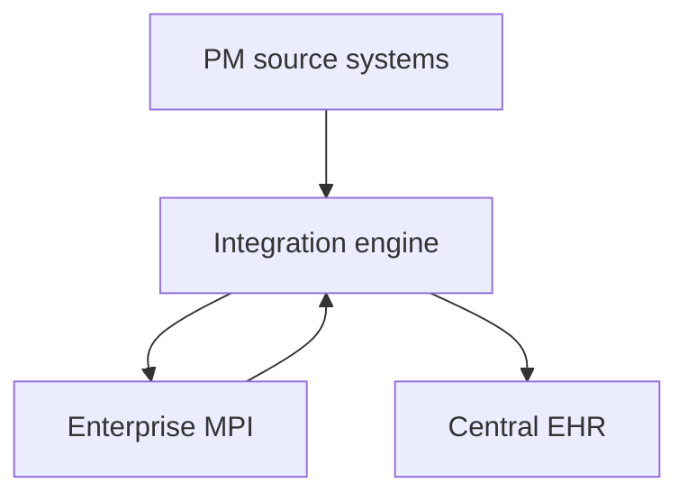
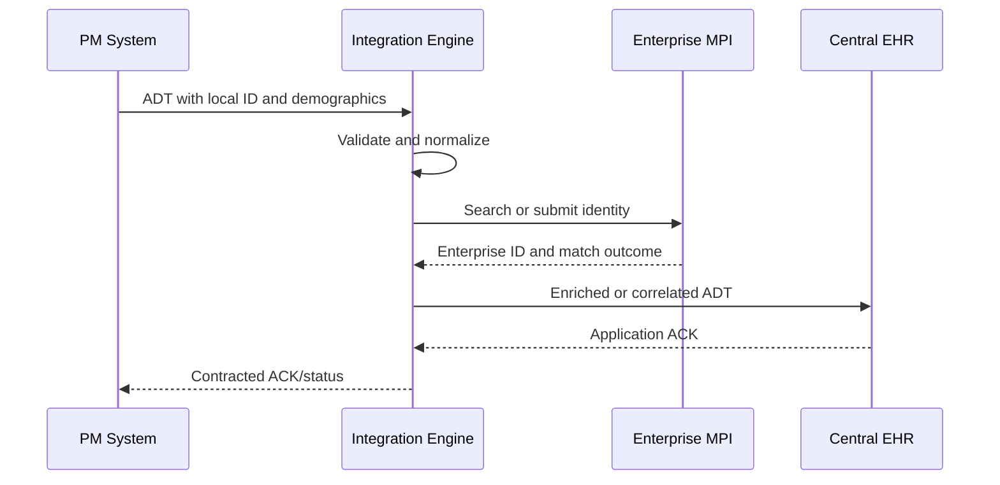

# HL7 PM-to-EHR Integration with an Enterprise MPI — Part 2

This guide explains the workflow illustrated in **HL7 PM-to-EHR v2, Part 2**: several practice-management (PM) systems register or encounter the same patient using different local identifiers, while a central Master Patient Index (MPI) links those identifiers to one enterprise identity used by the EHR.

> All identifiers and patient data in this document are fictional. Do not use real protected health information (PHI) in development or testing.

## Learning objectives

After completing this guide, you should be able to:

- distinguish a source-local patient identifier from an enterprise identifier;
- explain why direct PM-to-EHR delivery and MPI identity resolution are related but separate flows;
- describe the first-registration and subsequent-registration workflows;
- choose common HL7 v2 ADT events for registration, update, and merge operations;
- design acknowledgments, retries, idempotency, and reconciliation safely;
- recognize when an automatic match is unsafe and manual review is required; and
- outline an integration-engine channel that enriches and routes patient messages.

## Scope of Part 2

Part 2 develops the architecture introduced in Part 1. The diagram uses three PM systems—Allscripts, Epic, and Cerner—as examples of independent registration sources. Each system creates its own local patient identifier for encounters occurring at different times. A central EHR—shown as Meditech—must recognize that those records belong to the same person.

The MPI supplies that missing identity relationship. It maintains an enterprise identifier and a cross-reference between that identifier and every qualified local identifier.

The video is a conceptual workflow, not a vendor-specific user-interface or channel configuration demonstration. Product names identify example system roles; an actual implementation must follow the interfaces and profiles supported by the installed products.

## Architecture at a glance



| Component | Primary responsibility | Identifier it owns |
|---|---|---|
| PM system | Registration, scheduling, and its local patient/visit context | Local patient ID and often visit/account IDs |
| Integration engine | Validation, transformation, orchestration, routing, retry, and monitoring | Normally none; it transports qualified identifiers |
| Enterprise MPI | Identity search, matching, cross-reference, merge history, and enterprise identity | Enterprise patient ID |
| Central EHR | Longitudinal clinical record and clinical encounter processing | Its internal identifiers, plus the enterprise/local references it accepts |

An identifier is not globally meaningful by itself. Treat it as a qualified tuple:

```text
(identifier value, assigning authority, identifier type)
```

For example, `A100045^^^ALLSCRIPTS^MR` and `A100045^^^EPIC^MR` are not necessarily the same patient, even though the identifier values are identical.

## Two coordinated information streams

The diagram can be understood as two linked streams.

### 1. Registration and encounter delivery

The PM system sends the patient and visit event to the central EHR. The EHR needs enough information to create or update the appropriate clinical record and associate the encounter correctly.

### 2. Identity resolution and cross-reference

The MPI receives or is queried with the patient's qualified local identifier and demographics. It either finds an existing enterprise person, requests review, or creates a new enterprise identity. It then records the relationship:

```text
ALLSCRIPTS local ID ─┐
EPIC local ID       ├── Enterprise patient ID
CERNER local ID     ┘
```

These streams must be coordinated. Delivering an encounter before identity resolution is complete may create a duplicate EHR record; waiting indefinitely for the MPI may prevent clinical operations. The interface contract must define when resolution is synchronous, asynchronous, or allowed to enter an exception queue.

## End-to-end workflow



The logical steps are:

1. A source registers a patient or records a visit and assigns a local patient ID.
2. It sends an HL7 v2 ADT message to the integration engine.
3. The engine validates the envelope, required fields, code values, and identifier authorities.
4. The MPI first attempts an exact lookup using qualified identifiers.
5. If no exact cross-reference exists, the MPI evaluates demographic candidates.
6. The MPI returns one of three outcomes: matched, manual review, or new enterprise identity.
7. The engine carries the enterprise ID and local ID according to the agreed interface profile.
8. The central EHR creates or updates the correct patient and associates the visit.
9. Acknowledgments and processing status are returned according to the interface contract.
10. Audit and reconciliation records allow the full transaction to be traced later.

## First registration: establishing the enterprise identity

Assume the first visit occurs in January in the Allscripts PM system.

1. Allscripts assigns a local medical-record number.
2. The registration message contains that qualified ID and the available demographics.
3. The MPI finds no existing local-ID cross-reference.
4. It searches for candidates using normalized demographics.
5. If there is no sufficiently strong candidate, the MPI creates a new enterprise person.
6. The MPI stores the relationship between the Allscripts ID and the enterprise ID.
7. The EHR receives the resolved identity and processes the visit.

Example cross-reference after the first visit:

| Assigning authority | Local ID | Type | Enterprise ID |
|---|---:|---|---:|
| ALLSCRIPTS | A100045 | MR | E900001 |

The enterprise ID does not replace the source ID. Both are retained because each is required in a different system context.

## Later registrations: linking new local identities

Suppose the same patient visits an Epic-based location in March and a Cerner-based location in October. Each source may create a different local ID.

For each later event, the MPI:

1. checks whether the qualified local ID is already cross-referenced;
2. searches other strong identifiers, if available;
3. compares normalized demographic attributes;
4. selects the existing enterprise person only when the evidence meets policy;
5. adds the new local-ID cross-reference; and
6. returns or publishes the established enterprise ID.

The resulting identity graph might be:

| Assigning authority | Local ID | Type | Enterprise ID | First observed |
|---|---:|---|---:|---|
| ALLSCRIPTS | A100045 | MR | E900001 | January |
| EPIC | P770021 | MR | E900001 | March |
| CERNER | C440089 | MR | E900001 | October |

The dates describe when each relationship was first observed; they are not part of the identity key.

## Identity matching

### Deterministic matching

A deterministic rule requires an exact or explicitly defined relationship, such as:

- an existing qualified local-ID cross-reference;
- an enterprise ID issued by the trusted MPI;
- a verified national identifier where its use is lawful and appropriate; or
- a configured combination such as exact name, date of birth, and a second verified identifier.

Exact identifier matching should occur before fuzzy demographic scoring. A local identifier must never be compared without its assigning authority.

### Probabilistic matching

When a trusted identifier is unavailable, an MPI may score demographic agreement. The video illustrates weights such as:

| Attribute | Illustrative weight |
|---|---:|
| First name | 150 |
| Last name | 150 |
| Middle initial | 20 |
| Date of birth | 100 |
| Gender | 25 |
| National identifier | 20 |
| **Maximum shown** | **465** |

These values explain the idea of a weighted score; they are not production recommendations. A safe production algorithm also accounts for disagreement penalties, missing values, data quality, name frequency, phonetic similarity, historical values, and verified identifier strength.

A typical decision model uses policy bands:

| Result | Meaning | Action |
|---|---|---|
| Above automatic-match threshold | One candidate is sufficiently strong and unambiguous | Link under audit controls |
| Review band | Candidate is plausible but uncertain | Hold for an identity specialist |
| Below match threshold | No acceptable candidate | Create a new enterprise person if policy permits |
| Several strong candidates | Ambiguous population | Require manual review; do not choose arbitrarily |

Thresholds must be measured against representative, labeled data. The cost of a false positive—joining two people—is commonly much greater than the cost of a false negative duplicate.

### Normalization before comparison

Common normalization includes:

- trimming whitespace and normalizing case;
- treating punctuation and diacritics consistently;
- parsing dates into an unambiguous internal form;
- standardizing phone numbers and addresses;
- mapping administrative-sex and other coded fields through agreed value sets;
- preserving original values alongside normalized values; and
- distinguishing missing information from an explicit unknown value.

Normalization must not silently change the legal or clinical meaning of a value.

## HL7 v2 events commonly used

The exact event depends on the implementation profile, but the following patterns are common:

| Event | Typical purpose in this workflow |
|---|---|
| `ADT^A04` | Register an outpatient or emergency patient |
| `ADT^A28` | Add a person to a patient registry/MPI without an encounter |
| `ADT^A08` | Update patient or visit information |
| `ADT^A31` | Update person information in an MPI-oriented workflow |
| `ADT^A40` | Merge one patient identifier into another |
| `QBP` / `RSP` families | Query and response when supported by the selected identity profile |

Do not choose an event solely from this table. Confirm the receiving application's interface specification, HL7 version, trigger-event semantics, required segments, and identifier placement.

## Fictional registration message

The following message represents a PM system registering a patient with a local ID. Delimiters are shown as HL7 carriage-return-separated lines for readability.

```hl7
MSH|^~\&|PM_APP|ALLSCRIPTS|INT_ENGINE|ENTERPRISE|20260923101500||ADT^A04^ADT_A01|MSG000001|P|2.5.1
EVN|A04|20260923101430
PID|1||A100045^^^ALLSCRIPTS^MR||RIVERA^MORGAN^L||20150714|U|||125 EXAMPLE RD^^METRO^CA^90000^USA||5555550101
PV1|1|O|CLINIC1^ROOM1^BED1||||12345^CLINICIAN^CASEY
```

Important observations:

- `PID-3` contains the source-local ID, its assigning authority, and identifier type.
- The sending facility and application identify the source but do not replace the assigning authority in `PID-3`.
- The message-control ID in `MSH-10` supports acknowledgment correlation and duplicate detection.
- Whether an enterprise ID may also appear as another repetition of `PID-3` is an interface-profile decision.

## Example after enterprise resolution

If the EHR accepts both identifiers as repetitions of `PID-3`, an enriched downstream message could contain:

```hl7
MSH|^~\&|INT_ENGINE|ENTERPRISE|EHR|CENTRAL|20260923101502||ADT^A04^ADT_A01|MSG000001-EHR|P|2.5.1
EVN|A04|20260923101430
PID|1||A100045^^^ALLSCRIPTS^MR~E900001^^^ENTERPRISE_MPI^PI||RIVERA^MORGAN^L||20150714|U|||125 EXAMPLE RD^^METRO^CA^90000^USA||5555550101
PV1|1|O|CLINIC1^ROOM1^BED1||||12345^CLINICIAN^CASEY
```

Here:

- the local ID remains `A100045^^^ALLSCRIPTS^MR`;
- the enterprise ID is `E900001^^^ENTERPRISE_MPI^PI`; and
- the identifier repetitions are not interchangeable—the assigning authorities preserve their meanings.

Some products instead require a profile-specific query/response, an API, a custom segment, or an internal cross-reference lookup. Follow the agreed specification rather than assuming repeated `PID-3` is universally accepted.

## Example application acknowledgment

```hl7
MSH|^~\&|EHR|CENTRAL|INT_ENGINE|ENTERPRISE|20260923101503||ACK^A04^ACK|ACK000001|P|2.5.1
MSA|AA|MSG000001-EHR
```

Common acknowledgment codes are:

| Code | Meaning | Operational interpretation |
|---|---|---|
| `AA` | Application accept | Receiver completed the agreed application-level acceptance |
| `AE` | Application error | Message was understood but could not be processed successfully |
| `AR` | Application reject | Message could not be accepted, often because its structure or contract was invalid |

An integration engine must distinguish at least three events:

1. receipt of the source message;
2. completion of required MPI processing; and
3. acceptance or rejection by the EHR.

Returning `AA` immediately after transport receipt may be incorrect when the source contract defines success as completed identity resolution and downstream delivery. Define enhanced or original acknowledgment mode, timeouts, and final-status behavior explicitly.

## Recommended orchestration logic

```text
receive message
validate MSH, PID, event, identifiers, and required demographics
derive idempotency key from source + message-control ID
if transaction was already completed:
    return the recorded outcome
normalize a working copy of identity data
look up qualified local ID in cross-reference cache or MPI
if exact cross-reference exists:
    use its enterprise ID
else:
    request MPI candidate resolution
    if outcome is MATCH:
        record returned cross-reference
    else if outcome is REVIEW:
        place message in a controlled review workflow
        return the contracted pending/error status
    else if outcome is NEW:
        use the newly created enterprise ID
enrich or transform message according to the EHR profile
deliver to EHR
record ACK, timestamps, identifiers, and correlation IDs
return the contracted status to the source
```

An engine such as Mirth Connect can implement this using a source connector, validation and normalization transformers, an MPI request destination, a response transformer, an EHR destination, and an error/retry path. Keep matching policy in the MPI or a governed identity service rather than scattering it through channel scripts.

## Idempotency and duplicate delivery

HL7 interfaces commonly retry after network errors or missing acknowledgments. The receiver must safely handle the same logical transaction more than once.

Recommended controls include:

- keying message duplicates by sending application, sending facility, and `MSH-10`;
- storing the original processing outcome and acknowledgment;
- avoiding a second MPI create operation for a retried message;
- making cross-reference creation unique on qualified local ID;
- recording message hashes when a sender improperly reuses a control ID; and
- alerting when the same control ID arrives with different content.

Message idempotency and patient identity matching are different concerns. The first prevents repeated processing of one transaction; the second determines whether separate records represent the same person.

## Concurrency and race conditions

Two facilities may register the same previously unknown person at nearly the same time. Both requests could search before either enterprise identity is committed.

Mitigations include:

- transactional candidate resolution inside the MPI;
- unique constraints for trusted identifier cross-references;
- short-lived identity-resolution locks where supported;
- a final duplicate check before committing a new enterprise person;
- review queues for competing high-confidence candidates; and
- post-creation duplicate surveillance and reconciliation.

Do not attempt to solve this only with delays in the integration engine. The component that owns enterprise identity must protect its own consistency.

## Authoritative updates and loop prevention

When several systems exchange patient updates, an ungoverned `A08` can bounce indefinitely or overwrite a more authoritative value.

Define field-level stewardship, for example:

| Data element | Example authority | Other systems' role |
|---|---|---|
| Source-local patient ID | Issuing PM system | Store as a cross-reference; do not reissue |
| Enterprise ID and identity links | MPI | Consume and preserve |
| Visit/account status | Encounter-owning source or EHR | Update under the encounter interface contract |
| Legal name/demographics | Governed registration source or MPI policy | Submit evidence; accept reconciled values |
| Clinical observations | Clinical source/EHR | MPI should not become the clinical repository |

Loop-prevention strategies include origin stamps, event provenance, message-control tracking, change detection, and explicit rules about whether an MPI-published update may be sent back to its origin.

## Merge workflow

A merge occurs when two identifiers or enterprise persons were created for one real person and the organization determines that they must be combined.

In an `ADT^A40`, the surviving patient identifier is normally represented in `PID-3`, and the prior identifier is represented in `MRG-1`, according to the selected HL7 version and profile.

```hl7
MSH|^~\&|MPI|ENTERPRISE|EHR|CENTRAL|20260923113000||ADT^A40^ADT_A39|MERGE000001|P|2.5.1
EVN|A40|20260923112930
PID|1||E900001^^^ENTERPRISE_MPI^PI||RIVERA^MORGAN^L||20150714|U
MRG|E900145^^^ENTERPRISE_MPI^PI
```

Safe merge processing should:

- preserve an audit link from the retired ID to the survivor;
- update local-to-enterprise cross-references;
- reconcile downstream charts, visits, orders, results, and documents;
- be idempotent when the merge event is replayed;
- prevent new activity from being assigned to the retired identity; and
- support a governed correction process when a merge was wrong.

An unmerge is not simply the reverse of a merge. Data entered after the merge may need clinical and identity review to determine which person owns it. Use the MPI and EHR vendors' supported correction workflows.

## Failure handling

| Failure | Recommended response |
|---|---|
| Malformed HL7 or missing required identifier authority | Reject or quarantine with an actionable error |
| MPI timeout | Retry according to policy; do not blindly create a new enterprise person |
| Ambiguous match | Hold for manual review and preserve the source transaction |
| EHR rejects enriched message | Retain MPI outcome, correct the EHR problem, and replay idempotently |
| Duplicate message | Return the recorded result without recreating identity or encounter data |
| Conflicting enterprise IDs | Stop automated processing and escalate to identity governance |
| Downstream unavailable | Queue durably, monitor age, and preserve ordering where required |

Dead-letter and manual-review queues must expose enough context to resolve the problem without displaying unnecessary PHI.

## Privacy and security

- Encrypt HL7 transport, API traffic, and persisted queues.
- Limit access to patient and identity data by role.
- Mask PHI in development, screenshots, logs, and support tickets.
- Avoid logging complete messages unless policy explicitly permits it.
- Audit searches, links, merges, manual decisions, and demographic changes.
- Define retention and disposal rules for interface payloads.
- Use synthetic patients in non-production environments.

## Monitoring and reconciliation

Operational monitoring should include:

- message volume and processing latency by source and event;
- MPI match, review, and new-person rates;
- duplicate enterprise-person creation rate;
- EHR acceptance and rejection counts;
- retry count, queue depth, and oldest queued message;
- missing or invalid assigning authorities;
- merges and merge failures;
- unusually high match rates from one source;
- manual-review age and resolution outcome; and
- end-to-end correlation from source control ID to MPI result and EHR ACK.

Periodic reconciliation should compare:

1. source-local IDs exported by each PM system;
2. MPI cross-references and retired identities;
3. corresponding identifiers stored in the EHR; and
4. unresolved or failed interface transactions.

Transport success alone is not proof of identity consistency.

## Test scenarios

At minimum, test the following cases:

| Scenario | Expected result |
|---|---|
| First visit, no candidate | New enterprise ID and one local cross-reference |
| Later visit from a different PM system | New local ID linked to the existing enterprise ID |
| Exact local ID replay | Same enterprise ID; no duplicate creation |
| Exact demographics but conflicting strong identifier | No automatic link; review or rejection |
| Typographical name difference | Outcome follows measured matching policy |
| Missing middle name or phone | Missing fields are not treated as disagreement automatically |
| Twins or similar household members | No unsafe automatic merge |
| Two concurrent first registrations | One governed enterprise result or controlled review |
| MPI unavailable | Durable retry/exception handling; no blind new identity |
| EHR rejects message after MPI success | Safe replay without a second MPI person |
| Duplicate delivery with same `MSH-10` | Recorded result returned idempotently |
| Reused `MSH-10` with changed payload | Alert and quarantine |
| Valid merge | All cross-references point to the survivor |
| Erroneous merge correction | Vendor-supported review and data redistribution workflow |

## Implementation checklist

### Interface contract

- [ ] Define HL7 version, message structures, trigger events, and transport.
- [ ] Define required segments, fields, repetitions, and code systems.
- [ ] Document every assigning authority and identifier type.
- [ ] Specify where the enterprise ID is carried.
- [ ] Define synchronous versus asynchronous MPI processing.
- [ ] Define acknowledgment mode, timeout, retry, and final-status semantics.

### Identity governance

- [ ] Identify the enterprise-ID owner.
- [ ] Approve deterministic and probabilistic matching policies.
- [ ] Validate thresholds against representative data.
- [ ] Create manual-review, merge, and correction procedures.
- [ ] Assign field-level demographic stewardship.
- [ ] Audit automated and human identity decisions.

### Engineering

- [ ] Validate and normalize without destroying source values.
- [ ] Implement message and business-operation idempotency.
- [ ] Protect cross-reference creation against concurrency.
- [ ] Preserve end-to-end correlation IDs.
- [ ] Prevent update loops and stale overwrites.
- [ ] Build durable retry and exception queues.
- [ ] Reconcile source, MPI, and EHR identifiers regularly.

### Security and operations

- [ ] Encrypt data in transit and at rest.
- [ ] Apply least-privilege access.
- [ ] Mask PHI in non-production systems and logs.
- [ ] Monitor match behavior, queue health, and downstream errors.
- [ ] Test recovery, replay, downtime, merge, and unmerge procedures.

## Common mistakes

1. **Treating an MRN as globally unique.** It is only meaningful with its assigning authority.
2. **Overwriting local IDs with the enterprise ID.** Preserve both qualified identities.
3. **Sending to the EHR before the required identity decision.** This can create duplicates.
4. **Auto-matching on a high score without checking ambiguity.** Two candidates may both score highly.
5. **Using illustrative score weights as production thresholds.** Production rules require validation and governance.
6. **Returning success before contracted downstream work finishes.** Transport receipt and application acceptance are different.
7. **Retrying a create operation without idempotency.** A transient timeout can become a duplicate enterprise person.
8. **Allowing every system to update every demographic field.** Conflicting sources cause oscillation and stale overwrites.
9. **Implementing merge without downstream reconciliation.** Identity correction must reach charts, encounters, orders, and documents.
10. **Logging complete HL7 payloads indiscriminately.** Debugging convenience can create a privacy incident.

## Knowledge check

1. Why must a local patient ID always be paired with an assigning authority?
2. What is the difference between message duplicate detection and patient duplicate detection?
3. Why should exact qualified-ID lookup occur before demographic scoring?
4. What should happen when two candidates both fall above a nominal match threshold?
5. When is it safe for the integration engine to return an `AA` acknowledgment?
6. Why is an unmerge more complex than reversing the identifier mapping?
7. Which component should enforce concurrency safety when creating enterprise identities?
8. What information is needed to trace a source event through MPI processing and EHR acceptance?

## Summary

The central lesson of Part 2 is that patient registration and patient identity are related but distinct concerns. Each PM system legitimately owns a local patient ID, while the MPI governs the enterprise identity and the links between all qualified identifiers. The integration layer must coordinate those identity decisions with EHR delivery, preserve provenance, and handle ambiguity rather than hiding it.

A reliable implementation therefore combines:

- correctly qualified identifiers;
- governed deterministic and probabilistic matching;
- an explicit enterprise cross-reference lifecycle;
- well-defined HL7 events and acknowledgment contracts;
- idempotent, concurrency-safe orchestration;
- durable failure handling and reconciliation; and
- privacy-conscious monitoring and auditability.

Together, these controls allow separate visits from different PM systems and different dates to contribute safely to one longitudinal EHR record without assuming that matching identifier values—or similar demographics—automatically mean the same person.
