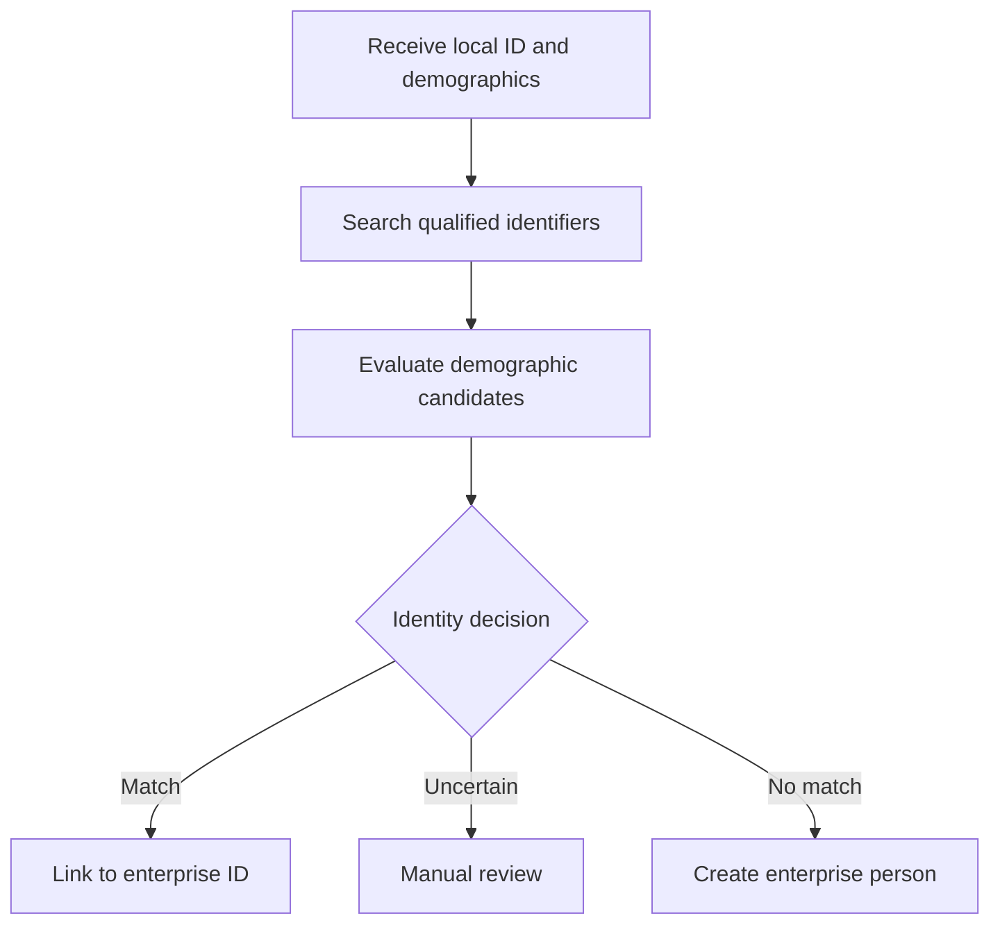
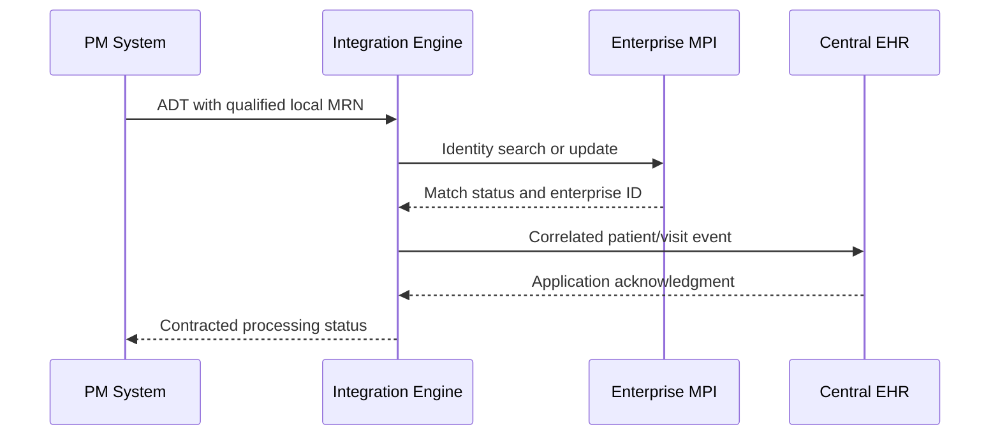

# HL7 PM-to-EHR Integration with an Enterprise MPI — Part 3

This guide explains the concluding workflow illustrated in **HL7 PM-to-EHR v2, Part 3**. It focuses on the final patient-identity decision: multiple practice-management systems hold different local patient identifiers, an enterprise Master Patient Index (MPI) evaluates identity evidence, and the central EHR uses the resulting enterprise relationship to maintain one longitudinal patient record.

> All patient names, dates, identifiers, and messages below are synthetic. Never use real protected health information (PHI) in training, screenshots, source control, or non-production testing.

## Learning objectives

After completing this guide, you should be able to:

- explain why equal or similar demographics are evidence, not proof, of identity;
- distinguish source-local identifiers from an enterprise identifier;
- describe how an MPI score becomes a governed match, review, or no-match decision;
- maintain a cross-reference between local MRNs and one enterprise person;
- carry both local and enterprise identifiers safely in an HL7 v2 workflow;
- prevent false-positive links, duplicate enterprise records, and update loops; and
- test and monitor the complete PM-to-MPI-to-EHR identity process.

## Scope of Part 3

Part 3 concludes the scenario developed in Parts 1 and 2. The diagram shows:

- three PM systems, represented by Allscripts, Epic, and Cerner;
- a different local patient identifier in each source;
- visits occurring in different months;
- a central EHR, represented by Meditech;
- an enterprise MPI and enterprise ID; and
- an illustrative demographic scorecard.

The product names are examples of system roles, not configuration instructions for those vendors. The video presents a conceptual identity workflow rather than a vendor user interface or a complete HL7 implementation profile.

## The central problem

One real person may be registered independently in several systems:

| Visit | Source system | Source-local MRN | Enterprise person |
|---|---|---:|---:|
| January | PM system A | `A100045` | `E900001` |
| March | PM system B | `B770021` | `E900001` |
| October | PM system C | `C440089` | `E900001` |

The three local MRNs are not duplicates in their own systems. Each is valid in its assigning authority. The MPI's job is to determine whether they refer to the same real person and, when appropriate, cross-reference them to one enterprise identity.

The safe identity key is not just the identifier value. It is a qualified identifier:

```text
(identifier value, assigning authority, identifier type)
```

For example:

```text
A100045^^^PM_A^MR
B770021^^^PM_B^MR
C440089^^^PM_C^MR
E900001^^^ENTERPRISE_MPI^PI
```

## Final identity-resolution flow



The corresponding system interaction is:



## Step 1: Preserve the source identity

The source system owns the local patient number that it issued. The integration engine must preserve:

- the identifier value;
- the assigning authority;
- the identifier type;
- the source application and facility;
- the original message-control ID; and
- the event time and provenance.

Do not replace the source MRN with the enterprise ID. The two identifiers answer different questions:

| Identifier | Meaning | Owner |
|---|---|---|
| Local MRN | Who is this patient inside one source organization or application? | Issuing source |
| Enterprise ID | Which enterprise person links the approved local identities? | MPI |

## Step 2: Search strong identifiers first

Before demographic scoring, the MPI should search for exact, qualified identity relationships. Examples include:

- an existing local-MRN cross-reference;
- an enterprise ID previously returned by the trusted MPI;
- a verified national identifier where its use is permitted; or
- another governed, high-confidence identifier.

An identifier value without an assigning authority must not be treated as globally unique. Two unrelated systems may legitimately issue the same numeric MRN.

## Step 3: Compare demographic evidence

If exact identifiers do not resolve the person, the MPI may compare demographic attributes. The video illustrates the following weights:

| Attribute | Illustrative weight |
|---|---:|
| First name | 150 |
| Last name | 150 |
| Middle initial | 20 |
| Date of birth | 100 |
| Gender | 25 |
| National identifier | 20 |
| **Maximum illustrated total** | **465** |

These numbers demonstrate a scorecard; they are not production recommendations. The diagram's threshold notation should also be treated as illustrative rather than a complete algorithm.

A real matching model must define:

- agreement weights;
- disagreement penalties;
- behavior for missing and unknown values;
- normalization and phonetic rules;
- reliability differences between data sources;
- candidate blocking rules;
- thresholds for automatic match and automatic no-match; and
- an intermediate manual-review band.

### Why simple addition is insufficient

Consider two records with the same common name and date of birth but conflicting verified national identifiers. A simple positive score may appear high, while the conflict is strong evidence that the records represent different people.

Matching policy should therefore support rules such as:

```text
if trusted identifiers conflict:
    do not auto-link
else if one unambiguous candidate exceeds the match threshold:
    link under audit controls
else if one or more candidates fall in the review band:
    require manual review
else:
    create a new enterprise person if policy permits
```

## Step 4: Make a governed decision

The MPI should produce an explicit outcome rather than only returning a number.

| Outcome | Meaning | Required action |
|---|---|---|
| `MATCH` | One existing enterprise person meets the approved policy | Add or confirm the local cross-reference |
| `REVIEW` | Evidence is incomplete, conflicting, or ambiguous | Hold the transaction for authorized review |
| `NEW` | No acceptable existing candidate was found | Create an enterprise person if allowed |
| `CONFLICT` | Strong identifiers contradict one another | Stop automated linking and investigate |
| `ERROR` | Resolution could not complete | Retry or quarantine according to the contract |

An automatic match requires both sufficient score and acceptable ambiguity. If two candidates score highly, the system must not simply choose the highest by a small margin.

## Step 5: Maintain the cross-reference

After an approved decision, the MPI stores relationships similar to:

| Enterprise ID | Assigning authority | Local ID | Type | Status |
|---:|---|---:|---|---|
| `E900001` | `PM_A` | `A100045` | `MR` | Active |
| `E900001` | `PM_B` | `B770021` | `MR` | Active |
| `E900001` | `PM_C` | `C440089` | `MR` | Active |

Useful metadata includes:

- when the relationship was first and last observed;
- which transaction created or changed it;
- whether it was automatic or manually approved;
- matching rule/model and version;
- reviewer identity when applicable; and
- merge, retirement, or correction history.

Cross-reference creation should be transactionally protected. A qualified local ID must not become active under two different enterprise people.

## Step 6: Correlate the central EHR record

The EHR needs enough identity context to place the registration or visit on the correct longitudinal record. Depending on the agreed interface profile, the integration may:

- send both the source-local MRN and enterprise ID as repetitions of `PID-3`;
- query the MPI before constructing the EHR message;
- use an internal EHR identity cross-reference service;
- receive an asynchronous MPI identity update; or
- use a profile-specific API or message exchange.

No single placement should be assumed for every product. The sender and receiver must agree on the HL7 version, assigning authorities, identifier types, repetition order, and update behavior.

## Fictional source registration message

```hl7
MSH|^~\&|PM_B_APP|PM_B|INT_ENGINE|ENTERPRISE|20260923103000||ADT^A04^ADT_A01|MSG-PMB-0001|P|2.5.1
EVN|A04|20260923102930
PID|1||B770021^^^PM_B^MR||RIVERA^MORGAN^L||20150714|U|||125 EXAMPLE RD^^METRO^CA^90000^USA||5555550101
PV1|1|O|CLINIC2^ROOM1^BED1||||12345^CLINICIAN^CASEY
```

Key observations:

- `MSH-10` contains the source message-control ID.
- `PID-3` identifies the patient inside the `PM_B` assigning authority.
- The demographics provide candidate evidence but do not independently prove identity.
- The visit in `PV1` must not be attached to a different person merely because a name is similar.

## Fictional EHR message after resolution

If the receiving profile accepts repeated identifiers in `PID-3`, the downstream event may contain:

```hl7
MSH|^~\&|INT_ENGINE|ENTERPRISE|EHR|CENTRAL|20260923103002||ADT^A04^ADT_A01|MSG-EHR-0001|P|2.5.1
EVN|A04|20260923102930
PID|1||B770021^^^PM_B^MR~E900001^^^ENTERPRISE_MPI^PI||RIVERA^MORGAN^L||20150714|U|||125 EXAMPLE RD^^METRO^CA^90000^USA||5555550101
PV1|1|O|CLINIC2^ROOM1^BED1||||12345^CLINICIAN^CASEY
```

The meaning is:

- `B770021^^^PM_B^MR` remains the source-local medical-record number;
- `E900001^^^ENTERPRISE_MPI^PI` is the enterprise patient identifier; and
- the assigning authorities prevent the two values from being confused.

Use this pattern only when the receiver's specification supports it.

## Acknowledgment example

```hl7
MSH|^~\&|EHR|CENTRAL|INT_ENGINE|ENTERPRISE|20260923103003||ACK^A04^ACK|ACK-EHR-0001|P|2.5.1
MSA|AA|MSG-EHR-0001
```

The integration contract must define what `AA` means. Possible processing milestones are:

1. the engine received syntactically valid HL7;
2. the MPI completed identity resolution;
3. the cross-reference was committed;
4. the EHR accepted the event; and
5. the visit was applied successfully.

Do not return final success at milestone 1 if the source expects completion through milestone 4 or 5.

## Recommended integration-engine logic

```text
receive ADT message
validate message type, required fields, and identifier authority
build idempotency key from source application/facility and MSH-10
if the transaction was processed before:
    return its recorded result

normalize a working copy of demographics
retain all original source values

request identity resolution from the MPI
if outcome is MATCH or NEW:
    validate returned enterprise ID and cross-reference status
    construct the EHR message according to its profile
    deliver to EHR and record its ACK
else if outcome is REVIEW or CONFLICT:
    place transaction in a controlled exception workflow
else:
    apply retry or quarantine policy

record correlation IDs, timestamps, identity outcome, and final status
return the acknowledgment required by the source contract
```

An integration engine such as Mirth Connect can orchestrate this flow, but patient-matching rules should remain in a governed MPI or identity service rather than being duplicated across channel scripts.

## Idempotency and concurrent registration

Message retry and patient matching are separate problems:

- **Message idempotency** prevents the same transaction from being processed twice.
- **Identity resolution** determines whether different records represent the same person.

Recommended safeguards include:

- detecting duplicate messages using source plus `MSH-10`;
- returning the previously recorded result for a true replay;
- preventing a retry from creating another enterprise person;
- enforcing uniqueness on the qualified local-ID cross-reference;
- rechecking candidates before committing a new enterprise identity; and
- handling simultaneous first registrations transactionally inside the MPI.

## False positives and false negatives

| Error | Description | Possible consequence |
|---|---|---|
| False positive | Two different people are linked | Clinical data may be combined under the wrong person |
| False negative | One person remains as two enterprise records | Clinicians may see an incomplete longitudinal history |

Both errors matter, but a false-positive overlay can directly endanger patient safety. Automatic matching thresholds should therefore be conservative, measured, monitored, and approved through identity governance.

## Demographic updates after linking

An approved identity link does not mean that every demographic value should be overwritten automatically. Systems may disagree because of spelling, timing, correction, transliteration, or data-entry quality.

Define field-level ownership:

| Data | Typical authority |
|---|---|
| Source-local MRN | Issuing PM system |
| Enterprise ID and cross-reference | MPI |
| Visit/account status | Encounter-owning system or EHR |
| Enterprise demographic values | Governed registration/MPI policy |
| Clinical observations | Clinical source and EHR |

Use provenance, update timestamps, verification status, and source priority. Prevent an MPI-published update from returning to the MPI as a new source change and creating a message loop.

## Merge and correction

If duplicate enterprise persons are later confirmed, a governed merge may be distributed with an event such as `ADT^A40`, where supported by the interface profile.

```hl7
MSH|^~\&|MPI|ENTERPRISE|EHR|CENTRAL|20260923113000||ADT^A40^ADT_A39|MERGE-0001|P|2.5.1
EVN|A40|20260923112930
PID|1||E900001^^^ENTERPRISE_MPI^PI||RIVERA^MORGAN^L||20150714|U
MRG|E900145^^^ENTERPRISE_MPI^PI
```

In this example, the surviving enterprise ID is in `PID-3` and the prior ID is in `MRG-1`, subject to the receiver's version and profile.

Safe merge handling must:

- preserve an alias/history from the retired ID to the survivor;
- move or update relevant local cross-references;
- reconcile encounters, orders, results, documents, and other downstream data;
- be idempotent when replayed; and
- support a governed correction process for a wrong merge.

An unmerge is not merely a reversed identifier mapping. Data entered after the merge may require clinical review and redistribution.

## Failure handling

| Condition | Safe response |
|---|---|
| Missing assigning authority | Reject or quarantine; do not guess |
| MPI timeout | Retry safely; do not create a person merely because the MPI is unavailable |
| Ambiguous candidates | Hold for manual review |
| Conflicting strong identifiers | Stop automatic linking and investigate |
| EHR rejection after MPI success | Preserve the MPI result and replay only the EHR step idempotently |
| Duplicate source message | Return the stored outcome without repeating identity creation |
| Cross-reference points to two enterprise IDs | Escalate immediately to identity governance |
| Downstream downtime | Queue durably and monitor message age |

## Privacy, security, and audit

- Encrypt interface traffic and persisted queues.
- Restrict access to MPI and exception-review functions by role.
- Mask PHI in non-production environments and support logs.
- Avoid logging entire HL7 payloads unless policy explicitly permits it.
- Audit searches, matches, new-person creation, reviews, links, merges, and corrections.
- Record the matching-policy version used for each automated decision.
- Use synthetic test patients and identifiers.

## Monitoring

Monitor both interface health and identity quality:

- message volume and latency by source;
- match, review, new-person, conflict, and error rates;
- review-queue age and resolution outcome;
- EHR accept/reject counts;
- duplicate enterprise-person rate;
- false-positive and false-negative findings;
- missing or unknown assigning authorities;
- retries, queue depth, and oldest queued transaction;
- merge activity and downstream merge failures; and
- unusual changes in match behavior after a rule or model update.

A sudden increase in automatic matches is not automatically an improvement. It may indicate an overly permissive rule or degraded source data.

## Test scenarios

| Scenario | Expected result |
|---|---|
| Known qualified local MRN | Existing enterprise cross-reference returned |
| New PM source, strong unambiguous match | New local MRN linked to the existing enterprise ID |
| Same name and DOB, conflicting verified ID | No automatic link |
| Two high-scoring candidates | Manual review |
| No acceptable candidate | New enterprise person if policy allows |
| Missing optional demographic value | Missing is handled distinctly from disagreement |
| Local MRN reused by a different authority | Treated as a separate qualified identifier |
| Exact message replay | Same result; no new person or encounter |
| Same `MSH-10` with changed content | Alert and quarantine |
| Concurrent first registrations | One consistent identity outcome or controlled review |
| MPI unavailable | Durable retry; no blind enterprise creation |
| EHR unavailable after successful match | Preserve match and retry EHR delivery only |
| Confirmed duplicate enterprise records | Governed merge propagated downstream |
| Erroneous merge | Supported correction workflow with clinical review |

## Implementation checklist

### Identity design

- [ ] Catalog every assigning authority and identifier type.
- [ ] Define the owner of the enterprise identifier.
- [ ] Search trusted qualified identifiers before demographic scoring.
- [ ] Define match, review, no-match, conflict, and error outcomes.
- [ ] Validate thresholds using representative labeled data.
- [ ] Measure false-positive and false-negative performance.

### HL7 contract

- [ ] Confirm HL7 version, event structures, and transport.
- [ ] Define required `MSH`, `PID`, `PV1`, and merge fields.
- [ ] Specify exactly where the enterprise ID appears.
- [ ] Define query/response behavior when identity resolution is synchronous.
- [ ] Define acknowledgment milestones, timeout, and retry behavior.
- [ ] Document merge and correction semantics.

### Engineering

- [ ] Preserve original values while normalizing a comparison copy.
- [ ] Implement message idempotency and operation idempotency.
- [ ] Protect cross-reference creation against concurrency.
- [ ] Retain end-to-end correlation IDs.
- [ ] Make downstream replay safe after partial completion.
- [ ] Prevent demographic update loops.
- [ ] Reconcile source, MPI, and EHR identifiers periodically.

### Operations and governance

- [ ] Create an authorized manual-review workflow.
- [ ] Define field-level demographic stewardship.
- [ ] Audit automated and human decisions.
- [ ] Monitor identity-quality metrics, not only transport uptime.
- [ ] Test downtime, retry, replay, merge, and correction scenarios.
- [ ] Review matching policy after source-system or population changes.

## Common mistakes

1. **Treating an MRN as globally unique.** Its assigning authority is part of its meaning.
2. **Replacing local IDs with the enterprise ID.** Both identities must be preserved.
3. **Assuming a high score proves identity.** Conflicts and candidate ambiguity still matter.
4. **Using the video's illustrative weights as production policy.** Real thresholds require validation and governance.
5. **Automatically choosing the highest candidate.** A narrow lead over another strong candidate is not safe certainty.
6. **Creating a new person during an MPI timeout.** Availability failure is not a no-match result.
7. **Returning final success too early.** Transport receipt may not satisfy the business contract.
8. **Retrying without idempotency.** A network timeout can otherwise create duplicate identities or visits.
9. **Allowing every system to overwrite demographics.** Conflicting updates can oscillate across interfaces.
10. **Merging identifiers without downstream reconciliation.** The patient record is more than the MPI cross-reference.

## Knowledge check

1. Why is `A100045^^^PM_A^MR` safer than storing only `A100045`?
2. Why should exact qualified-identifier lookup occur before demographic scoring?
3. What is the difference between a high score and an approved match decision?
4. What should happen when two candidates both score above the nominal threshold?
5. Why must the source-local MRN remain after an enterprise ID is assigned?
6. How do message idempotency and identity matching differ?
7. Why is an MPI timeout not permission to create a new enterprise person?
8. What additional work is required after an enterprise merge?

## Summary

Part 3 completes the PM-to-EHR identity scenario. Separate PM systems can legitimately assign different local patient identifiers to the same person. The MPI evaluates qualified identifiers and demographic evidence, produces a governed identity outcome, and maintains the cross-reference to one enterprise identity. The central EHR can then associate visits from different systems and dates with the correct longitudinal record.

The essential controls are:

- qualify every identifier with its authority and type;
- treat demographic scores as evidence within a governed policy;
- provide match, review, new, conflict, and error outcomes;
- preserve local IDs alongside the enterprise ID;
- make orchestration idempotent and concurrency-safe;
- propagate merges and corrections carefully; and
- monitor clinical identity quality as well as message delivery.

The goal is not to maximize automatic matches. It is to establish the correct enterprise identity with enough certainty, provenance, and operational control to protect the patient and the integrity of the EHR.
