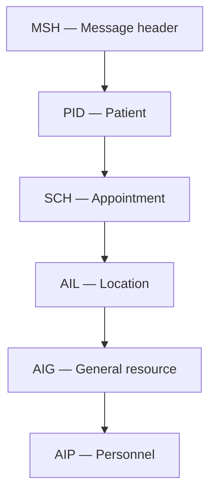
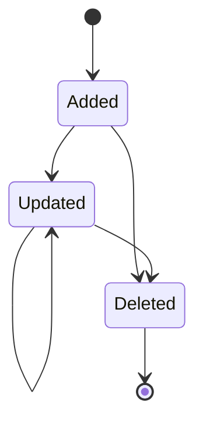

# HL7 Scheduling: Assigning a General Resource with the AIG Segment — Part 1

This guide explains the lesson demonstrated in **Assign AIG, Part 1**. It introduces HL7 v2 scheduling messages, shows where the `AIG` segment belongs, and explains how `AIG` represents a general resource assigned to an appointment.

Typical AIG resources include equipment, devices, service resources, and other non-person, non-location resources needed to perform an appointment.

> All patients, identifiers, resources, and appointments in this document are fictional. Do not use real protected health information (PHI) in training or testing.

## Learning objectives

After completing this guide, you should be able to:

- identify the purpose of an HL7 SIU scheduling message;
- distinguish `AIG`, `AIL`, and `AIP` appointment-resource segments;
- explain the fourteen fields shown for the `AIG` segment;
- construct an `AIG` segment with resource, timing, quantity, and status data;
- place `AIG` in a basic scheduling-message structure;
- count HL7 fields and components correctly; and
- avoid common resource-assignment and message-validation errors.

## Lesson scope

The video begins with a simple pipe-delimited message in a text editor and then consults HL7 reference material for scheduling messages. The main focus is the `AIG` segment and its field definitions.

The lesson shows the following scheduling-related segments:

| Segment | Purpose |
|---|---|
| `MSH` | Message header and routing metadata |
| `EVN` | Event information when required by the chosen profile |
| `PID` | Patient identification |
| `SCH` | Appointment activity and schedule information |
| `AIL` | Appointment location resource |
| `AIG` | General appointment resource |
| `AIP` | Appointment personnel resource |
| `PV1` | Patient-visit context when required |

This is a teaching-oriented list. The exact message structure, required segments, and repetitions depend on the SIU trigger event, HL7 version, and interface profile agreed between sender and receiver.

## What is an SIU message?

`SIU` means **Scheduling Information Unsolicited**. SIU messages communicate appointment events such as creating, modifying, rescheduling, canceling, or otherwise updating scheduled activity.

Common trigger events include:

| Trigger | Common interpretation |
|---|---|
| `SIU^S12` | Notification of a new appointment booking |
| `SIU^S13` | Notification of appointment rescheduling |
| `SIU^S14` | Notification of appointment modification |
| `SIU^S15` | Notification of appointment cancellation |

Trigger semantics can vary by implementation. Always follow the receiver's conformance profile.

The value in `MSH-9` should identify the scheduling event, for example:

```hl7
SIU^S12^SIU_S12
```

An `AIG` segment belongs to a scheduling workflow. It should not be added arbitrarily to an ADT message simply because both messages contain patient details.

## Appointment-resource segments

HL7 separates different resource categories so that their meanings remain clear.

| Segment | Resource category | Examples |
|---|---|---|
| `AIL` | Location | Clinic, room, operating theatre, imaging suite |
| `AIG` | General resource | X-ray machine, ultrasound unit, wheelchair, interpreter service |
| `AIP` | Personnel | Physician, nurse, technician, therapist |

Example appointment:

```text
Location:   Radiology Room 2       -> AIL
Equipment:  Ultrasound Machine 4   -> AIG
Provider:   Dr. Example            -> AIP
```

Do not use `AIG` for a provider merely because a person is a resource to the appointment. HL7 provides `AIP` specifically for personnel.

## Simplified scheduling-message structure



This diagram is conceptual. In a formal message definition, segments may belong to repeating resource groups, and some may be optional or conditional.

## HL7 delimiters used in the lesson

The video constructs message lines using the pipe delimiter. A typical header begins:

```hl7
MSH|^~\&|
```

The delimiter characters mean:

| Character | Role |
|---|---|
| `|` | Field separator |
| `^` | Component separator |
| `~` | Repetition separator |
| `\` | Escape character |
| `&` | Subcomponent separator |

Example coded value:

```hl7
US01^Ultrasound Machine 01^L
```

This contains three components:

1. identifier: `US01`;
2. descriptive text: `Ultrasound Machine 01`; and
3. coding system: `L`, meaning a locally defined code system in this example.

## Field counting rules

For most segments, the first field after the segment name is field 1:

```hl7
AIG|1|A|US01^Ultrasound Machine 01^L|EQUIPMENT
```

| Position | Value |
|---|---|
| Segment | `AIG` |
| `AIG-1` | `1` |
| `AIG-2` | `A` |
| `AIG-3` | `US01^Ultrasound Machine 01^L` |
| `AIG-4` | `EQUIPMENT` |

`MSH` is special: the character immediately after `MSH` is `MSH-1`, the field separator. Therefore, do not count MSH fields in exactly the same visual manner as other segments.

## AIG — Appointment Information: General Resource

The `AIG` segment communicates a general resource associated with a scheduled appointment.

The video reviews the following fourteen fields:

| Field | Data type | Name | Practical meaning |
|---|---|---|---|
| `AIG-1` | `SI` | Set ID - AIG | Sequence number for repeated AIG segments |
| `AIG-2` | `ID` | Segment Action Code | Whether this resource occurrence is being added, updated, or deleted |
| `AIG-3` | `CWE` | Resource ID | Identifier and description of the assigned resource |
| `AIG-4` | `CWE` | Resource Type | Category of resource |
| `AIG-5` | `CWE` | Resource Group | Optional grouping or pool from which the resource belongs |
| `AIG-6` | `NM` | Resource Quantity | Number or amount of resources required |
| `AIG-7` | `CNE` | Resource Quantity Units | Units used for the resource quantity |
| `AIG-8` | `DTM` | Start Date/Time | Resource-assignment start date and time |
| `AIG-9` | `NM` | Start Date/Time Offset | Numeric offset relative to the appointment timing |
| `AIG-10` | `CNE` | Start Date/Time Offset Units | Units for the timing offset |
| `AIG-11` | `NM` | Duration | Length of time for which the resource is required |
| `AIG-12` | `CNE` | Duration Units | Units for the duration |
| `AIG-13` | `CWE` | Allow Substitution Code | Whether another suitable resource may be substituted |
| `AIG-14` | `CWE` | Filler Status Code | Status assigned by the scheduling/filler application |

The required, optional, or conditional status of these fields depends on the HL7 version and the implementation profile. The reference shown in the lesson marks some fields as required or conditional, but the trading partners' agreed specification is authoritative for a real interface.

## Detailed field explanation

### AIG-1 — Set ID

`AIG-1` numbers each `AIG` occurrence within its resource group.

```hl7
AIG|1|...
AIG|2|...
```

Use sequential values when several general resources are assigned. This is not the equipment's business identifier; that belongs in `AIG-3`.

### AIG-2 — Segment Action Code

`AIG-2` states what should happen to this resource occurrence. The video associates this field with HL7 table `0206`.

Common scheduling profiles use action concepts such as add, update, or delete. Do not assume a code set without confirming the selected HL7 version and receiver profile.

Example add action:

```hl7
AIG|1|A|...
```

When modifying an appointment, the receiver must know which existing resource occurrence is being changed. Agree on the correlation rule; a set ID alone may not be a durable business key across separate messages.

### AIG-3 — Resource ID

`AIG-3` identifies the actual resource.

```hl7
US01^Ultrasound Machine 01^L
```

For a coded value, send a stable identifier, readable text, and the correct coding-system designation. Avoid placing only a free-text description when the receiving system needs a stable resource code.

### AIG-4 — Resource Type

`AIG-4` describes the kind of general resource being requested or assigned.

```hl7
EQUIP^Medical Equipment^L
```

`AIG-3` answers **which resource?** while `AIG-4` answers **what kind of resource?**

### AIG-5 — Resource Group

`AIG-5` can identify a resource pool or group.

```hl7
US_POOL^Ultrasound Equipment Pool^L
```

This is useful when the appointment initially reserves a category or pool and a specific unit is assigned later. The field may repeat in the version/profile shown by the lesson.

### AIG-6 and AIG-7 — Quantity and units

These fields describe how much of the resource is required.

```text
AIG-6 = 1
AIG-7 = EA^Each^UCUM
```

Quantity without units can be ambiguous. For countable equipment, `1 each` may be appropriate. Other resource types may use a different unit defined by the interface contract.

### AIG-8 — Start date/time

`AIG-8` carries the resource-assignment start time using the HL7 `DTM` format.

```text
20260927100000+0300
```

This represents 27 September 2026 at 10:00:00 with a `+03:00` UTC offset.

Recommended practices:

- include the timezone offset when systems may operate in different zones;
- use the precision supported by the appointment workflow;
- do not send display formats such as `27/09/2026 10:00 AM`; and
- keep resource time consistent with the associated `SCH` appointment time.

### AIG-9 and AIG-10 — Start-time offset

The offset fields express the resource start relative to the appointment timing.

Example concept:

```text
Resource setup begins 15 minutes before the appointment.
```

The numeric offset and its unit must be interpreted together. The interface profile must also define how a negative or positive offset relates to the base appointment time. Do not populate both an absolute start time and an offset with contradictory values.

### AIG-11 and AIG-12 — Duration

These fields state how long the resource is needed.

```text
AIG-11 = 45
AIG-12 = min^minute^UCUM
```

Duration is different from the appointment's total duration. A room may be booked for 60 minutes while equipment is needed for only 45 minutes.

### AIG-13 — Allow substitution code

`AIG-13` specifies whether the scheduling system may replace the requested resource with an equivalent one. The lesson associates this field with table `0279`.

Examples of business questions include:

- Is the exact machine mandatory?
- May any machine in the same approved pool be used?
- Does substitution require confirmation?

Use only values supported by the receiver's HL7 version and profile.

### AIG-14 — Filler status code

`AIG-14` reports the filler application's state for the resource assignment. The lesson associates this field with table `0278`.

The reference reviewed in the video displays scheduling states such as pending, waitlisted, booked, started, completed, canceled, deleted, blocked, overbooked, and no-show concepts. Exact spellings and allowed values are version/profile dependent.

Resource status is not automatically the same as overall appointment status. For example, the appointment may remain booked while a requested device is still pending confirmation.

## Complete fictional AIG segment

```hl7
AIG|1|A|US01^Ultrasound Machine 01^L|EQUIP^Medical Equipment^L|US_POOL^Ultrasound Equipment Pool^L|1|EA^Each^UCUM|20260927100000+0300|||45|min^minute^UCUM|N^No substitution^L|BOOKED^Booked^L
```

Field-by-field interpretation:

| Field | Example value | Interpretation |
|---|---|---|
| `AIG-1` | `1` | First AIG occurrence |
| `AIG-2` | `A` | Add this resource occurrence |
| `AIG-3` | `US01^Ultrasound Machine 01^L` | Specific device |
| `AIG-4` | `EQUIP^Medical Equipment^L` | Resource category |
| `AIG-5` | `US_POOL^Ultrasound Equipment Pool^L` | Equipment pool |
| `AIG-6` | `1` | Quantity requested |
| `AIG-7` | `EA^Each^UCUM` | Quantity unit |
| `AIG-8` | `20260927100000+0300` | Start time |
| `AIG-9` | empty | No relative offset sent |
| `AIG-10` | empty | No offset unit sent |
| `AIG-11` | `45` | Duration value |
| `AIG-12` | `min^minute^UCUM` | Duration unit |
| `AIG-13` | `N^No substitution^L` | Local substitution rule example |
| `AIG-14` | `BOOKED^Booked^L` | Local status example |

The substitution and status codes above are deliberately identified as local examples. Replace them with the codes mandated by the receiving profile.

## Fictional SIU message containing AIG

```hl7
MSH|^~\&|SCHEDULER|CLINIC_A|EHR|HOSPITAL|20260925170000+0300||SIU^S12^SIU_S12|SIU000001|P|2.5.1
SCH|APT10001|FILL10001||||XRAY^Diagnostic Imaging^L|FOLLOWUP^Follow-up appointment^L|ROUTINE^Routine^L|45|min^minute^UCUM|^^^20260927100000+0300^20260927104500+0300|||||1001^BOOKER^CASEY^^^^^^STAFF||||1001^BOOKER^CASEY^^^^^^STAFF
PID|1||P100045^^^CLINIC_A^MR||RIVERA^MORGAN^L||19900514|U
PV1|1|O|RADIOLOGY^ROOM2
AIL|1|A|RADIOLOGY^ROOM2^BED1^CLINIC_A|ROOM^Imaging Room^L||20260927100000+0300|||45|min^minute^UCUM||BOOKED^Booked^L
AIG|1|A|XRAY01^X-Ray Machine 01^L|EQUIP^Imaging Equipment^L|XRAY_POOL^X-Ray Equipment Pool^L|1|EA^Each^UCUM|20260927100000+0300|||45|min^minute^UCUM|N^No substitution^L|BOOKED^Booked^L
AIP|1|A|PRV100^CLINICIAN^CASEY^^^^^^STAFF|TECH^Radiology Technician^L||20260927100000+0300|||45|min^minute^UCUM||BOOKED^Booked^L
```

This sample is educational. A production message must be generated from the receiver's precise message definition, including its required segment order, fields, code tables, and resource groups.

## AIG versus AIL versus AIP examples

```hl7
AIL|1|A|RADIOLOGY^ROOM2^BED1^CLINIC_A|ROOM^Imaging Room^L||20260927100000+0300|||45|min^minute^UCUM||BOOKED^Booked^L
AIG|1|A|XRAY01^X-Ray Machine 01^L|EQUIP^Imaging Equipment^L|XRAY_POOL^X-Ray Equipment Pool^L|1|EA^Each^UCUM|20260927100000+0300|||45|min^minute^UCUM|N^No substitution^L|BOOKED^Booked^L
AIP|1|A|PRV100^CLINICIAN^CASEY^^^^^^STAFF|TECH^Radiology Technician^L||20260927100000+0300|||45|min^minute^UCUM||BOOKED^Booked^L
```

The three segments describe one coordinated booking:

- `AIL` reserves the imaging room;
- `AIG` reserves the X-ray machine; and
- `AIP` assigns the radiology technician.

## Multiple AIG segments

An appointment may require several general resources:

```hl7
AIG|1|A|XRAY01^X-Ray Machine 01^L|EQUIP^Imaging Equipment^L||1|EA^Each^UCUM|20260927100000+0300|||45|min^minute^UCUM|N^No substitution^L|BOOKED^Booked^L
AIG|2|A|WHEEL01^Wheelchair 01^L|EQUIP^Mobility Equipment^L||1|EA^Each^UCUM|20260927095000+0300|||60|min^minute^UCUM|Y^Substitution allowed^L|BOOKED^Booked^L
```

Each occurrence has its own set ID, resource identity, timing, duration, substitution rule, and status.

## Add, update, and delete lifecycle

The segment action code communicates the intended change to an existing resource assignment.



A robust interface must define:

- which action codes are permitted;
- how an update identifies the original resource occurrence;
- whether omitted fields mean unchanged, empty, or unknown;
- whether delete requires only an identifier or a full segment;
- how repeated AIG segments are matched; and
- whether a cancellation updates resource status or removes the assignment.

## Date/time and duration consistency

Before sending an appointment, validate that:

```text
resource start <= resource end
resource duration > 0
resource interval is compatible with appointment interval
offset value has offset units
quantity has quantity units when the profile requires them
```

If both absolute time and relative offset are populated, calculate the effective time and confirm that they agree.

Example:

```text
Appointment start: 10:00
Resource offset:   -15 minutes
Resource start:     09:45
```

The sign convention and base time must be explicitly documented between systems.

## Resource-code governance

The sender and receiver need a shared resource catalog or mapping.

| Concern | Recommended control |
|---|---|
| Different resource IDs | Maintain an approved source-to-target mapping |
| Renamed equipment | Keep the stable code; update display text separately |
| Retired resource | Mark inactive and reject new assignments after the effective date |
| Resource type differences | Map to a governed resource-type vocabulary |
| Unknown code | Reject, quarantine, or route for mapping review |
| Local codes | Send an explicit local coding-system identifier |

Do not match equipment using description text alone. Names can change and may not be unique.

## Acknowledgment behavior

A typical acknowledgment may look like:

```hl7
MSH|^~\&|EHR|HOSPITAL|SCHEDULER|CLINIC_A|20260925170001+0300||ACK^S12^ACK|ACK000001|P|2.5.1
MSA|AA|SIU000001
```

Common MSA codes are:

| Code | Meaning |
|---|---|
| `AA` | Application accept |
| `AE` | Application error |
| `AR` | Application reject |

Possible resource-related errors include:

- unknown `AIG-3` resource ID;
- unsupported `AIG-4` resource type;
- invalid or missing action code;
- unavailable or conflicting resource time;
- invalid unit or duration;
- unsupported substitution/status code; and
- inconsistent update/delete correlation.

An `AA` confirms only the processing level defined by the interface contract. It does not necessarily guarantee that the appointment occurred or that every operational workflow is complete.

## Mirth Connect implementation guidance

For a Mirth Connect scheduling channel, consider these processing stages:

1. receive the SIU message over the agreed transport;
2. validate `MSH-9`, `MSH-10`, HL7 version, and trigger event;
3. verify that the patient and appointment identifiers are present;
4. iterate over all `AIG` occurrences;
5. validate resource code, type, quantity, units, timing, duration, and status;
6. map source resource codes to the target catalog;
7. transform only fields required by the target profile;
8. send the scheduling transaction;
9. correlate the destination response with `MSH-10`; and
10. store a privacy-conscious audit record and return the agreed ACK.

Illustrative validation logic:

```javascript
var messageType = msg['MSH']['MSH.9']['MSH.9.1'].toString();
var triggerEvent = msg['MSH']['MSH.9']['MSH.9.2'].toString();

if (messageType !== 'SIU') {
    throw 'Expected an SIU scheduling message';
}

if (!triggerEvent) {
    throw 'Missing scheduling trigger event';
}

for each (var aig in msg..AIG) {
    var resourceId = aig['AIG.3']['AIG.3.1'].toString();
    var resourceType = aig['AIG.4']['AIG.4.1'].toString();

    if (!resourceId) {
        throw 'AIG-3 Resource ID is required by this interface';
    }
    if (!resourceType) {
        throw 'AIG-4 Resource Type is required by this interface';
    }
}
```

The exact XML/E4X representation depends on the Mirth Connect version and inbound transformer. Keep business mappings in governed configuration rather than hard-coding large resource catalogs in JavaScript.

## Validation checklist

### Message level

- [ ] `MSH-9` contains the expected SIU trigger and structure.
- [ ] `MSH-10` is present and unique within the sender's replay window.
- [ ] `MSH-12` uses the agreed HL7 version.
- [ ] Segments appear in the structure required by the receiver.
- [ ] Appointment and patient identifiers are present where required.

### AIG level

- [ ] `AIG-1` is sequential within the repeating resource group.
- [ ] `AIG-2` contains a supported action code.
- [ ] `AIG-3` contains a known, stable resource code.
- [ ] `AIG-4` contains a supported resource type.
- [ ] Resource group is mapped when `AIG-5` is used.
- [ ] Quantity and units agree.
- [ ] Start time is a valid HL7 `DTM`.
- [ ] Offset and offset units are populated together.
- [ ] Duration is positive and includes the correct units.
- [ ] Substitution code follows the agreed vocabulary.
- [ ] Filler status follows the receiver's accepted value set.

### Operational level

- [ ] Resource exists and is active.
- [ ] Resource is available during the required interval.
- [ ] Duplicate messages are processed idempotently.
- [ ] Updates and deletions correlate with the correct assignment.
- [ ] Rejections create an actionable error without exposing unnecessary PHI.

## Test cases

| Test | Expected result |
|---|---|
| Valid single AIG resource | Appointment resource is added |
| Two valid AIG repetitions | Both resources are assigned separately |
| Unknown resource ID | Reject or route for mapping review |
| Missing resource type | Reject when required by the profile |
| Quantity without required units | Validation error |
| Invalid date/time | Validation error |
| Offset without offset units | Validation error |
| Negative or zero duration | Validation error unless explicitly supported |
| Unsupported substitution code | Validation or mapping error |
| Resource time conflicts with another booking | Business rejection or scheduling exception |
| Duplicate message-control ID and identical payload | Return recorded result idempotently |
| Reused control ID with different payload | Quarantine and alert |
| Update to an existing AIG occurrence | Correct resource assignment is changed |
| Delete of an unknown occurrence | Controlled error; no unrelated resource changed |
| Provider sent in AIG instead of AIP | Semantic validation failure |
| Room sent in AIG instead of AIL | Semantic validation failure |

## Common mistakes

1. **Using `ADT` as the message type for a scheduling-resource assignment.** Use the SIU event defined by the scheduling interface.
2. **Placing a room in `AIG`.** Appointment locations belong in `AIL`.
3. **Placing a clinician in `AIG`.** Appointment personnel belong in `AIP`.
4. **Confusing `AIG-1` with the resource ID.** `AIG-1` is the set sequence; `AIG-3` identifies the resource.
5. **Sending only free text in `AIG-3`.** Stable coded identifiers are safer for system integration.
6. **Populating quantity without units.** `1`, `15`, or `100` may have different meanings.
7. **Mixing absolute time and offset inconsistently.** Both must resolve to one intended resource start.
8. **Assuming appointment status and resource status are identical.** Each resource may have its own filler state.
9. **Guessing action, substitution, or status codes.** Use the exact table/profile supported by the receiver.
10. **Treating a repeated message as a new booking.** Scheduling processing must be idempotent.

## Knowledge check

1. What type of scheduling resource is represented by `AIG`?
2. Which segment should represent an appointment room?
3. Which segment should represent a physician or technician?
4. What is the difference between `AIG-1` and `AIG-3`?
5. Why should `AIG-3` contain a stable resource identifier?
6. How do `AIG-6` and `AIG-7` work together?
7. What is the difference between `AIG-8` and `AIG-9`/`AIG-10`?
8. Why can the filler status of a resource differ from the appointment status?
9. What must be defined before processing an AIG update or deletion?
10. Why must the receiver's profile override assumptions made from a generic field table?

## Summary

The `AIG` segment assigns a **general resource** to an HL7 scheduling event. It complements `AIL`, which describes appointment locations, and `AIP`, which describes appointment personnel.

The most important implementation rules are:

- use an appropriate SIU scheduling trigger;
- identify resources with stable coded values;
- distinguish resource ID, type, and group;
- pair quantities, offsets, and durations with meaningful units;
- keep resource timing consistent with the appointment;
- use governed action, substitution, and filler-status codes;
- validate repeated AIG segments independently; and
- follow the receiver's HL7 version and conformance profile.

Part 1 establishes the field-level foundation needed to build, validate, and troubleshoot appointment-resource assignments safely.
