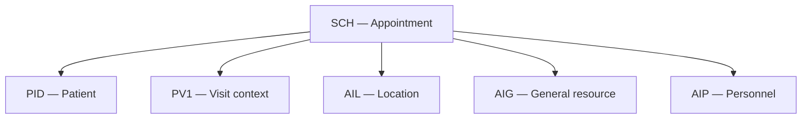
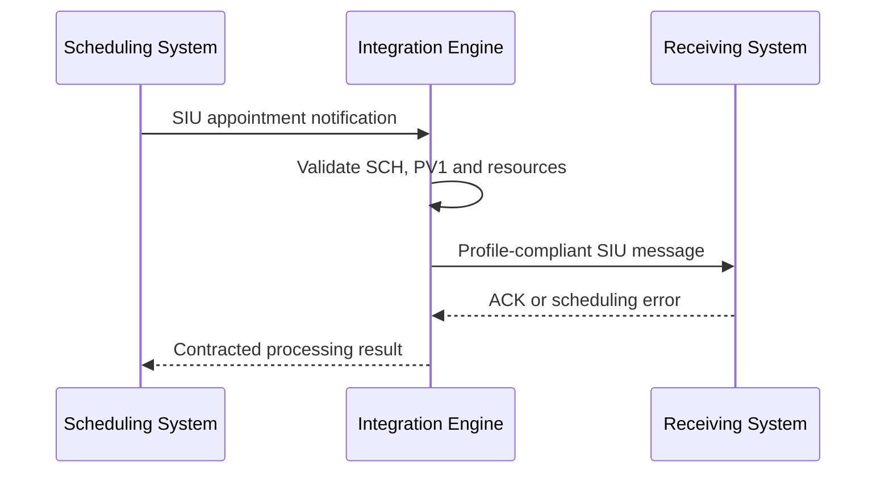

# HL7 Scheduling: Assigning AIG Resources in a Complete SIU Message — Part 2

This guide continues **Assign AIG, Part 1**. Part 1 introduced the fourteen `AIG` fields. Part 2 places the general resource inside a broader HL7 v2 scheduling message and explains how `AIG`, `AIL`, `AIP`, `SCH`, and `PV1` cooperate to describe one appointment.

> All patient, visit, provider, location, resource, and appointment data in this document is fictional. Never use real protected health information (PHI) in training, screenshots, or non-production testing.

## Learning objectives

After completing this guide, you should be able to:

- explain the role of `PV1` in an SIU scheduling message;
- identify scheduling-relevant `PV1` fields;
- distinguish the appointment header, visit context, location, general resource, and personnel assignments;
- construct a coherent SIU message containing `SCH`, `PID`, `PV1`, `AIL`, `AIG`, and `AIP`;
- keep patient, appointment, visit, and resource identifiers distinct;
- validate timing and status consistency across scheduling segments; and
- troubleshoot common message-structure and semantic errors.

## Scope of Part 2

The video continues reviewing the `AIG` definition, then examines the `PV1` segment as the appointment's patient-visit perspective. It concludes with sample SIU messages that combine:

- `MSH` — message routing and event metadata;
- `PID` — patient identity;
- `SCH` — appointment-level information;
- `PV1` — patient-visit context;
- `AIG` — general appointment resource;
- `AIL` — appointment location; and
- `AIP` — appointment personnel.

The reference examples in the video are educational. A production implementation must follow the exact message structure and value sets agreed with the receiver.

## The appointment information model

One scheduled appointment involves several related but distinct concepts:



| Question | Segment | Example answer |
|---|---|---|
| What appointment is being scheduled? | `SCH` | Imaging follow-up appointment |
| Which patient is involved? | `PID` | Enterprise/local patient identifier |
| What is the patient encounter context? | `PV1` | Outpatient visit in radiology |
| Where will it occur? | `AIL` | Radiology Room 2 |
| What non-person resource is required? | `AIG` | X-ray machine 01 |
| Which person is assigned? | `AIP` | Radiology technician |

## AIG review

`AIG` means **Appointment Information — General Resource**. It describes equipment or another non-location, non-person resource associated with the appointment.

| Field | Name | Scheduling purpose |
|---|---|---|
| `AIG-1` | Set ID - AIG | Sequence number for the AIG occurrence |
| `AIG-2` | Segment Action Code | Add, update, or remove the resource occurrence |
| `AIG-3` | Resource ID | Identifies the particular resource |
| `AIG-4` | Resource Type | Classifies the resource |
| `AIG-5` | Resource Group | Identifies a resource pool/group |
| `AIG-6` | Resource Quantity | States the amount required |
| `AIG-7` | Resource Quantity Units | Defines the quantity's units |
| `AIG-8` | Start Date/Time | Gives an absolute resource start time |
| `AIG-9` | Start Date/Time Offset | Gives a relative start offset |
| `AIG-10` | Start Date/Time Offset Units | Defines the offset units |
| `AIG-11` | Duration | Gives the assignment duration |
| `AIG-12` | Duration Units | Defines the duration units |
| `AIG-13` | Allow Substitution Code | Controls resource substitution |
| `AIG-14` | Filler Status Code | Reports the filler-side resource status |

Example:

```hl7
AIG|1|A|XRAY01^X-Ray Machine 01^L|EQUIP^Imaging Equipment^L|XRAY_POOL^X-Ray Equipment Pool^L|1|EA^Each^UCUM|20260927100000+0300|||45|min^minute^UCUM|N^No substitution^L|BOOKED^Booked^L
```

This segment contains exactly fourteen AIG fields. Empty `AIG-9` and `AIG-10` are preserved by the consecutive field separators.

## Why PV1 appears in scheduling messages

`PV1` means **Patient Visit**. In a scheduling workflow it can supply encounter context that is not the responsibility of `SCH` or the appointment-resource segments.

Examples include:

- whether the expected encounter is inpatient, outpatient, or emergency;
- the assigned patient location;
- attending, referring, and consulting providers;
- the visit number;
- financial class or other visit classifications;
- planned or actual admission/discharge information; and
- an alternate visit identifier.

Not every SIU interface requires every `PV1` field. Optionality depends on the trigger event, HL7 version, and conformance profile.

## Scheduling-relevant PV1 fields

The video reviews the broader PV1 field table and highlights several fields useful in an appointment context.

| Field | Name | Practical scheduling use |
|---|---|---|
| `PV1-1` | Set ID - PV1 | Sequence number for the visit segment |
| `PV1-2` | Patient Class | Expected encounter class, such as outpatient |
| `PV1-3` | Assigned Patient Location | Visit location assigned to the patient |
| `PV1-4` | Admission Type | Planned admission category when applicable |
| `PV1-7` | Attending Doctor | Provider responsible for the patient's care |
| `PV1-8` | Referring Doctor | Provider who referred the patient |
| `PV1-9` | Consulting Doctor | Consulting provider when applicable |
| `PV1-10` | Hospital Service | Service responsible for the encounter |
| `PV1-18` | Patient Type | Organization-specific patient classification |
| `PV1-19` | Visit Number | Identifier for the visit/encounter |
| `PV1-20` | Financial Class | Financial classification when required |
| `PV1-44` | Admit Date/Time | Admission or encounter start date/time |
| `PV1-45` | Discharge Date/Time | Discharge or encounter end date/time |
| `PV1-50` | Alternate Visit ID | Additional visit identifier |

The video also displays many other PV1 fields. They should be populated only when they are meaningful, supported by the selected version, and required by the interface.

## PV1-2 — Patient class

`PV1-2` describes the visit class, not the appointment status.

Common examples include:

```text
O = Outpatient
I = Inpatient
E = Emergency
```

Use the code set required by the receiver. A booked appointment is not itself a patient class; `BOOKED` belongs to scheduling/resource status logic, not `PV1-2`.

Example outpatient context:

```hl7
PV1|1|O
```

## PV1-3 — Assigned patient location

`PV1-3` is a `PL` composite. It may contain components such as point of care, room, bed, facility, and location status, depending on the version.

```hl7
PV1|1|O|RADIOLOGY^ROOM2^^HOSPITAL_A
```

Do not assume `PV1-3` replaces `AIL-3`:

- `PV1-3` is the patient's visit location context;
- `AIL-3` is the location resource assigned to the appointment.

They may contain similar values but have different semantic roles.

## PV1-7, PV1-8, and PV1-9 — Providers

These fields identify visit-level provider relationships:

| Field | Relationship |
|---|---|
| `PV1-7` | Attending doctor |
| `PV1-8` | Referring doctor |
| `PV1-9` | Consulting doctor |

Example:

```hl7
PV1|1|O|RADIOLOGY^ROOM2^^HOSPITAL_A||||PRV100^CLINICIAN^CASEY^^^^^^STAFF|PRV200^REFERRER^MORGAN^^^^^^STAFF
```

These visit-level provider roles do not replace `AIP`. `AIP` explicitly assigns personnel to the scheduled appointment and can include its own timing, duration, substitution rule, and filler status.

## PV1-19 — Visit number

`PV1-19` identifies the visit or encounter. It must not be confused with:

| Identifier | Common location |
|---|---|
| Patient identifier/MRN | `PID-3` |
| Placer appointment identifier | `SCH-1` |
| Filler appointment identifier | `SCH-2` |
| Visit/encounter number | `PV1-19` |
| General resource identifier | `AIG-3` |
| Location resource identifier | `AIL-3` |
| Personnel resource identifier | `AIP-3` |

Example visit number:

```text
VST900001^^^HOSPITAL_A^VN
```

The assigning authority and identifier type are essential when identifiers cross organizational boundaries.

## PV1-44 and PV1-45 — Admit and discharge date/time

These fields provide visit timing when relevant:

```text
PV1-44 = 20260927100000+0300
PV1-45 = 20260927104500+0300
```

In a pre-appointment notification, actual admission or discharge may not yet exist. The interface profile must define whether these fields represent planned values, actual values, or must remain empty until the encounter occurs.

Do not fabricate an actual admit/discharge time merely to duplicate the schedule time.

## PV1-50 — Alternate visit ID

`PV1-50` provides another visit identifier when a second system or workflow uses a different visit key.

```text
ALT-VST-10001^^^SOURCE_B^VN
```

Keep the primary and alternate identifiers qualified by their assigning authorities. Do not place an alternate appointment ID here when it is not a visit identifier.

## Relationship between PV1 and appointment-resource segments

| Concept | Segment/field | Ownership question |
|---|---|---|
| Patient's encounter class | `PV1-2` | What type of visit is expected? |
| Visit location | `PV1-3` | Where is the patient assigned in the encounter? |
| Attending/referring roles | `PV1-7` / `PV1-8` | Which providers relate to the visit? |
| Visit identifier | `PV1-19` | Which encounter does this represent? |
| Scheduled location resource | `AIL` | Which location is reserved for the appointment? |
| Scheduled general resource | `AIG` | Which equipment/service resource is reserved? |
| Scheduled personnel | `AIP` | Which person is assigned to the appointment? |

Although these data may overlap operationally, they must not be collapsed into one field or segment.

## Building a coherent SIU message

The logical construction sequence is:

1. create the message envelope in `MSH`;
2. identify the appointment with `SCH`;
3. identify the patient with `PID`;
4. supply the encounter perspective in `PV1`;
5. assign the location using `AIL`;
6. assign general resources using `AIG`;
7. assign personnel using `AIP`; and
8. validate identifiers, timing, statuses, and segment grouping.



## Complete fictional SIU message

```hl7
MSH|^~\&|SCHEDULER|CLINIC_A|EHR|HOSPITAL_A|20260925173000+0300||SIU^S12^SIU_S12|SIU000002|P|2.5.1
SCH|APT10002|FILL10002||||IMG^Diagnostic Imaging^L|FOLLOWUP^Follow-up appointment^L|ROUTINE^Routine^L|45|min^minute^UCUM|^^^20260927100000+0300^20260927104500+0300|||||USR100^BOOKER^ALEX^^^^^^STAFF||||USR100^BOOKER^ALEX^^^^^^STAFF
PID|1||P100046^^^CLINIC_A^MR||PATIENT^SAMPLE^A||19900115|U
PV1|1|O|RADIOLOGY^ROOM2^^HOSPITAL_A||||PRV100^CLINICIAN^CASEY^^^^^^STAFF|PRV200^REFERRER^MORGAN^^^^^^STAFF|||||||||||VST900001^^^HOSPITAL_A^VN|||||||||||||||||||||||||20260927100000+0300|20260927104500+0300|||||ALT-VST-10001^^^SOURCE_B^VN
AIL|1|A|RADIOLOGY^ROOM2^^HOSPITAL_A|ROOM^Imaging Room^L||20260927100000+0300|||45|min^minute^UCUM||BOOKED^Booked^L
AIG|1|A|XRAY01^X-Ray Machine 01^L|EQUIP^Imaging Equipment^L|XRAY_POOL^X-Ray Equipment Pool^L|1|EA^Each^UCUM|20260927100000+0300|||45|min^minute^UCUM|N^No substitution^L|BOOKED^Booked^L
AIP|1|A|PRV300^TECHNICIAN^JORDAN^^^^^^STAFF|TECH^Radiology Technician^L||20260927100000+0300|||45|min^minute^UCUM||BOOKED^Booked^L
```

This example illustrates the relationships; it is not a substitute for a receiver-specific conformance profile.

## Message interpretation

The sample states that:

- `SIU^S12` announces a new appointment booking;
- the placer appointment ID is `APT10002`;
- the filler appointment ID is `FILL10002`;
- the patient has a qualified MRN in `PID-3`;
- the expected visit is outpatient;
- the encounter/visit number is `VST900001`;
- Radiology Room 2 is reserved as the location;
- X-ray Machine 01 is reserved as the general resource;
- a radiology technician is assigned as personnel; and
- the location, equipment, and personnel share a compatible 45-minute window.

## Field-position verification

For the AIG line:

```hl7
AIG|1|A|XRAY01^X-Ray Machine 01^L|EQUIP^Imaging Equipment^L|XRAY_POOL^X-Ray Equipment Pool^L|1|EA^Each^UCUM|20260927100000+0300|||45|min^minute^UCUM|N^No substitution^L|BOOKED^Booked^L
```

| Position | Content |
|---|---|
| `AIG-1` | `1` |
| `AIG-2` | `A` |
| `AIG-3` | `XRAY01^X-Ray Machine 01^L` |
| `AIG-4` | `EQUIP^Imaging Equipment^L` |
| `AIG-5` | `XRAY_POOL^X-Ray Equipment Pool^L` |
| `AIG-6` | `1` |
| `AIG-7` | `EA^Each^UCUM` |
| `AIG-8` | `20260927100000+0300` |
| `AIG-9` | empty |
| `AIG-10` | empty |
| `AIG-11` | `45` |
| `AIG-12` | `min^minute^UCUM` |
| `AIG-13` | `N^No substitution^L` |
| `AIG-14` | `BOOKED^Booked^L` |

Consecutive delimiters are significant. Removing one delimiter shifts all later values into the wrong fields.

## Status coordination

The video refers to a filler-status value set. Scheduling resources may move through states such as pending, booked, started, completed, canceled, deleted, waitlisted, blocked, overbooked, or no-show, depending on the HL7 version/profile.

Do not assume that every segment has the same state at the same moment:

| Appointment component | Possible state |
|---|---|
| Overall appointment | Booked |
| Room (`AIL`) | Booked |
| Equipment (`AIG`) | Pending maintenance confirmation |
| Technician (`AIP`) | Booked |

The receiving workflow must define whether one pending resource blocks the entire appointment, creates a warning, or begins an exception process.

## Timing consistency

The message may contain timing information at several levels:

- appointment timing in `SCH`;
- visit timing in `PV1-44`/`PV1-45`, when applicable;
- location timing in `AIL`;
- general-resource timing in `AIG`; and
- personnel timing in `AIP`.

Validate the intended relationships:

```text
appointment start <= resource start
resource end <= appointment end
start + duration = expected end
PV1 actual times are not invented from planned times
all time zones and precisions are compatible
```

A setup resource may legitimately begin before the patient appointment. If so, the offset and business meaning must be documented.

## Identifier separation

Never reuse one arbitrary number for every identifier role.

| Business object | Example | Suggested field |
|---|---|---|
| Patient | `P100046` | `PID-3` |
| Placer appointment | `APT10002` | `SCH-1` |
| Filler appointment | `FILL10002` | `SCH-2` |
| Visit | `VST900001` | `PV1-19` |
| Alternate visit | `ALT-VST-10001` | `PV1-50` |
| Location | `RADIOLOGY^ROOM2` | `AIL-3` |
| Equipment | `XRAY01` | `AIG-3` |
| Personnel | `PRV300` | `AIP-3` |

Each identifier should have an assigning authority or coding system whenever the datatype supports it.

## Appointment modifications

When an appointment changes, the interface may send a modification trigger such as `SIU^S14`, subject to the receiver profile.

Examples:

- change the appointment time;
- replace one equipment resource;
- move the appointment to another room;
- assign a different technician;
- alter a resource's duration; or
- update filler status.

The receiving system needs stable correlation keys. Define how it identifies:

1. the appointment (`SCH-1`/`SCH-2`);
2. the visit (`PV1-19`), if already created;
3. the resource occurrence being updated; and
4. the exact add, update, or delete action.

`AIG-1` is a set sequence inside a message. Do not automatically treat it as a permanent enterprise resource-assignment identifier.

## Acknowledgment example

```hl7
MSH|^~\&|EHR|HOSPITAL_A|SCHEDULER|CLINIC_A|20260925173001+0300||ACK^S12^ACK|ACK000002|P|2.5.1
MSA|AA|SIU000002
```

| Code | Meaning |
|---|---|
| `AA` | Application accept |
| `AE` | Application error |
| `AR` | Application reject |

Possible errors include:

- unknown visit or appointment identifier;
- unsupported patient class;
- invalid assigned location;
- unknown AIG resource code;
- resource scheduling conflict;
- inconsistent appointment and resource times;
- unsupported action or filler-status code; and
- malformed segment grouping.

The interface contract must define whether `AA` means the message was parsed, the appointment was saved, or every requested resource was successfully committed.

## Mirth Connect processing guidance

A scheduling channel can use the following stages:

1. validate `MSH-9`, `MSH-10`, and `MSH-12`;
2. validate `SCH-1` and/or `SCH-2` according to the identifier contract;
3. verify `PID-3` and its assigning authority;
4. inspect `PV1-2`, `PV1-3`, `PV1-19`, and supported provider fields;
5. iterate over the repeating location, general-resource, and personnel groups;
6. validate action codes, identifiers, times, quantities, durations, and statuses;
7. map source codes to the receiver's catalogs;
8. reject or quarantine semantic contradictions;
9. deliver the transformed SIU message; and
10. correlate the response with the original `MSH-10`.

Illustrative checks:

```javascript
var msgCode = msg['MSH']['MSH.9']['MSH.9.1'].toString();
var controlId = msg['MSH']['MSH.10']['MSH.10.1'].toString();
var patientClass = msg['PV1']['PV1.2']['PV1.2.1'].toString();
var visitNumber = msg['PV1']['PV1.19']['PV1.19.1'].toString();

if (msgCode !== 'SIU') {
    throw 'Expected an SIU scheduling message';
}
if (!controlId) {
    throw 'Missing MSH-10 Message Control ID';
}
if (patientClass && ['O', 'I', 'E'].indexOf(patientClass) === -1) {
    throw 'Unsupported PV1-2 Patient Class';
}

for each (var aig in msg..AIG) {
    var resourceId = aig['AIG.3']['AIG.3.1'].toString();
    var startTime = aig['AIG.8']['AIG.8.1'].toString();
    var duration = aig['AIG.11']['AIG.11.1'].toString();

    if (!resourceId) {
        throw 'Missing AIG-3 Resource ID';
    }
    if (!startTime) {
        throw 'Missing AIG-8 Start Date/Time';
    }
    if (duration && Number(duration) <= 0) {
        throw 'AIG-11 Duration must be positive';
    }
}
```

Adapt these checks to the actual receiver profile. Do not hard-code a complete resource catalog in channel JavaScript; use governed configuration or a terminology/resource service.

## Idempotency and replay

SIU messages may be retried when an acknowledgment is delayed or lost. Prevent the retry from creating a duplicate appointment or duplicate resource reservations.

Recommended controls:

- use sending application, sending facility, and `MSH-10` as a message-level key;
- store the original processing outcome and ACK;
- use placer/filler appointment IDs as business correlation keys;
- detect reuse of one control ID with different content;
- make each resource add/update/delete operation idempotent; and
- retain enough audit data to trace the appointment, visit, and resources.

## Validation checklist

### Message envelope

- [ ] `MSH-9` contains the agreed SIU trigger and structure.
- [ ] `MSH-10` is present and traceable.
- [ ] `MSH-12` contains the agreed HL7 version.
- [ ] Segments and groups follow the receiver's structure.

### Appointment and patient

- [ ] `SCH-1`/`SCH-2` follow the appointment-ID contract.
- [ ] Appointment reason, type, timing, and duration use approved codes/units.
- [ ] `PID-3` contains a qualified patient identifier.

### Visit context

- [ ] `PV1-2` contains an accepted patient class.
- [ ] `PV1-3` is semantically compatible with the scheduled location.
- [ ] Provider roles are placed in the correct PV1 fields.
- [ ] `PV1-19` is a visit ID, not an appointment or patient ID.
- [ ] `PV1-44`/`PV1-45` represent planned or actual times exactly as agreed.
- [ ] `PV1-50` is used only for a genuine alternate visit ID.

### Resources

- [ ] `AIL` describes locations.
- [ ] `AIG` describes non-person general resources.
- [ ] `AIP` describes personnel.
- [ ] Every resource code maps to an active receiver-side resource.
- [ ] Timing, duration, units, substitution, and status are valid.
- [ ] Repeated resources have unique set IDs within their message group.

### Operations

- [ ] Duplicate messages are handled idempotently.
- [ ] Resource conflicts produce controlled business errors.
- [ ] Updates and deletions correlate to the intended appointment/resource.
- [ ] Logs and error queues avoid unnecessary PHI exposure.

## Test scenarios

| Scenario | Expected result |
|---|---|
| Valid new outpatient appointment | Appointment and all resources are accepted |
| Visit number omitted before encounter creation | Accepted only if the profile permits it |
| Patient class unsupported | Validation error |
| `PV1-3` conflicts with `AIL-3` | Reject, warn, or reconcile according to policy |
| Provider appears only in `PV1-7` | Visit attending role is set; appointment assignment depends on `AIP` policy |
| Equipment placed in `AIP` | Semantic validation error |
| Person placed in `AIG` | Semantic validation error |
| Room placed in `AIG` instead of `AIL` | Semantic validation error |
| Appointment and resource times agree | Accepted |
| Resource time lies outside appointment interval | Business validation error unless explicitly allowed |
| AIG filler status is pending while appointment is booked | Process according to partial-resource policy |
| Duplicate message with same content | Previous result returned without duplicate reservations |
| Reused `MSH-10` with changed content | Quarantine and alert |
| Resource update references unknown occurrence | Controlled error |
| Cancellation arrives after resource completed | Apply profile-specific exception workflow |

## Common mistakes

1. **Treating `PV1` as an appointment segment.** It supplies visit context; `SCH` identifies and describes the appointment.
2. **Using `PV1-19` as the patient MRN.** The patient identifier belongs in `PID-3`.
3. **Using `PV1-3` as a complete replacement for `AIL`.** Visit location and scheduled location resource are related but distinct.
4. **Assuming `PV1-7` replaces `AIP`.** Visit-provider role and scheduled personnel assignment have different meanings.
5. **Placing a location in `AIG`.** Use `AIL` for appointment locations.
6. **Using descriptions as resource keys.** Stable codes are required for reliable mapping and updates.
7. **Copying planned schedule times into actual admission/discharge fields without agreement.** Planned and actual times are different facts.
8. **Assuming all resource statuses equal the appointment status.** A resource can be pending while the appointment is booked.
9. **Ignoring consecutive delimiters.** Empty fields must be preserved to keep later values in the correct positions.
10. **Using AIG set ID as a permanent assignment ID.** Define stable business correlation separately.

## Knowledge check

1. What is the difference between `SCH` and `PV1` in an SIU message?
2. Which PV1 field identifies the patient class?
3. Which PV1 field normally carries the visit number?
4. How does `PV1-3` differ from `AIL-3`?
5. How do `PV1-7` and `AIP-3` differ?
6. Which segment should carry an X-ray machine assignment?
7. Why might `PV1-44` and `PV1-45` remain empty before the visit occurs?
8. Why can an appointment be booked while one AIG resource remains pending?
9. What keys should be used to identify a duplicate message and the same business appointment?
10. Why must every example be reconciled with the receiver's conformance profile?

## Summary

Part 2 connects the general resource in `AIG` to the wider scheduling message. `SCH` describes the appointment, `PID` identifies the patient, `PV1` supplies the encounter perspective, and the resource segments describe what must be reserved:

- `AIL` for location;
- `AIG` for non-person general resources; and
- `AIP` for personnel.

A correct SIU message requires more than valid syntax. The patient, appointment, visit, location, equipment, and personnel identifiers must remain distinct; timing must be compatible; statuses must retain their separate meanings; and repeated or modified transactions must be correlated safely.

The receiver's HL7 version and conformance profile remain the final authority for segment order, optionality, code tables, repetitions, and acknowledgment behavior.
