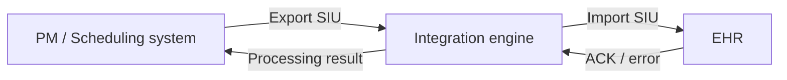
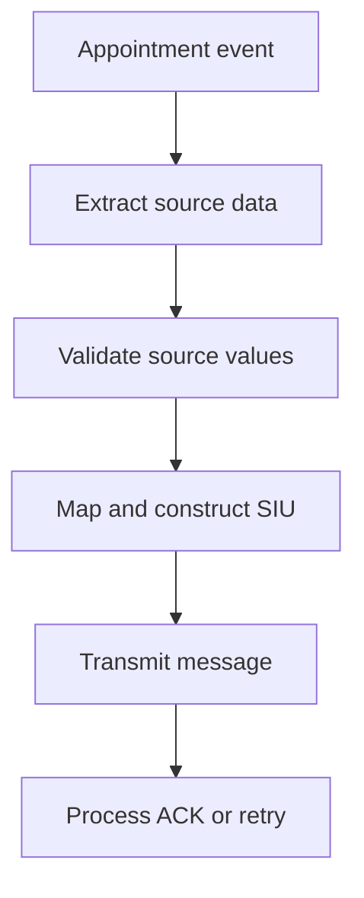
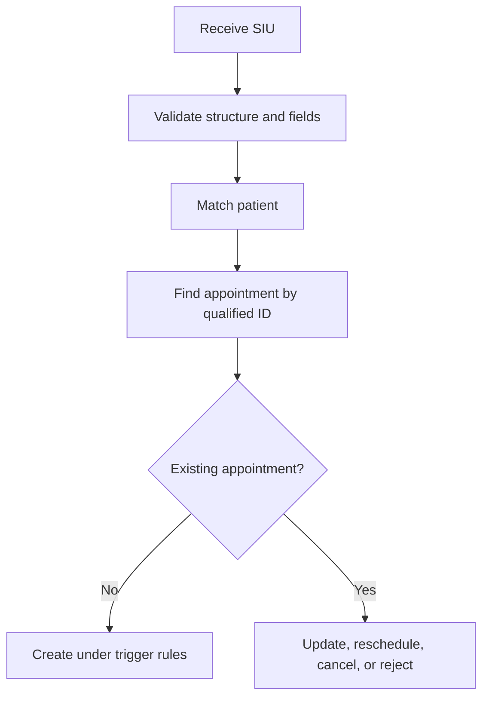

# HL7 SIU Import and Export Between a PM System and an EHR — Part 1

This guide explains the workflow demonstrated in **Import and Export, Part 1**. The lesson uses HL7 v2 scheduling (`SIU`) messages to introduce two complementary operations:

- **Export:** a practice-management (PM) or scheduling system extracts appointment data, transforms it into HL7, and sends it to an EHR.
- **Import:** the EHR receives the HL7 message, validates it, matches the patient, identifies the appointment, and applies the scheduling event safely.

The video also compares provider-, general-resource-, and room-based appointment examples and opens sample messages in an HL7 message viewer for inspection.

> All patients, identifiers, appointments, facilities, providers, and resources in this document are fictional. Never use real protected health information (PHI) in training, screenshots, source control, or non-production testing.

## Learning objectives

After completing this guide, you should be able to:

- distinguish HL7 export from HL7 import;
- describe the end-to-end PM-to-EHR scheduling flow;
- identify the main segments in an `SIU^S12` appointment message;
- load and inspect an HL7 message in a message-viewer application;
- distinguish provider, general-resource, and location appointments;
- validate a message before applying it to the EHR;
- correlate the patient and appointment using governed identifiers;
- prevent duplicate appointment creation; and
- design acknowledgments, retries, audit, and exception handling.

## Scope of Part 1

Part 1 provides an overview rather than a complete product configuration. It demonstrates:

1. examining the standard structure of a new-booking message;
2. opening an HL7 sample file in a desktop message viewer;
3. reviewing provider/doctor-, resource-, and room-based examples;
4. outlining the PM export process; and
5. outlining the EHR import process.

The exact screens and menu names vary by HL7 viewer. The integration principles remain the same.

## Architecture overview



| System | Main responsibility |
|---|---|
| PM/scheduling system | Owns scheduling workflow and exports appointment events |
| Integration engine | Validates, transforms, routes, retries, correlates, and monitors messages |
| EHR | Imports the event and updates the correct patient appointment safely |

## Import versus export

The same message is viewed differently by each system:

| Perspective | Operation | Meaning |
|---|---|---|
| PM system | Export | Convert internal appointment data into an outbound HL7 SIU message |
| EHR | Import | Parse the inbound SIU message and apply the requested appointment event |

Export is not merely saving text to a file, and import is not merely opening that file. Both are controlled integration processes involving data ownership, validation, identity resolution, business rules, acknowledgment, and audit.

## SIU scheduling messages

`SIU` means **Scheduling Information Unsolicited**. An SIU message notifies another application about an appointment event.

Common triggers include:

| Trigger event | Common interpretation |
|---|---|
| `SIU^S12` | New appointment booking |
| `SIU^S13` | Appointment rescheduling |
| `SIU^S14` | Appointment modification |
| `SIU^S15` | Appointment cancellation |

Trigger meanings and supported structures must be confirmed in the receiver's interface profile.

The video examines an `SIU^S12`, which is commonly used for a new appointment notification.

## Main message segments

A scheduling message may contain segments such as:

| Segment | Purpose |
|---|---|
| `MSH` | Message envelope, routing, event, control ID, and HL7 version |
| `SCH` | Appointment identifiers and appointment-level information |
| `PID` | Patient identity and demographics |
| `PV1` | Patient-visit context |
| `AIL` | Appointment location resource |
| `AIG` | General appointment resource |
| `AIP` | Appointment personnel resource |

The exact order, grouping, optionality, and allowed repetitions depend on the HL7 version, trigger event, and conformance profile.

## Appointment resource types

The lesson compares three appointment patterns.

### Provider- or doctor-based appointment

The key scheduled resource is a person, such as a physician or technician. Use `AIP` for appointment personnel.

```hl7
AIP|1|A|PRV100^CLINICIAN^CASEY^^^^^^STAFF|PHYSICIAN^Physician^L||20260927100000+0300|||30|min^minute^UCUM||BOOKED^Booked^L
```

### General-resource-based appointment

The key scheduled resource is equipment or another non-person resource. Use `AIG`.

```hl7
AIG|1|A|XRAY01^X-Ray Machine 01^L|EQUIP^Imaging Equipment^L|XRAY_POOL^X-Ray Equipment Pool^L|1|EA^Each^UCUM|20260927100000+0300|||30|min^minute^UCUM|N^No substitution^L|BOOKED^Booked^L
```

### Room- or location-based appointment

The scheduled resource is a physical location. Use `AIL`.

```hl7
AIL|1|A|RADIOLOGY^ROOM2^^HOSPITAL_A|ROOM^Imaging Room^L||20260927100000+0300|||30|min^minute^UCUM||BOOKED^Booked^L
```

An appointment can contain all three at the same time: a room, a machine, and a clinician.

## Why the distinction matters

| Resource | Correct segment | Incorrect shortcut |
|---|---|---|
| Physician/technician | `AIP` | Treating the person as a general `AIG` resource |
| X-ray/ultrasound machine | `AIG` | Placing equipment in `AIP` |
| Clinic/room/bed | `AIL` | Placing the location in `AIG` |

The correct segment allows each resource to carry the appropriate identifier, role/type, timing, duration, substitution rule, and filler status.

## Inspecting a sample HL7 file

The video opens a sample message with a desktop HL7 message viewer. A typical review workflow is:

1. obtain a synthetic `.hl7` or `.txt` test message;
2. open the message-viewer application;
3. choose **Open** or the equivalent file-import command;
4. browse to the sample-message folder;
5. select the intended file;
6. confirm that the viewer parses the message into segments and fields;
7. inspect raw and structured/tree views; and
8. record any syntax, datatype, or structure errors.

Use only trusted test files. A desktop viewer is an inspection tool; successfully opening a message does not prove that the receiving EHR will accept or correctly process it.

## Raw view and parsed view

### Raw view

The raw view preserves the pipe-delimited wire format:

```hl7
MSH|^~\&|SCHEDULER|CLINIC_A|EHR|HOSPITAL_A|20260925180000+0300||SIU^S12^SIU_S12|SIU000003|P|2.5.1
PID|1||P100047^^^CLINIC_A^MR||PATIENT^SAMPLE^B||19920318|U
```

This view is useful for counting delimiters, detecting shifted values, and seeing the exact transmitted representation.

### Parsed/tree view

The structured view labels segments and fields, making it easier to confirm that:

- `MSH-9` is the expected message type/trigger;
- `MSH-10` contains a control ID;
- `PID-3` contains the patient identifier;
- `SCH-1`/`SCH-2` contain appointment identifiers; and
- `AIL`, `AIG`, and `AIP` values landed in their intended fields.

Always examine both views. A visually plausible raw message may be parsed differently when a delimiter is missing.

## Export workflow: PM system to EHR

The video outlines the following export tasks:

1. identify all data that must be sent in the HL7 SIU message;
2. query the source database;
3. transform the extracted data into the agreed HL7 structure; and
4. send the HL7 message to the EHR system.



## Step 1: Identify the export dataset

Before writing SQL or transformation code, define the data contract.

| Business data | Example source | HL7 destination |
|---|---|---|
| Placer appointment ID | Appointment table | `SCH-1` |
| Filler appointment ID | Receiver/booking table | `SCH-2`, when available |
| Appointment reason/type | Appointment definition | `SCH` coded fields |
| Appointment start/end | Appointment schedule | `SCH` timing |
| Patient ID | Patient master | `PID-3` |
| Patient demographics | Patient master | `PID` |
| Visit number/class | Encounter table | `PV1-19` / `PV1-2` |
| Room/location | Location catalog | `AIL-3` / `AIL-4` |
| Equipment | Resource catalog | `AIG-3` / `AIG-4` |
| Provider/personnel | Provider catalog | `AIP-3` / `AIP-4` |

Define ownership and optionality for every outbound field. Do not export values merely because they exist in the database.

## Step 2: Extract data from the database

An export query commonly joins appointment, patient, visit, provider, location, and resource data.

Conceptual query:

```sql
SELECT
    a.appointment_id,
    a.appointment_status,
    a.start_datetime,
    a.end_datetime,
    p.patient_id,
    p.family_name,
    p.given_name,
    v.visit_number,
    v.patient_class,
    l.location_code,
    r.resource_code,
    pr.provider_id
FROM appointment a
JOIN patient p
  ON p.patient_key = a.patient_key
LEFT JOIN patient_visit v
  ON v.visit_key = a.visit_key
LEFT JOIN location l
  ON l.location_key = a.location_key
LEFT JOIN appointment_resource r
  ON r.appointment_key = a.appointment_key
LEFT JOIN provider pr
  ON pr.provider_key = a.provider_key
WHERE a.appointment_id = :appointment_id;
```

This is pseudocode, not a database-specific production query. Use bind variables, least-privilege credentials, appropriate indexes, and a transactionally consistent snapshot.

### Extraction risks

- one-to-many joins can duplicate appointment rows;
- a missing optional join can remove the entire appointment if an inner join is used;
- source timestamps may lack timezone information;
- inactive resource codes may still be stored historically;
- patient or appointment changes can occur during extraction; and
- database status values may not map directly to HL7 codes.

## Step 3: Transform source data into HL7

Transformation performs more than string concatenation. It should:

- select the correct SIU trigger;
- map internal codes to approved HL7/local codes;
- format `DTM` values correctly;
- qualify patient, visit, appointment, provider, and resource identifiers;
- build repeating resource groups without losing records;
- preserve empty fields when later positions are populated;
- escape delimiter characters inside data values;
- generate a unique `MSH-10`; and
- validate the completed message before transmission.

Conceptual mapping:

```text
source appointment_id       -> SCH-1
source patient_mrn          -> PID-3
source visit_number         -> PV1-19
source location_code        -> AIL-3
source equipment_code       -> AIG-3
source provider_id          -> AIP-3
source appointment_datetime -> SCH timing and resource timing
```

## Step 4: Send and track the message

Common transports include MLLP/TCP, files, message queues, web services, or vendor-specific interfaces. For every outbound transaction, record:

- message-control ID;
- appointment ID and event type;
- target system;
- send time and retry count;
- transport result;
- application acknowledgment;
- final processing state; and
- a privacy-conscious error summary.

Transport success is not the same as application acceptance.

## Import workflow: EHR receives SIU

The video outlines the import responsibilities as:

1. validate that required segments and fields are present;
2. determine whether the appointment already exists;
3. match the patient using trusted identifiers and/or governed matching; and
4. correlate the appointment using the appointment identifier, demonstrated with `SCH-1`.



## Step 1: Structural validation

Validate at least:

- segment terminators and encoding characters;
- supported HL7 version;
- `MSH-9` message type, trigger event, and structure;
- required segments and repetitions;
- field data types and maximum lengths where enforced;
- required identifiers and assigning authorities;
- coded values and code systems;
- date/time syntax and timezone handling; and
- correct placement of appointment-resource segments.

Do not apply business data to the EHR before the message passes the required validation stage.

## Step 2: Message duplicate detection

Before performing business operations, determine whether the same message was processed already.

Suggested message key:

```text
(MSH-3 sending application,
 MSH-4 sending facility,
 MSH-10 message-control ID)
```

If an identical message is retried, return the recorded outcome instead of creating another appointment. If the same control ID arrives with different content, quarantine it and alert support staff.

Message duplicate detection is different from appointment duplicate detection.

## Step 3: Patient matching

The video mentions matching by identifiers or a scorecard. Use a safe order:

1. search a trusted, qualified patient identifier from `PID-3`;
2. search an enterprise identity/cross-reference when available;
3. only then evaluate governed demographic candidates;
4. reject or manually review ambiguous/conflicting matches; and
5. never attach an appointment to an arbitrary highest-scoring patient.

A qualified identifier includes:

```text
(identifier value, assigning authority, identifier type)
```

Example:

```hl7
PID|1||P100047^^^CLINIC_A^MR||PATIENT^SAMPLE^B||19920318|U
```

Patient matching must finish successfully before the appointment is committed to a chart.

## Step 4: Appointment correlation

The video demonstrates `SCH-1` as the appointment identifier. In HL7 scheduling:

- `SCH-1` is the **placer appointment ID**; and
- `SCH-2` is the **filler appointment ID**.

The receiving contract should define which identifier is authoritative and how both systems cross-reference them.

Example:

```hl7
SCH|APT10003^PM_A|FILL10003^EHR_A
```

Do not search by the bare value alone if several assigning systems can issue the same number.

Suggested appointment key:

```text
(placer appointment ID, placer assigning authority)
```

or a governed cross-reference of placer and filler IDs.

## Step 5: Choose the business operation

The trigger event and existing appointment state determine the action.

| Incoming event | Appointment absent | Appointment present |
|---|---|---|
| New booking (`S12`) | Create | Treat as replay, conflict, or controlled update according to profile |
| Reschedule (`S13`) | Reject or exception | Update time/resources |
| Modify (`S14`) | Reject or exception | Apply allowed changes |
| Cancel (`S15`) | Reject, ignore, or tombstone according to policy | Cancel and release resources |

Do not turn every SIU message into an unconditional database insert.

## Complete fictional provider-based appointment

```hl7
MSH|^~\&|PM_APP|CLINIC_A|EHR|HOSPITAL_A|20260925180000+0300||SIU^S12^SIU_S12|SIU000003|P|2.5.1
SCH|APT10003^PM_A|FILL10003^EHR_A||||CONSULT^Consultation^L|FOLLOWUP^Follow-up^L|ROUTINE^Routine^L|30|min^minute^UCUM|^^^20260927100000+0300^20260927103000+0300
PID|1||P100047^^^CLINIC_A^MR||PATIENT^SAMPLE^B||19920318|U
PV1|1|O|CLINIC1^ROOM4^^HOSPITAL_A||||PRV100^CLINICIAN^CASEY^^^^^^STAFF||||||||||||VST900002^^^HOSPITAL_A^VN
AIL|1|A|CLINIC1^ROOM4^^HOSPITAL_A|ROOM^Consultation Room^L||20260927100000+0300|||30|min^minute^UCUM||BOOKED^Booked^L
AIP|1|A|PRV100^CLINICIAN^CASEY^^^^^^STAFF|PHYSICIAN^Physician^L||20260927100000+0300|||30|min^minute^UCUM||BOOKED^Booked^L
```

## Complete fictional resource-based appointment

```hl7
MSH|^~\&|PM_APP|CLINIC_A|EHR|HOSPITAL_A|20260925180100+0300||SIU^S12^SIU_S12|SIU000004|P|2.5.1
SCH|APT10004^PM_A|FILL10004^EHR_A||||XRAY^Diagnostic Imaging^L|FOLLOWUP^Follow-up^L|ROUTINE^Routine^L|30|min^minute^UCUM|^^^20260927110000+0300^20260927113000+0300
PID|1||P100048^^^CLINIC_A^MR||PATIENT^SAMPLE^C||19870721|U
PV1|1|O|RADIOLOGY^ROOM2^^HOSPITAL_A||||PRV200^CLINICIAN^MORGAN^^^^^^STAFF||||||||||||VST900003^^^HOSPITAL_A^VN
AIL|1|A|RADIOLOGY^ROOM2^^HOSPITAL_A|ROOM^Imaging Room^L||20260927110000+0300|||30|min^minute^UCUM||BOOKED^Booked^L
AIG|1|A|XRAY01^X-Ray Machine 01^L|EQUIP^Imaging Equipment^L|XRAY_POOL^X-Ray Equipment Pool^L|1|EA^Each^UCUM|20260927110000+0300|||30|min^minute^UCUM|N^No substitution^L|BOOKED^Booked^L
AIP|1|A|PRV300^TECHNICIAN^JORDAN^^^^^^STAFF|TECH^Radiology Technician^L||20260927110000+0300|||30|min^minute^UCUM||BOOKED^Booked^L
```

## Complete fictional room-based appointment

```hl7
MSH|^~\&|PM_APP|CLINIC_A|EHR|HOSPITAL_A|20260925180200+0300||SIU^S12^SIU_S12|SIU000005|P|2.5.1
SCH|APT10005^PM_A|FILL10005^EHR_A||||OBS^Observation^L|ROOM^Room reservation^L|ROUTINE^Routine^L|60|min^minute^UCUM|^^^20260927120000+0300^20260927130000+0300
PID|1||P100049^^^CLINIC_A^MR||PATIENT^SAMPLE^D||19951109|U
PV1|1|O|DAYCARE^ROOM5^^HOSPITAL_A||||PRV400^CLINICIAN^TAYLOR^^^^^^STAFF||||||||||||VST900004^^^HOSPITAL_A^VN
AIL|1|A|DAYCARE^ROOM5^^HOSPITAL_A|ROOM^Patient Stay Room^L||20260927120000+0300|||60|min^minute^UCUM||BOOKED^Booked^L
AIP|1|A|PRV400^CLINICIAN^TAYLOR^^^^^^STAFF|PHYSICIAN^Physician^L||20260927120000+0300|||60|min^minute^UCUM||BOOKED^Booked^L
```

These examples intentionally use the correct semantic resource segments even when a teaching sample or local interface uses a simplified convention.

## Import decision table

| Validation result | Patient result | Appointment result | Action |
|---|---|---|---|
| Invalid message | Not evaluated | Not evaluated | Reject with an actionable error |
| Valid | No trusted match | Not evaluated | Manual review or reject; do not attach arbitrarily |
| Valid | Ambiguous match | Not evaluated | Identity-review queue |
| Valid | Matched | New ID + new-booking event | Create appointment |
| Valid | Matched | Existing ID + identical replay | Return stored outcome |
| Valid | Matched | Existing ID + permitted change | Update transactionally |
| Valid | Matched | Existing ID + conflicting create | Reject or route for review |
| Valid | Matched | Missing ID for update/cancel | Reject or exception |

## Transaction boundaries

The EHR import should avoid partial state. For example, it should not create the appointment and then silently fail while assigning resources.

Possible strategies include:

- one atomic database transaction when all records share one database;
- a staged/pending appointment until all required resources succeed;
- compensating operations for distributed services; or
- a controlled partial-success state explicitly supported by the business workflow.

The acknowledgment must accurately represent the committed result.

## Acknowledgment example

```hl7
MSH|^~\&|EHR|HOSPITAL_A|PM_APP|CLINIC_A|20260925180001+0300||ACK^S12^ACK|ACK000003|P|2.5.1
MSA|AA|SIU000003
```

Common MSA codes:

| Code | Meaning | Example use |
|---|---|---|
| `AA` | Application accept | Valid event committed under the interface contract |
| `AE` | Application error | Message understood but business processing failed |
| `AR` | Application reject | Unsupported or invalid message/contract |

If an error is returned, include the appropriate error detail supported by the selected HL7 version and profile without exposing unnecessary PHI.

## Mirth Connect export channel

Conceptual source-to-destination flow:

```text
database poller or application event
    -> select changed appointment
    -> enrich patient/visit/resource data
    -> map source codes
    -> construct SIU message
    -> validate message
    -> send to EHR
    -> process ACK
    -> mark export outcome
```

Important controls:

- use a durable change marker or outbox pattern;
- do not mark a row exported before the contracted success milestone;
- generate stable appointment business identifiers;
- generate a unique message-control ID per logical message;
- store retry state separately from appointment state; and
- prevent two channel instances from exporting the same event concurrently.

## Mirth Connect import channel

Conceptual inbound flow:

```text
receive SIU
    -> parse and structurally validate
    -> check message idempotency
    -> match patient
    -> correlate appointment using SCH identifiers
    -> validate trigger against existing state
    -> map visit/location/resource/provider values
    -> commit appointment and required resources
    -> return ACK
```

Illustrative validation logic:

```javascript
var messageCode = msg['MSH']['MSH.9']['MSH.9.1'].toString();
var triggerEvent = msg['MSH']['MSH.9']['MSH.9.2'].toString();
var messageControlId = msg['MSH']['MSH.10']['MSH.10.1'].toString();
var patientId = msg['PID']['PID.3']['PID.3.1'].toString();
var patientAuthority = msg['PID']['PID.3']['PID.3.4'].toString();
var placerAppointmentId = msg['SCH']['SCH.1']['SCH.1.1'].toString();

if (messageCode !== 'SIU') {
    throw 'Expected an SIU message';
}
if (!triggerEvent) {
    throw 'Missing SIU trigger event';
}
if (!messageControlId) {
    throw 'Missing MSH-10 Message Control ID';
}
if (!patientId || !patientAuthority) {
    throw 'PID-3 must contain a qualified patient identifier';
}
if (!placerAppointmentId) {
    throw 'Missing SCH-1 Placer Appointment ID';
}
```

Adapt all rules to the actual conformance profile. Avoid putting complex patient-matching policy directly in channel JavaScript; call a governed identity service or MPI.

## Export validation checklist

- [ ] The source appointment event is eligible for export.
- [ ] Required patient, appointment, visit, and resource data are available.
- [ ] SQL joins do not duplicate or drop resource occurrences.
- [ ] Internal codes map to approved outbound values.
- [ ] Dates/times use valid HL7 precision and timezone handling.
- [ ] Identifiers include the correct authorities/types.
- [ ] `MSH-9`, `MSH-10`, and `MSH-12` are populated correctly.
- [ ] Segment order and grouping match the receiver profile.
- [ ] The complete message passes validation before transmission.
- [ ] ACK, retry, and final-state behavior are recorded.

## Import validation checklist

- [ ] The sender and transport are authorized.
- [ ] `MSH-9` contains a supported SIU trigger and structure.
- [ ] `MSH-10` is present and checked for duplicate/reuse.
- [ ] `MSH-12` is a supported version.
- [ ] Required segments and fields are present.
- [ ] `PID-3` contains a trusted qualified identifier or enters governed matching.
- [ ] Patient match is unique and safe.
- [ ] `SCH-1`/`SCH-2` correlate to the intended appointment.
- [ ] Trigger event is valid for the appointment's current state.
- [ ] `AIL`, `AIG`, and `AIP` contain the correct resource categories.
- [ ] Resource timing and status are internally consistent.
- [ ] The database operation is transactional or has controlled recovery.
- [ ] The returned acknowledgment reflects the committed outcome.

## Test scenarios

| Scenario | Expected result |
|---|---|
| Valid new provider appointment | Patient matched and appointment created with AIP assignment |
| Valid X-ray resource appointment | AIG equipment resource mapped and reserved |
| Valid room appointment | AIL location mapped and reserved |
| Required segment missing | Reject before business processing |
| Malformed date/time | Structural/datatype error |
| Unknown code or resource | Mapping exception or reject |
| Exact message replay | Recorded result returned; no duplicate appointment |
| Same `MSH-10`, changed payload | Quarantine and alert |
| Same `SCH-1`, identical new booking | Replay/conflict policy applied; no duplicate insert |
| Same `SCH-1`, different patient | Critical conflict; stop processing |
| Patient ID exact match | Continue to appointment correlation |
| Patient demographic candidates ambiguous | Manual identity review |
| Update for nonexistent appointment | Controlled exception or reject |
| Cancellation for existing booked appointment | Cancel and release resources transactionally |
| Room available but equipment unavailable | Apply required-resource/partial-success policy |
| Database commit fails after parsing | Roll back and return error; retry safely |
| ACK lost after successful commit | Retry returns the original outcome idempotently |

## Monitoring and reconciliation

Monitor:

- exported and imported message counts by trigger;
- validation failures by segment/field;
- patient-match, ambiguity, and no-match rates;
- appointment create/update/cancel counts;
- duplicate-message and duplicate-appointment detections;
- resource-mapping and scheduling conflicts;
- application accept/error/reject counts;
- retry queue depth and oldest message;
- end-to-end processing latency; and
- appointments present in one system but absent or inconsistent in the other.

Reconciliation should compare PM appointments with EHR appointments using qualified placer/filler IDs, not patient name and time alone.

## Security and privacy

- Encrypt messages in transit and queues at rest.
- Use least-privilege database and application accounts.
- Restrict access to message viewers and interface logs.
- Mask PHI in screenshots, training, and support tickets.
- Avoid logging complete HL7 messages unless policy explicitly permits it.
- Audit message access, patient-match decisions, and appointment changes.
- Apply retention and secure-disposal policies to exported files and payloads.
- Use synthetic data in all non-production examples.

## Common mistakes

1. **Treating export as simple string concatenation.** Mapping, escaping, validation, and correlation are required.
2. **Treating import as file opening.** The EHR must validate and apply business rules transactionally.
3. **Searching an appointment only by patient and date.** Use qualified appointment identifiers from `SCH`.
4. **Assuming `SCH-1` and `SCH-2` are interchangeable.** They represent placer and filler identifiers.
5. **Creating the appointment before matching the patient safely.** This can attach data to the wrong chart.
6. **Processing every `S12` as an unconditional insert.** Existing appointment state must be checked.
7. **Confusing resource categories.** Use `AIP` for people, `AIG` for general resources, and `AIL` for locations.
8. **Ignoring repeated resource rows in the source query.** One-to-many joins require deliberate grouping.
9. **Returning `AA` before the required business commit.** Receipt and successful import may be different milestones.
10. **Retrying without idempotency.** A lost ACK can otherwise create duplicate appointments and reservations.

## Knowledge check

1. What is the difference between HL7 export and import?
2. Which system exports the appointment in the demonstrated PM-to-EHR flow?
3. What are the four main export activities described in the lesson?
4. What must the EHR validate before applying the event?
5. Why must message duplicate detection occur before appointment processing?
6. How should the EHR match a patient safely?
7. What is the difference between `SCH-1` and `SCH-2`?
8. Which segments represent personnel, general resources, and locations?
9. Why does successful parsing in a message viewer not guarantee EHR acceptance?
10. What should happen when the same appointment identifier arrives for a different patient?

## Summary

Part 1 establishes the foundation for bidirectional thinking about HL7 scheduling integration:

- the PM system **exports** appointment data by identifying the dataset, querying the database, transforming it into a compliant SIU message, and sending it to the EHR;
- the EHR **imports** the message by validating its structure, detecting replays, matching the patient, correlating the appointment through `SCH` identifiers, and applying the correct business event; and
- an integration engine coordinates mapping, routing, acknowledgments, retries, monitoring, and exceptions.

The key safety principle is correlation before mutation: identify the message, patient, appointment, visit, and resources correctly before creating or changing EHR data.
