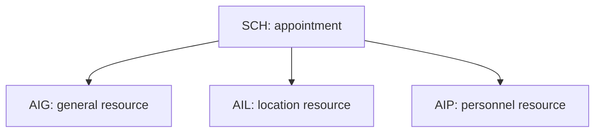

# HL7 Import and Export — Part 3

## Overview

This guide continues the HL7 scheduling import/export series with a focused reference for three SIU scheduling segments:

- `SCH` — appointment-level control information;
- `AIG` — general appointment resources;
- `AIL` — appointment locations.

The lesson also reaches the heading for `AIP` (Appointment Information — Personnel Resource), which is the natural next resource segment, but its field table is not covered in this recording.

The practical theme is scope: `SCH` describes the appointment as a whole, while AIG and AIL describe resources assigned to that appointment. Keeping those responsibilities separate makes messages easier to transform, validate, and import.

## Learning objectives

After completing this part, you should be able to:

- distinguish appointment control data from resource data;
- identify the important SCH fields used for correlation and status;
- represent a general resource with AIG;
- represent a location with AIL;
- interpret segment action codes in repeating resource segments;
- validate resource timing against the parent appointment;
- construct and inspect a basic SIU scheduling fragment.

## Segment relationship



A single appointment may contain multiple repetitions of each resource segment. For example, one appointment can reserve equipment through AIG, a clinic room through AIL, and one or more clinicians through AIP.

## SCH — Schedule Activity Information

SCH is the appointment-control segment. It carries identifiers, event details, timing information, contacts, status, and order references.

### SCH fields reviewed in the lesson

| Field | Name | Purpose |
|---|---|---|
| `SCH-1` | Placer Appointment ID | Appointment identifier assigned by the placer/requesting system |
| `SCH-2` | Filler Appointment ID | Appointment identifier assigned by the filler/scheduling system |
| `SCH-3` | Occurrence Number | Identifies an occurrence within a recurring appointment series |
| `SCH-4` | Placer Group Number | Groups related appointments from the placer |
| `SCH-5` | Schedule ID | Identifies the schedule involved |
| `SCH-6` | Event Reason | Reason for the scheduling event |
| `SCH-7` | Appointment Reason | Clinical or business reason for the appointment |
| `SCH-8` | Appointment Type | Category/type of appointment |
| `SCH-9` | Appointment Duration | Numeric appointment duration |
| `SCH-10` | Appointment Duration Units | Units for `SCH-9` |
| `SCH-11` | Appointment Timing Quantity | Structured appointment timing |
| `SCH-12` | Placer Contact Person | Contact person at the placing system |
| `SCH-13` | Placer Contact Phone Number | Placer contact phone |
| `SCH-14` | Placer Contact Address | Placer contact address |
| `SCH-15` | Placer Contact Location | Placer contact location |
| `SCH-16` | Filler Contact Person | Contact person at the filling system |
| `SCH-17` | Filler Contact Phone Number | Filler contact phone |
| `SCH-18` | Filler Contact Address | Filler contact address |
| `SCH-19` | Filler Contact Location | Filler contact location |
| `SCH-20` | Entered By Person | Person who entered the appointment |
| `SCH-21` | Entered By Phone Number | Phone number associated with the entering person |
| `SCH-22` | Entered By Location | Location from which the appointment was entered |
| `SCH-23` | Parent Placer Appointment ID | Placer ID of a parent appointment |
| `SCH-24` | Parent Filler Appointment ID | Filler ID of a parent appointment |
| `SCH-25` | Filler Status Code | Current status assigned by the filler |
| `SCH-26` | Placer Order Number | Related placer order identifier |
| `SCH-27` | Filler Order Number | Related filler order identifier |

Field names, optionality, data types, table numbers, and maximum lengths vary by HL7 version. The project's conformance profile is authoritative.

## Appointment identifiers and ownership

The two appointment identifiers represent different system perspectives:

| Identifier | Assigned by | Recommended use |
|---|---|---|
| `SCH-1` | Placer/requesting system | Correlate back to the sender's appointment |
| `SCH-2` | Filler/scheduling system | Correlate to the scheduling system's appointment |

Store both identifiers with their assigning authorities whenever available. Do not overwrite one with the other, and do not use `MSH-10` as an appointment ID—`MSH-10` identifies a message instance.

## SCH reason, type, timing, and status

The following fields answer different questions:

- `SCH-6`: Why did this scheduling event occur?
- `SCH-7`: Why is the patient being seen?
- `SCH-8`: What kind of appointment is it?
- `SCH-9`/`SCH-10`: How long is it expected to last?
- `SCH-11`: When or how often is it scheduled?
- `SCH-25`: What status has the filler assigned?

Do not collapse these values into one local field. Each may use a different code table and business rule.

## AIG — Appointment Information: General Resource

AIG represents a non-personnel, non-location resource assigned to an appointment. Examples include equipment, a device, a treatment unit, or another general schedulable asset.

### AIG fields shown in the lesson

| Field | Name | Purpose |
|---|---|---|
| `AIG-1` | Set ID — AIG | Sequence number for repeated AIG segments |
| `AIG-2` | Segment Action Code | Action to perform on this resource occurrence |
| `AIG-3` | Resource ID | Identifier of the assigned resource |
| `AIG-4` | Resource Type | Classification of the resource |
| `AIG-5` | Resource Group | Group or pool to which the resource belongs |
| `AIG-6` | Resource Quantity | Amount of the resource required |
| `AIG-7` | Resource Quantity Units | Units for `AIG-6` |
| `AIG-8` | Start Date/Time | Resource start time |
| `AIG-9` | Start Date/Time Offset | Offset relative to the appointment timing |
| `AIG-10` | Start Date/Time Offset Units | Units for the offset |
| `AIG-11` | Duration | Length of resource use |
| `AIG-12` | Duration Units | Units for `AIG-11` |
| `AIG-13` | Allow Substitution Code | Whether another equivalent resource may be substituted |
| `AIG-14` | Filler Status Code | Filler's status for the resource assignment |

### General-resource matching

`AIG-3` should resolve through a governed crosswalk to exactly one resource in the target system. `AIG-4` describes the resource's type; it should not be used as a substitute for a unique resource ID when a specific asset is required.

Validate resource availability, active status, quantity, timing, permitted substitution, and compatibility with the appointment type.

## AIL — Appointment Information: Location Resource

AIL represents the physical or logical location assigned to an appointment, such as a facility, clinic, department, room, or bed.

### AIL fields shown in the lesson

| Field | Name | Purpose |
|---|---|---|
| `AIL-1` | Set ID — AIL | Sequence number for repeated AIL segments |
| `AIL-2` | Segment Action Code | Action to perform on this location occurrence |
| `AIL-3` | Location Resource ID | Location assigned to the appointment |
| `AIL-4` | Location Type — AIL | Classification of the location |
| `AIL-5` | Location Group | Location group or pool |
| `AIL-6` | Start Date/Time | Location reservation start |
| `AIL-7` | Start Date/Time Offset | Offset from the parent appointment timing |
| `AIL-8` | Start Date/Time Offset Units | Units for the offset |
| `AIL-9` | Duration | Length of location use |
| `AIL-10` | Duration Units | Units for `AIL-9` |
| `AIL-11` | Allow Substitution Code | Whether another suitable location may be substituted |
| `AIL-12` | Filler Status Code | Filler's status for the location assignment |

### Location matching

Match the structured components of `AIL-3` according to the interface agreement. Display text alone is unsafe because names can change or be duplicated.

A useful location crosswalk records:

- external location code;
- assigning authority/facility;
- location type;
- target-system location ID;
- effective dates;
- active status;
- parent facility or department.

## Segment Action Code

`AIG-2` and `AIL-2` indicate what the receiver should do with the specific resource occurrence. Typical actions can include adding, updating, or deleting/cancelling a resource assignment, but the permitted literal codes must come from the agreed HL7 table and version.

Safe processing requires both an action and a stable occurrence identity. A delete action must target an existing resource assignment; it must not delete every resource of the same type.

## Timing rules

Resource timing can be expressed directly or relative to the appointment.

### Direct timing

- `AIG-8` or `AIL-6` contains an explicit start date/time.
- Duration and duration units define the reservation window.

### Offset timing

- The segment carries a start offset and offset units.
- The receiver calculates the resource start relative to the parent appointment time.

Recommended validation:

```text
resourceStart = explicitStart
                OR appointmentStart + signedOffset

resourceEnd = resourceStart + duration
```

- Require a supported unit for every duration or offset.
- Reject contradictory direct and offset timing unless the profile defines precedence.
- Check that the resource window is reasonable relative to the appointment.
- Use an agreed timezone policy and preserve offsets where supported.

## Illustrative SIU fragment

The following fictional example demonstrates the relationship between SCH, AIG, and AIL. It is not a verbatim transcript of the lesson.

```hl7
MSH|^~\\&|SCHEDULER|GENERAL_HOSPITAL|EHR|GENERAL_HOSPITAL|20260925210000||SIU^S12|SIU000301|P|2.5
SCH|PLC1001^PLACER|FIL9001^FILLER||||BOOK^Booking|FOLLOWUP^Follow-up visit|ROUTINE^Routine appointment|30|min||||||56789^CONTACT^FILLER||||12345^USER^ENTRY|||||BOOKED
PID|1||PAT100245^^^GENERAL_HOSPITAL^MR||PATIENT^EXAMPLE
AIG|1|A|ECG01^ECG Machine 01|EQUIPMENT^Equipment||1|unit|20260926100000|||30|min|N|BOOKED
AIL|1|A|CARD^ROOM12^GENERAL_HOSPITAL|ROOM^Room||20260926100000|||30|min|N|BOOKED
```

### Example interpretation

- `SCH-1` and `SCH-2` carry the placer and filler appointment identifiers.
- `SCH-7` and `SCH-8` describe the appointment reason and type.
- `SCH-9`/`SCH-10` specify a 30-minute appointment.
- `SCH-25` carries the filler-assigned appointment status in this profile.
- AIG assigns one ECG machine for 30 minutes.
- AIL assigns a cardiology room for the same interval.

## Position verification

HL7 fields are positional. Empty pipes are meaningful placeholders. When constructing SCH, AIG, or AIL:

1. count from the segment name as field zero;
2. preserve every empty field before a populated later field;
3. do not remove trailing/intermediate separators during transformation;
4. inspect the message with the correct HL7 version;
5. verify each populated value against the project profile.

## Import workflow

1. Parse `MSH` and verify message type, event, version, sender, and receiver.
2. Detect duplicate messages using sender namespace plus `MSH-10`.
3. Match the patient.
4. Resolve the appointment using `SCH-1` and/or `SCH-2` as agreed.
5. Validate the requested appointment transition and `SCH-25` status.
6. Process each AIG occurrence using its set ID, action code, resource identity, and timing.
7. Process each AIL occurrence using its set ID, action code, structured location, and timing.
8. Commit appointment and resource changes atomically where possible.
9. Store an audit record and return the configured acknowledgment.

## Testing checklist

### SCH tests

- New appointment with only placer ID.
- Response/update containing both placer and filler IDs.
- Recurring appointment with occurrence number.
- Valid and invalid appointment reason/type codes.
- Duration without units.
- Unsupported filler status.
- Parent/child appointment linkage.

### AIG tests

- Add one valid general resource.
- Add multiple AIG repetitions.
- Unknown resource ID or resource type.
- Quantity without units.
- Unavailable resource.
- Substitution allowed and prohibited.
- Update/delete action for a missing occurrence.

### AIL tests

- Add one valid location.
- Multiple location reservations.
- Unknown facility, department, or room.
- Location inactive on the appointment date.
- Direct time and offset conflict.
- Duration extends beyond an allowed reservation window.

### Reliability tests

- Replay the same `MSH-10`.
- Repeat the same resource action under a new message control ID.
- Deliver an update before the create event.
- Simulate a failure after SCH update but before resource updates.
- Retry after acknowledgment timeout and confirm no duplicate resources are created.

## Common mistakes

- Confusing placer and filler appointment IDs.
- Using `MSH-10` as the appointment identifier.
- Treating appointment reason, appointment type, and status as the same field.
- Using AIG for a provider or location.
- Using AIL display text as the unique location key.
- Ignoring the segment action code.
- Treating set ID as a permanent enterprise resource identifier.
- Omitting units for duration, quantity, or offset.
- Applying a resource update without validating the parent appointment.
- Dropping empty pipe placeholders and shifting later values into the wrong fields.

## Operational recommendations

- Maintain crosswalks for appointment types, reasons, statuses, resources, and locations.
- Store both placer and filler identifiers.
- Log message ID, appointment ID, resource occurrence, action, old value, and new value.
- Use exception queues for unmatched or ambiguous resources.
- Monitor duplicate rate, resource-conflict rate, rejection rate, and processing latency.
- Reconcile appointment and resource assignments between sender and receiver.
- Protect patient and scheduling data in logs and support tools.

## Summary

SCH controls the appointment; AIG assigns general resources; AIL assigns locations. A reliable SIU import/export implementation preserves placer and filler identifiers, respects segment action codes, resolves resources through governed crosswalks, validates timing and units, processes repeated resources idempotently, and keeps appointment and resource changes auditable.
