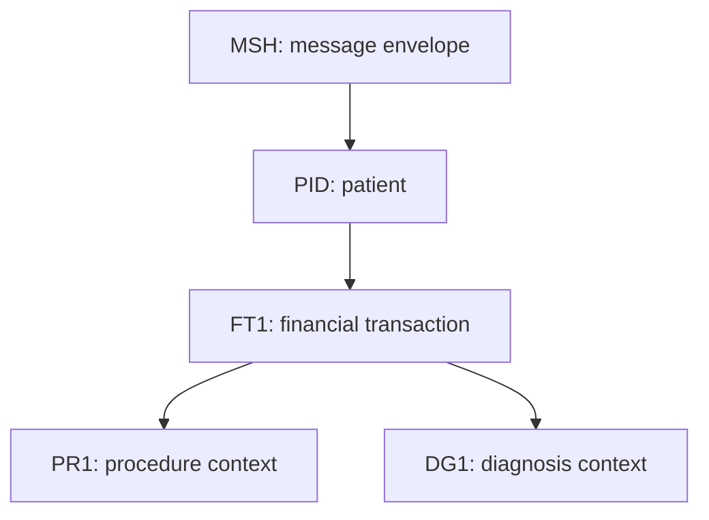

# HL7 Finance — Part 1

## Overview

This guide introduces financial transactions in HL7 v2, concentrating on the **DFT** message and its main transaction segment, **FT1**. It also explains how `PR1` procedure information and `DG1` diagnosis information provide the clinical context needed to interpret a charge.

The lesson demonstrates the field definitions in an HL7 reference document, reviews a sample `DFT^P03` message, and opens that message in an HL7 viewer to inspect the parsed FT1 values.

> A DFT message transports financial transaction facts. It does not replace the receiving organization's billing rules, fee schedules, coding validation, or accounting controls.

## Learning objectives

After completing this part, you should be able to:

- explain the purpose of a DFT message;
- identify the principal segments used in the demonstrated financial workflow;
- interpret the most important FT1 fields;
- distinguish transaction, procedure, and diagnosis information;
- read a raw DFT message and verify its values in an HL7 viewer;
- design basic validation and testing for a financial interface.

## What is a DFT message?

**DFT** means **Detailed Financial Transaction**. A source system sends a DFT message when it needs to communicate a charge, credit, payment-related event, or another financial transaction to a downstream billing, patient-accounting, or EHR system.

The video uses the `DFT^P03` event. `P03` is commonly associated with posting a detailed financial transaction. The exact event, supported transaction types, and acknowledgment behavior must be agreed in the interface specification.

## Segments introduced in the lesson

The demonstrated DFT structure includes the following segments:

| Segment | Purpose |
|---|---|
| `MSH` | Message envelope: sender, receiver, timestamp, message type, control ID, version |
| `EVN` | Event information, when required by the profile |
| `PID` | Patient identity |
| `FT1` | Individual financial transaction or charge line |
| `PR1` | Procedure performed |
| `DG1` | Diagnosis supporting the encounter or charge |

Depending on the HL7 version and implementation profile, a DFT message can contain additional segments such as patient visit, insurance, guarantor, or notes. Segment presence and repetition must follow the trading-partner agreement rather than a generic example alone.

## Conceptual relationship



A message may contain more than one FT1 transaction line. The association between repeating FT1, PR1, and DG1 segments must be defined by the selected message structure and local profile; never infer the relationship only from screen position.

## FT1 — Financial Transaction segment

FT1 is the main focus of the lesson. It represents one financial transaction line and contains identifiers, dates, codes, quantities, monetary values, departmental information, provider references, procedure information, and other billing details.

### Core FT1 fields

| Field | Name | Practical use |
|---|---|---|
| `FT1-1` | Set ID — FT1 | Sequence number for repeated FT1 segments |
| `FT1-2` | Transaction ID | Unique identifier assigned to the transaction |
| `FT1-3` | Transaction Batch ID | Groups transactions processed in the same batch |
| `FT1-4` | Transaction Date | Date or period in which the service/transaction occurred |
| `FT1-5` | Transaction Posting Date | Date the transaction was posted |
| `FT1-6` | Transaction Type | Classifies the action, such as charge, credit, adjustment, or payment according to the local code set |
| `FT1-7` | Transaction Code | Billable service, item, or transaction code |
| `FT1-8` | Transaction Description | Human-readable description of the transaction |
| `FT1-9` | Transaction Description — Alternate | Alternate description when required |
| `FT1-10` | Transaction Quantity | Number of billable units |
| `FT1-11` | Transaction Amount — Extended | Total amount for the transaction line |
| `FT1-12` | Transaction Amount — Unit | Amount per unit |
| `FT1-13` | Department Code | Department responsible for the transaction |
| `FT1-14` | Insurance Plan ID | Related insurance plan identifier |
| `FT1-15` | Insurance Amount | Amount allocated to insurance |
| `FT1-16` | Assigned Patient Location | Location associated with the transaction |
| `FT1-17` | Fee Schedule | Fee schedule used for pricing |
| `FT1-18` | Patient Type | Patient classification used by the financial workflow |
| `FT1-19` | Diagnosis Code — FT1 | Diagnosis directly associated with the transaction line |
| `FT1-20` | Performed By Code | Person or organization that performed the service |
| `FT1-21` | Ordered By Code | Person who ordered the service |
| `FT1-22` | Unit Cost | Cost for a single unit |
| `FT1-23` | Filler Order Number | Receiving/filler application's order identifier |
| `FT1-24` | Entered By Code | User or system that entered the transaction |
| `FT1-25` | Procedure Code | Procedure associated with the transaction |
| `FT1-26` | Procedure Code Modifier | Modifier qualifying the procedure |
| `FT1-27` | Advanced Beneficiary Notice Code | ABN-related indicator/code where applicable |
| `FT1-28` | Medically Necessary Duplicate Procedure Reason | Reason for a medically necessary duplicate procedure |
| `FT1-29` | NDC Code | National Drug Code, when applicable |
| `FT1-30` | Payment Reference ID | Reference assigned to a payment |
| `FT1-31` | Transaction Reference Key | Cross-reference to another transaction |
| `FT1-32` | Performing Facility | Facility where the service was performed |
| `FT1-33` | Ordering Facility | Facility from which the order originated |

Later HL7 versions may define additional FT1 fields. Always verify field names, data types, repetition, optionality, and valid code tables against the **exact HL7 version and implementation profile** used by the interface.

### Important date distinction

- `FT1-4` tells when the transaction or service occurred.
- `FT1-5` tells when it was posted.

These values can differ. Do not substitute the message timestamp (`MSH-7`) for either field unless the interface specification explicitly permits it.

### Amount and quantity checks

Where the interface treats `FT1-12` as the unit amount, the following relationship may be expected:

```text
expected extended amount = transaction quantity × unit amount
```

However, rounding, discounts, tax, package pricing, modifiers, and payer rules may produce a different result. The receiver should validate according to the contracted business rules rather than silently recalculating every charge.

## PR1 — Procedure segment

PR1 describes a procedure performed for the patient. The lesson's reference table includes fields such as:

| Field | Name |
|---|---|
| `PR1-1` | Set ID — PR1 |
| `PR1-2` | Procedure Coding Method |
| `PR1-3` | Procedure Code |
| `PR1-4` | Procedure Description |
| `PR1-5` | Procedure Date/Time |
| `PR1-6` | Procedure Functional Type |
| `PR1-7` | Procedure Minutes |
| `PR1-8` | Anesthesiologist |
| `PR1-9` | Anesthesia Code |
| `PR1-10` | Anesthesia Minutes |
| `PR1-11` | Surgeon |
| `PR1-12` | Procedure Practitioner |
| `PR1-13` | Consent Code |
| `PR1-14` | Procedure Priority |
| `PR1-15` | Associated Diagnosis Code |
| `PR1-16` | Procedure Code Modifier |
| `PR1-17` | Procedure DRG Type |
| `PR1-18` | Tissue Type Code |
| `PR1-19` | Procedure Identifier |
| `PR1-20` | Procedure Action Code |

`FT1-25` and `PR1-3` can both carry procedure-related information, but they serve different structural roles. The implementation guide must state whether both are required, how they relate, and which is authoritative if their values disagree.

## DG1 — Diagnosis segment

DG1 provides diagnosis information that may support the clinical and billing context.

| Field | Name |
|---|---|
| `DG1-1` | Set ID — DG1 |
| `DG1-2` | Diagnosis Coding Method |
| `DG1-3` | Diagnosis Code — DG1 |
| `DG1-4` | Diagnosis Description |
| `DG1-5` | Diagnosis Date/Time |
| `DG1-6` | Diagnosis Type |
| `DG1-7` | Major Diagnostic Category |

Additional DG1 fields exist in various HL7 versions. Codes should include the correct coding system/version where required. A diagnosis description is not a reliable replacement for a coded diagnosis.

## Illustrative DFT message

The following example is designed for learning. It is not a verbatim copy of the patient's sample shown in the video and contains no real patient information.

```hl7
MSH|^~\\&|BILLING_APP|GENERAL_HOSPITAL|EHR|GENERAL_HOSPITAL|20260925143000||DFT^P03|DFT000001|P|2.5
EVN|P03|20260925143000
PID|1||1000006994^^^GENERAL_HOSPITAL^MR||PATIENT^TEST||19800101|M
FT1|1|TXN000123|BATCH009|20260925120000|20260925143000|CG|93000^Electrocardiogram^CPT|ECG service||1|25.000|25.000|CARD|||||O|R07.9^Chest pain, unspecified^ICD-10-CM|56789^CLINICIAN^TEST|56789^CLINICIAN^TEST||||93000^Electrocardiogram^CPT
PR1|1|CPT|93000^Electrocardiogram^CPT|ECG service|20260925120000
DG1|1|ICD10|R07.9^Chest pain, unspecified^ICD-10-CM|Chest pain, unspecified|20260925120000|F
```

### How to read it

1. `MSH-9` identifies the message as `DFT^P03`.
2. `MSH-10` is the unique message control ID used for acknowledgment and duplicate-message detection.
3. `PID-3` identifies the patient in the agreed assigning authority.
4. `FT1-2` identifies the financial transaction.
5. `FT1-4` and `FT1-5` distinguish the service date from the posting date.
6. `FT1-6` and `FT1-7` classify the transaction and billable service.
7. `FT1-10` through `FT1-12` carry quantity and monetary values.
8. `PR1` supplies procedure detail, while `DG1` supplies diagnosis context.

## Reading the message in an HL7 viewer

The demonstration pastes a sample message into an HL7 viewer and expands FT1. This is useful because the viewer maps each pipe-delimited value to a field name.

Recommended verification process:

1. Confirm that each segment begins on a new line using a carriage return in the transmitted message.
2. Select the correct HL7 version.
3. Check `MSH-9`, `MSH-10`, and `MSH-12` first.
4. Expand FT1 and compare every populated value with the field mapping.
5. Confirm that date/time, coded element, quantity, and amount values parse correctly.
6. Review PR1 and DG1 independently; do not assume the viewer proves their business relationship to FT1.
7. Compare the parsed output with the receiver's conformance profile.

A viewer confirms syntax and field placement. It cannot confirm that the patient, account, transaction type, price, procedure, diagnosis, or provider is valid in the destination system.

## Import and validation workflow

### 1. Envelope validation

- Validate sender, receiver, message type, trigger event, processing ID, and version.
- Require `MSH-10` and use it for message-level duplicate detection.
- Reject unsupported versions or events according to the interface contract.

### 2. Identity validation

- Match the patient using a stable identifier such as `PID-3` with assigning authority.
- Match the visit/account when the profile supplies one.
- Reject or quarantine ambiguous matches.

### 3. Financial validation

- Require a stable transaction identifier such as `FT1-2`.
- Map `FT1-6` transaction types through an agreed code table.
- Validate `FT1-7`, quantities, amounts, currency assumptions, department, provider, and facility.
- Check whether the transaction is a new charge, reversal, correction, credit, or other supported action.
- Prevent the same business transaction from being posted twice even if it arrives with a new `MSH-10`.

### 4. Clinical-code validation

- Validate procedure and diagnosis coding systems.
- Check effective dates and allowed modifiers.
- Define how `FT1-19`, `FT1-25`, PR1, and DG1 must agree.
- Route invalid or unsupported codes to an exception workflow.

### 5. Persistence and acknowledgment

- Apply related database changes in one transaction where possible.
- Store an immutable audit record of the received message and processing result.
- Return the agreed acknowledgment only after reaching the contracted durability point.

## Acknowledgment guidance

Typical HL7 acknowledgment codes are:

| Code | Meaning | Example use |
|---|---|---|
| `AA` | Application Accept | Transaction accepted and processed according to the contract |
| `AE` | Application Error | Message parsed, but a validation or processing error occurred |
| `AR` | Application Reject | Message could not be accepted, parsed, or routed |

Include the original `MSH-10` in the acknowledgment and return actionable error details without unnecessarily exposing patient information.

## Testing checklist

### Positive tests

- One valid charge with FT1, PR1, and DG1.
- Multiple FT1 segments in one message.
- Valid procedure modifier and diagnosis code.
- Different transaction and posting dates.
- Correct quantity, unit amount, and extended amount.

### Negative tests

- Missing patient identifier.
- Missing transaction ID or transaction type.
- Invalid transaction code.
- Unsupported procedure or diagnosis coding system.
- Invalid date/time format.
- Negative or zero amount where prohibited.
- Quantity/amount inconsistency under the agreed business rules.
- Procedure mismatch between FT1 and PR1.

### Reliability tests

- Replay the same `MSH-10`.
- Resend the same transaction with a different `MSH-10`.
- Send a reversal before the original charge.
- Simulate a database failure midway through processing.
- Retry after an acknowledgment timeout and confirm that no duplicate charge is created.

## Common mistakes

- Treating `MSH-10` as the financial transaction ID.
- Confusing transaction date with posting date.
- Assuming a transaction description is sufficient when a coded value is required.
- Posting duplicate charges during retry.
- Assuming FT1 procedure or diagnosis fields automatically match PR1/DG1.
- Using floating-point arithmetic for monetary values.
- Logging unmasked patient and financial data.
- Accepting a message merely because an HL7 viewer can parse it.
- Hard-coding codes without documenting the code system and version.

## Implementation recommendations

- Store monetary values using fixed-precision decimal types.
- Maintain version-controlled crosswalks for transaction, procedure, diagnosis, department, provider, and facility codes.
- Preserve the original inbound message together with message control ID, transaction ID, processing status, and acknowledgment.
- Separate syntactic validation from business validation.
- Make charge posting idempotent.
- Define reversal and correction handling before production use.
- Reconcile source and destination transaction totals regularly.
- Monitor rejection rate, duplicate rate, processing latency, and unmatched-code volume.

## Summary

HL7 DFT messages communicate detailed financial transactions. FT1 is the central charge or transaction segment; PR1 describes procedures, and DG1 supplies diagnosis context. A dependable implementation requires correct field placement, stable patient and transaction identifiers, exact code-system mapping, decimal-safe amount handling, idempotent processing, and an auditable acknowledgment workflow.
