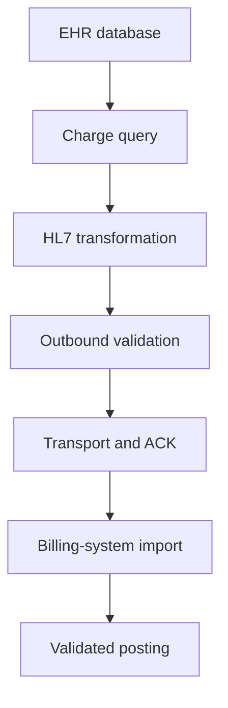
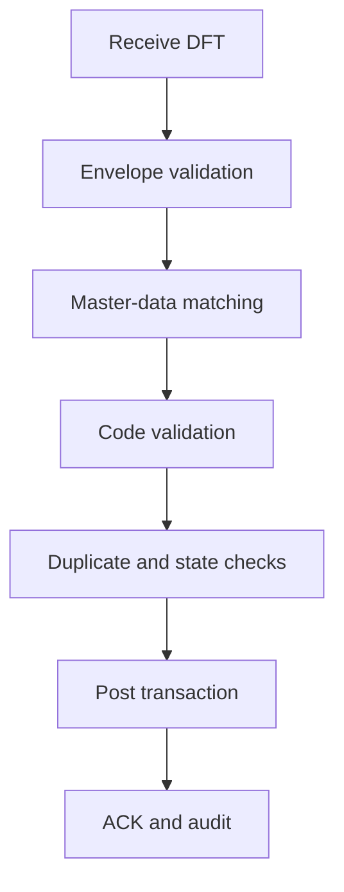

# HL7 Finance — Part 2

## Overview

This guide continues HL7 Finance Part 1 by moving from DFT/FT1 field definitions to the practical integration workflow between an **EHR** and a **practice-management or billing system**.

The lesson presents two complementary processes:

- **Export:** identify charge data in the EHR, query it, transform it into an HL7 financial message, and send it to the billing system.
- **Import:** validate the message and correlate its patient, encounter, provider, location, diagnosis, and procedure data before posting the transaction.

The key idea is that a syntactically correct `DFT^P03` message is not automatically safe to post. Every business identifier and code must resolve to the intended record in the receiving system.

## Learning objectives

After completing this part, you should be able to:

- design an EHR-to-billing export pipeline;
- identify the minimum data required to build a financial HL7 message;
- correlate patients and encounters safely;
- map provider and location identifiers across systems;
- validate ICD diagnosis and CPT procedure codes;
- separate message validation from financial posting;
- handle duplicates, unmatched values, corrections, and exceptions.

## Integration direction

The scenario demonstrated in the video is:

```text
EHR  -------------------->  Practice Management / Billing System
          DFT / financial HL7 message
```

The EHR is the source of the performed-service and charge information. The practice-management or billing system receives the message, resolves the identifiers against its own master data, and posts the supported financial transaction.

## High-level architecture



The interface engine may perform transformation, validation, routing, retries, and acknowledgment handling. The authoritative financial posting rules remain with the receiving billing application.

## Export workflow: EHR to billing system

The video lists four principal export steps.

### 1. Identify all required data elements

Define the receiving system's requirements before writing the query. A typical financial export may require:

| Data group | Example values | Common HL7 locations |
|---|---|---|
| Message metadata | sender, receiver, message time, control ID, version | `MSH` |
| Patient | patient ID, assigning authority, name | `PID` |
| Encounter/account | visit number, patient class, location | commonly `PV1`; profile-dependent |
| Financial transaction | transaction ID, type, code, dates, quantity, amount | `FT1` |
| Provider | ordering, performing, or attending provider | `FT1`, `PV1`, or `PR1`, depending on profile |
| Location | department, assigned patient location, facility | `FT1` and/or `PV1` |
| Procedure | CPT or another procedure code and modifiers | `FT1-25`, `FT1-26`, and/or `PR1` |
| Diagnosis | ICD code, description, type | `FT1-19` and/or `DG1` |

Create a version-controlled mapping specification containing the source column, target HL7 field, data type, required/optional status, code system, transformation rule, and example.

### 2. Query the source data

The query should return one deterministic export record per intended transaction line. Join the required patient, encounter, provider, location, procedure, diagnosis, and charge data without multiplying rows unintentionally.

Recommended query controls:

- select only transactions that are eligible for export;
- use a stable transaction key;
- store or derive an export status;
- use a committed-data boundary or watermark;
- order results deterministically;
- prevent one-to-many joins from duplicating charges;
- retain the source record version or last-updated timestamp.

### 3. Transform the data into HL7

Build the message using the agreed HL7 version and conformance profile. Transformation includes:

- formatting timestamps;
- escaping delimiter characters;
- constructing composite values;
- translating local codes through crosswalks;
- generating a unique `MSH-10` message control ID;
- assigning stable transaction IDs such as `FT1-2`;
- placing CPT and ICD values in their agreed fields;
- omitting or defaulting fields only when the specification permits it.

### 4. Send the message

Send the validated message to the practice-management or billing system using the agreed transport, commonly MLLP/TCP in HL7 v2 environments.

The sending workflow should:

1. persist the outbound payload and status;
2. transmit the message;
3. wait for the configured acknowledgment;
4. correlate the ACK using the original `MSH-10`;
5. mark the transaction successful only at the agreed acknowledgment level;
6. retry transient failures without producing duplicate charges.

## Import workflow: billing-system correlation

The receiving system should validate the HL7 envelope and then perform the business matches highlighted in the lesson.



## Required matches

### Patient match

The lesson identifies patient ID and a local card/score-card identifier as possible matching values. In production, define exactly which identifier is authoritative.

Recommended approach:

- use `PID-3` with assigning authority and identifier type;
- map the EHR patient ID to the billing system's patient ID;
- use a card/score-card identifier only when it is governed and unique in both systems;
- never match solely on patient name;
- quarantine zero-match and multiple-match results.

| Outcome | Action |
|---|---|
| Exactly one patient | Continue validation |
| No patient | Hold the transaction in an exception queue |
| Multiple patients | Reject or quarantine; never guess |
| Inactive/merged patient | Follow the target system's merge and alias rules |

### Encounter match

The encounter connects the financial transaction with the correct visit or account. A receiver commonly uses the visit number in `PV1-19`, but the exact field must follow the implementation guide.

Validate that:

- the encounter belongs to the matched patient;
- the encounter is valid for the service date;
- its status permits financial posting;
- the patient class and facility are consistent;
- the incoming encounter ID has not been reused in another namespace.

Do not post an encounter-specific charge to a patient-level account merely because the patient matched.

### Provider match

The provider may be represented as ordering, performing, attending, or referring. These roles are not interchangeable.

Match using a governed identifier and assigning authority, then validate:

- provider role;
- active status on the service date;
- facility or department affiliation;
- identifier type, such as local provider ID or NPI where applicable;
- crosswalk to the billing system's internal provider record.

### Location match

Location can affect routing, department ownership, pricing, and reporting. The message may carry location information in `PV1` and/or FT1 department/location fields.

The receiver should resolve the incoming facility, department, clinic, and room identifiers through a controlled crosswalk. Display names are unsuitable as primary matching keys because they can change and may not be unique.

### ICD match

ICD represents diagnosis information. Validate more than the code string:

- coding system and version;
- effective date;
- active/inactive status;
- diagnosis type and priority where required;
- compatibility with the receiving system's code set;
- relationship to the transaction or procedure according to the message profile.

Diagnosis may appear in `DG1` and, in some profiles, `FT1-19`. Define which representation is authoritative and how discrepancies are handled.

### CPT match

CPT represents a procedure/service code in the demonstrated workflow. It may be transmitted in `FT1-25`, in `PR1-3`, or in both locations according to the interface specification.

Validate:

- code-system identifier;
- code and description;
- service-date validity;
- required modifiers;
- quantity and unit rules;
- fee-schedule eligibility;
- department/provider restrictions;
- agreement between FT1 and PR1 when both are populated.

> CPT is a proprietary code system maintained by the American Medical Association. Implementations must use properly licensed and current reference data where required.

## Correlation matrix

| Business object | Preferred matching input | Example HL7 field(s) | Failure handling |
|---|---|---|---|
| Patient | Enterprise/local patient ID plus namespace | `PID-3` | Quarantine |
| Encounter | Visit/account number plus namespace | commonly `PV1-19` | Quarantine or reject |
| Provider | Provider ID plus assigning authority and role | `FT1-20`, `FT1-21`, `PV1`, `PR1` | Quarantine |
| Location | Facility/department/location code | `PV1`, `FT1-13`, `FT1-16` | Crosswalk exception |
| Diagnosis | ICD code plus coding system/version | `DG1-3`, possibly `FT1-19` | Code exception |
| Procedure | CPT code plus coding system/modifiers | `FT1-25`, `FT1-26`, `PR1-3` | Code exception |
| Transaction | Source transaction ID plus sending namespace | `FT1-2` | Duplicate/state check |
| Message | Sender plus message control ID | `MSH-10` | Message replay detection |

Field selection in this table is representative; the project profile is authoritative.

## Example DFT message

This illustrative message emphasizes the identifiers required by the Part 2 workflow. It contains fictional data and is not a verbatim copy of the lesson.

```hl7
MSH|^~\\&|EHR|GENERAL_HOSPITAL|BILLING|GENERAL_HOSPITAL|20260925200000||DFT^P03|DFT000201|P|2.5
EVN|P03|20260925200000
PID|1||PAT100245^^^GENERAL_HOSPITAL^MR||PATIENT^EXAMPLE||19850512|F
PV1|1|O|CARD^ROOM12^GENERAL_HOSPITAL||||PRV0078^CLINICIAN^EXAMPLE||||CARD||||||||ENC900771
FT1|1|TXN551209|BATCH0925|20260925183000|20260925200000|CG|93000^Electrocardiogram^CPT|ECG service||1|25.000|25.000|CARD|||||O|R07.9^Chest pain, unspecified^ICD-10-CM|PRV0078^CLINICIAN^EXAMPLE|||||93000^Electrocardiogram^CPT
PR1|1|CPT|93000^Electrocardiogram^CPT|ECG service|20260925183000
DG1|1|ICD10CM|R07.9^Chest pain, unspecified^ICD-10-CM|Chest pain, unspecified|20260925183000|F
```

### Correlation walkthrough

1. `MSH-10` (`DFT000201`) identifies this message instance.
2. `PID-3` identifies the patient and its assigning authority.
3. `PV1-19` (`ENC900771`) identifies the encounter.
4. The provider identifier is mapped to the billing provider master.
5. `CARD`, the room, and the facility are mapped to target locations.
6. The ICD-10-CM diagnosis is validated against the service date.
7. The CPT procedure is validated along with its quantity and modifiers.
8. `FT1-2` (`TXN551209`) is checked for an existing financial transaction.
9. Only after all required checks pass is the charge posted.

## Duplicate prevention

Financial interfaces need two levels of idempotency:

### Message-level duplicate detection

Use the sending application/facility and `MSH-10` to detect retransmission of the same message.

### Business-level duplicate detection

Use a stable transaction identity, such as sender namespace plus `FT1-2`, to prevent the same charge from being posted again under a new message control ID.

```text
if message_control_id already processed:
    return the stored/repeat-safe acknowledgment
else if financial_transaction_id already posted:
    compare content and current state
    do not create a second charge
else:
    complete all matches and validations
    post once inside a controlled transaction
```

A repeated transaction with different content must not be silently accepted as identical. Route it to a correction or conflict workflow.

## Corrections, credits, and reversals

Do not implement every incoming transaction as a new positive charge. Define how the receiver distinguishes:

- original charge;
- correction or replacement;
- credit;
- reversal;
- void;
- informational update.

The interface specification should define transaction-type codes, sign conventions, reference identifiers, allowable state transitions, and whether the original transaction must already exist.

## Acknowledgment and exception handling

### Suggested result categories

| Result | ACK approach | Operational action |
|---|---|---|
| Fully validated and durably posted | `AA` | Mark successful |
| Parsed but unmatched/invalid business data | commonly `AE` | Exception queue |
| Unreadable, unsupported, or unroutable message | commonly `AR` | Reject and alert |
| Temporary infrastructure failure | Contract-specific | Retry safely |

ACK behavior must follow the bilateral interface contract. Include the original message control ID and useful error location/details while avoiding unnecessary exposure of patient or financial data.

### Exception record

Store at least:

- message control ID;
- transaction ID;
- patient and encounter identifiers in protected form;
- failed matching domain;
- incoming value and namespace/code system;
- validation error;
- retryability;
- timestamps and processing attempts;
- operator resolution and audit history.

## Testing checklist

### Export tests

- Source query returns one row per intended transaction.
- Required patient, encounter, provider, location, ICD, and CPT data are populated.
- Delimiter characters are escaped correctly.
- All timestamps and decimal amounts use the agreed formats.
- Messages are not marked sent before the required ACK is received.

### Match tests

- Valid patient and encounter match.
- Missing patient.
- Multiple patients for the supplied identifier.
- Encounter belongs to another patient.
- Unknown or inactive provider.
- Unknown location or department.
- Invalid/expired ICD code.
- Invalid CPT code or modifier.
- Conflict between FT1 and PR1 procedure values.
- Conflict between FT1 and DG1 diagnosis values.

### Reliability tests

- Replay the same `MSH-10`.
- Send the same `FT1-2` under a different `MSH-10`.
- Send a changed transaction using an existing transaction ID.
- Send reversal before original charge.
- Disconnect after the receiver posts but before the sender receives the ACK.
- Reprocess an exception after its crosswalk is corrected.

### Reconciliation tests

- Compare exported count and amount totals with accepted postings.
- Separate rejected, pending, reversed, and duplicate transactions.
- Reconcile by service date, posting date, facility, and department.

## Common mistakes

- Matching a patient by name alone.
- Posting a charge when only the patient matches but the encounter does not.
- Treating all provider roles as equivalent.
- Matching locations using display text instead of codes.
- Sending ICD or CPT values without a code-system identifier.
- Treating `MSH-10` as the financial transaction ID.
- Retrying a timed-out message without business-level duplicate protection.
- Joining multiple diagnoses/procedures in a way that duplicates FT1 charges.
- Returning `AA` before reaching the agreed durable-posting point.
- Editing rejected transactions manually without preserving an audit trail.

## Production-readiness checklist

- Approved interface specification and message profile.
- Source-to-HL7 mapping document.
- Patient, encounter, provider, and location crosswalk strategy.
- Licensed/current ICD and CPT reference data as applicable.
- Defined transaction, correction, credit, and reversal rules.
- Message-level and business-level idempotency.
- Error queue with controlled reprocessing.
- PHI-safe logging and role-based access.
- ACK timeout, retry, and dead-letter procedures.
- Daily reconciliation and alerting.
- Test evidence for happy path, negative cases, replay, and recovery.

## Summary

HL7 financial integration is a controlled data-correlation workflow. The EHR must identify, query, transform, validate, and send the correct charge data. The billing system must then match the patient, encounter, provider, location, ICD diagnosis, and CPT procedure before posting anything. Stable identifiers, governed crosswalks, duplicate protection, explicit correction rules, exception handling, and reconciliation are essential to prevent incorrect or duplicate financial transactions.
